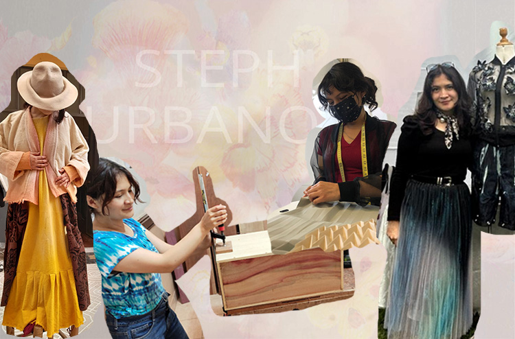

# Sobre mi

Hola! Soy Stephanie Urbano Párraga, nací y crecí en Huancayo, Junín, una región a 3500m.s.n.m. donde la naturaleza y la cultura se encuentra a cada paso, y que me inspiran cada día.

Como diseñadora multidisciplinaria (estudié diseño de indumentaria y diseño industrial) y artista por vocación, me gusta abordar los proyectos desde una mirada empática, exploratoria, colaborativa y divergente. Disfruto mucho el crear con las manos: cocinar, coser, pintar, los textiles, el arte, admiro profundamente la artesanía de mi país; las técnicas manuales son mis preferidas, y las complemento con distintas habilidades y programas digitales.

Combino tradición con nuevas tecnologías para desarrollar soluciones que desafían los límites de la materialidad y la funcionalidad en el diseño de productos y servicios. Mi enfoque multidisciplinario me permite generar propuestas que no solo tienen valor estético y funcional, sino que buscan sobretodo un impacto social y ambiental, promoviendo un modelo de diseño consciente y responsable.

Me emociona mucho esta especialización en manufactura digital  y será un placer compartir los hallazgos que iré desarrollando en el camino, así que esta página será una bitácora digital de este proceso.

Mi portafolio y la gran mayoría de mis trabajos los dejo por aquí **[my website](https://stephurbanop.wordpress.com/)**
