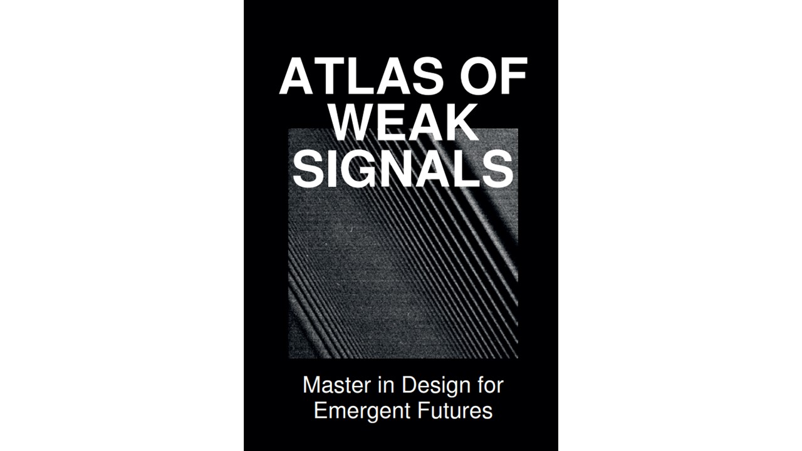
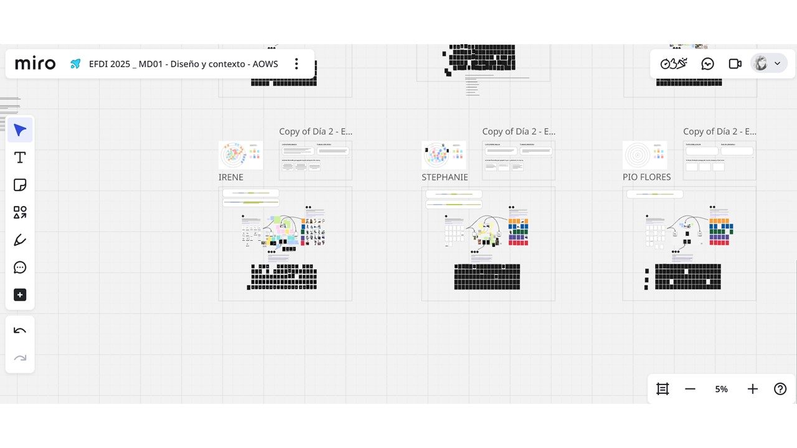
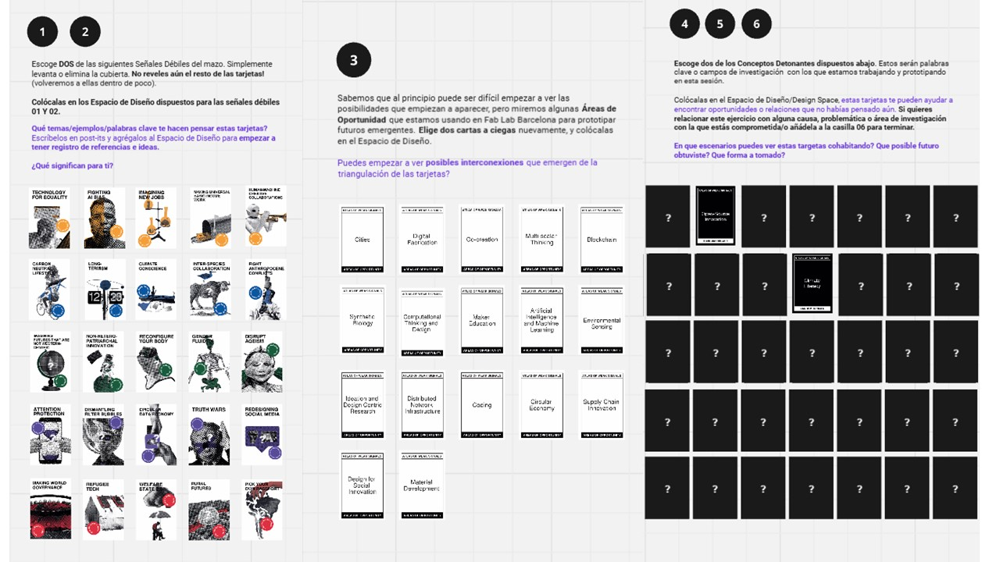
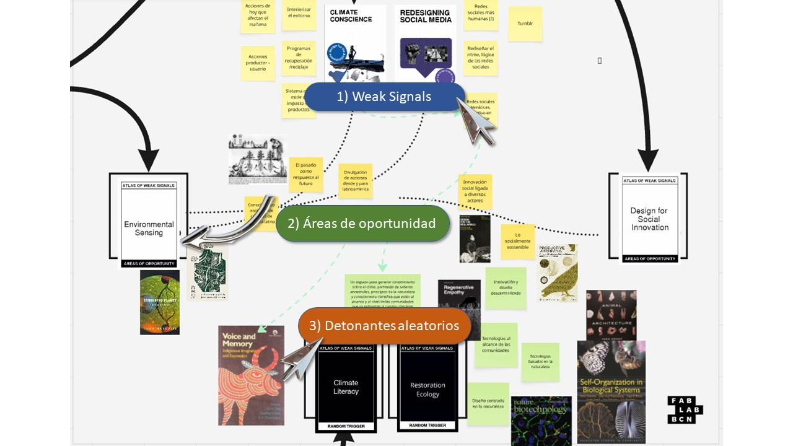
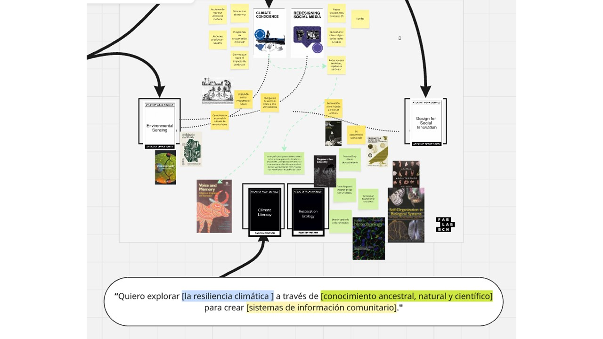
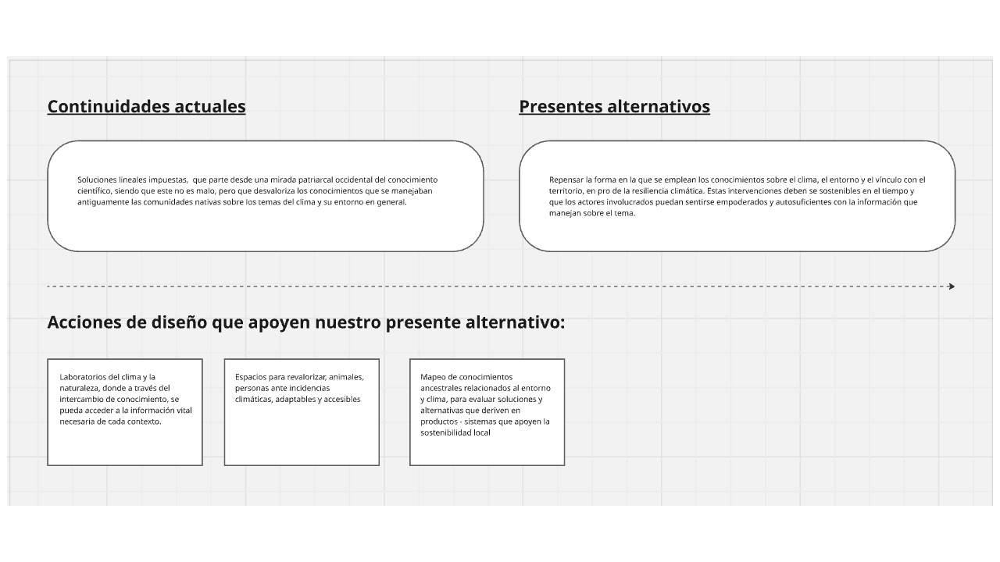
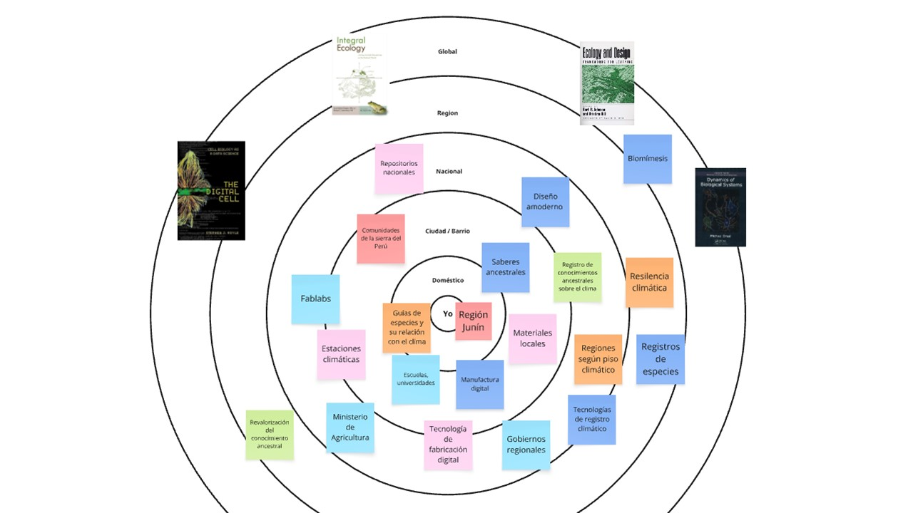

---
hide:
    - toc
---

# MD01

## Proyecto y contexto
El objetivo de la sesión fue identificar algunas áreas de interés para poder desarrollar posteriormente en el proyecto final. Ya sea que tuviésemos una idea previa, o más bien, encontrar aquellos posibles indicios para temas de investigación y desarrollo posterior.

Como herramienta metodológica trabajamos con el  _Atlas of Weak Signals_, la cual, nos habla de los Weak Signals como indicadores tempranos que tienen poco o ningún impacto en el presente, pero con el potencial de provocar un gran cambio, desencadenando acontecimientos importantes en el futuro. Me hizo una relación con el aleteo de una mariposa, que puede ser que no tenga un gran impacto evidente, pero que a largo plazo, ese aleteo puede convertirse en un huracán, siendo su impacto, evidentemente mayor.

La idea es trabajarlo en un espacio de diseño donde se entrelazan diversos intereses, temas, estado del arte etc. Un espacio en el que podemos encontrar e hilar estas ideas, donde fundamentamos la reflexión a partir de estos datos visuales. 
Como espacio de diseño usamos Miro. Esta página colaborativa ya la conocía previamente por trabajos en la universidad, donde también lo empleamos con el mismo fin. 

Entonces esta herramienta [ATLASOWS](https://fablabbcn.org/wp-content/uploads/2022/03/WeakSignals-.pdf) nos permite identificar esas oportunidades de intervención, con un sustento basado en una idea/hipótesis, en el marco del Diseño de Futuros Emergentes. Vamos viendo puntos de interés, conceptos actuales, escenarios posibles conforme se va dando el juego de sacar las cartas, guiándonos de forma dinámica. La herramienta consta de 4 grupos de cartas / elementos que se van relacionando entre sí:
-  SEÑALES DÉBILES (weak signals)
- ÁREAS DE OPORTUNIDAD (areas of opportunity
- DETONANTES ALEATORIOS(random triggers).
- RETOS DE DISEÑO ESPECÍFICOS(specific design challenges) _esta aún no esta puesta en el tablero_

Me pareció una herramienta muy interesante y lúdica para poder iniciar la guía o exploración de temas. Considero que es importante llegar con la mente abierta para evitar sesgos de información. 

En principio nos recomendaron seguir la secuencia de pasos para poder luego ir generando este cruce de conceptos de forma más orgánica y que puede llegar a enriquecer enormemente el espacio de diseño. La idea es ir sacando las cartas sin verlas, y empezar a realizar el juego de conexiones y brainstorming.

Apartir de la secuencia de estas etapas, se va armando poco a poco un mapa interconectado. Conforme iba sacando las cartas, coloque conceptos asociados, imágenes y referencias, para luego redactar nuevas relaciones encontradas. Nuevamente importante recordar que esta herramienta no pide como resultado un proyecto específico, sino mas bien, un mapa - atlas - cartografía de estas ideas que pueden derivar en un tema de exploración sustentado. Entonces en mi caso, los tópicos macros que salieron de este juego fueron ligados al clima, ecología, conciencia climática, repensar las rrss, detección de datos para monitoreo de elementos del medio ambiente y diseño para la innovación social. A partir de estos planteo la posible intervención que sigue la secuencia interés / tema / oportunidad:

Posteriormente, se redactaron sustentos y propuestas a partir de a partir de 3 componentes secuenciales: _Continuidades actuales_ - _Presentes alternativos_,  _Acciones de diseño que apoyen el presente alternativo._ 

Para complementar, se genera un espacio de diseño multiescalar, donde se plantean 6 realidades desde lo individual, local, nacional a lo macro a partir de 6 categorías que permiten organizar la información. La idea es aterrizar el proyecto planteándolo en un posible escenario realista, clasificando los _tópicos de interés_, _estado del arte_. _infraestructura_, _materiales/suministros_, _tecnologías/metodologías_ y _posibles contextos de intervención_.

Esto se complementa con el enfoque en primera persona, y también lleva a reflexionar sobre le rol del diseñador/investigador no solo desde una mirada paternalista y como ‘’faro de conocimiento’’, sino que invita a sincerarse y evaluar como son las soluciones que se están planteando, que deben partir de experiencias reales, con los actores que forman parte para comprender de manera mucho más real, las necesidades que se están mapeando y que finalmente, repercuten en la sostenibilidad de un proyecto.

## Continuará...
En general considero que una herramienta interesante de ideación/investigación y tuve suerte tal vez que las cartas que saque fueron construyendo una narrativa que tenia mucho sentido para mí. Se me hizo bastante divertido, intrigante, nutritivo y dinámico como diseñadora, poder mapear una posible oportunidad de intervención, pero si considero que puede seguir evolucionando mucho más. 

.

