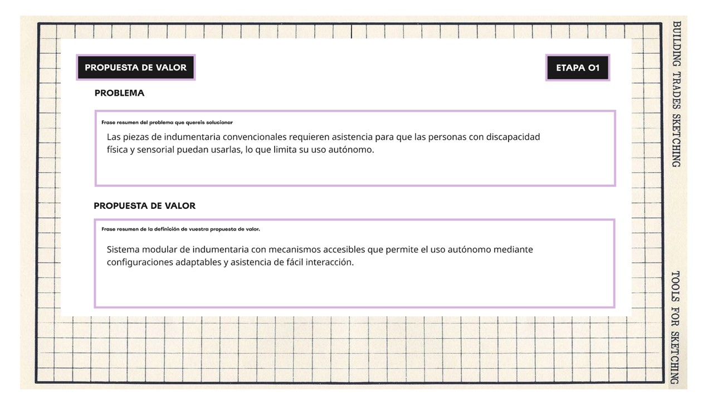
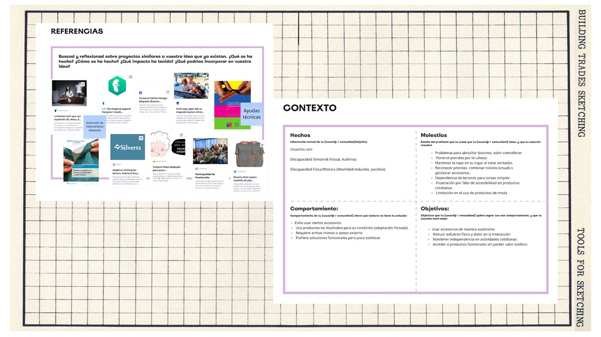
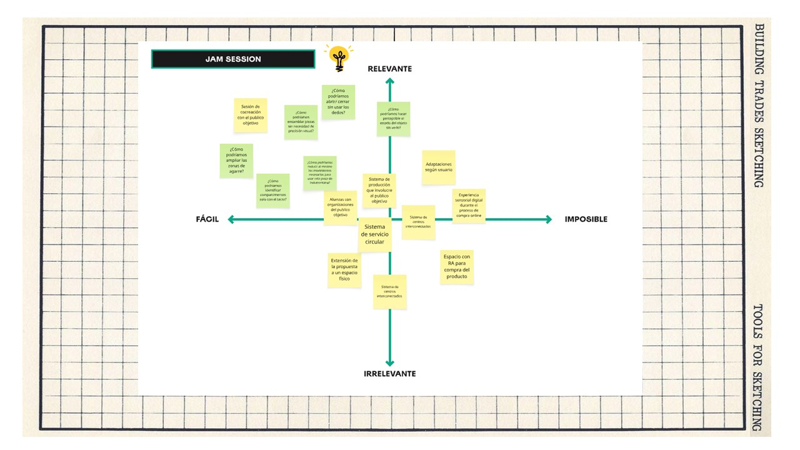
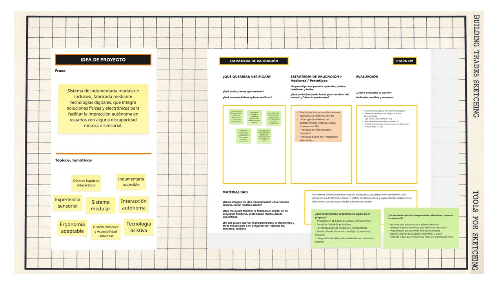

# MD02 

## Proyecto y diseño

Design Squiggle es un representación visual del proceso de diseño. Cómo es que de un garabato de líneas entrecruzadas, la maraña se va desenredando para dar lugar a un guía clara a seguir.
Ya sea el design thinking, double diamond u otros, existen diversas metodologías que pueden converger para apoyarnos en nuestro proceso de diseño. Cómo premisa y punto de partida, basandonos en la indagación anterior del módulo MD01, tenemos unos cuadros que nos conducen a la premisa de determinar _''Una acción de diseño situada en un contexto real que involucra directamente a la comunidad / objeto de estudio''_

La primera aproximación que tuve, relacionado a mis saberes previos e interes personal, fue sobre el vestir. Además, considere una experiencia en mi entorno. Mi padre es mayor de edad y tienen un interés por estar bien presentable siempre. Pero a raíz de un accidente en el brazo, se vieron afectadas el sus actividades diarias, especialmente el vestirse.

Es así que con esta premisa comenzamos definiendo cual sería el problema indentificado y cual su propuesta de valor, considerando que el marco teórico que habiamos revisado se encuentra en la definición del proyecto y contexto.

Importante el mapeo de referencias, benchmarking, estado del arte, sobre proyectos similares o transversales, ya que ayudan a alimentar la narrativa de lo que ya existe frente a lo que se puede desarrollar.

También priorizamos algunos conceptos que pueden abrir caminos de exploración muy interesante, a través de la matiz de jam ssesion.

Al final, un cuadro nos ayuda a resumir información clave como la idea general de proyecto con los topics relacionados, además de la primera aproximación de posibles estrategias de validación y la materialidad de la propuesta 

