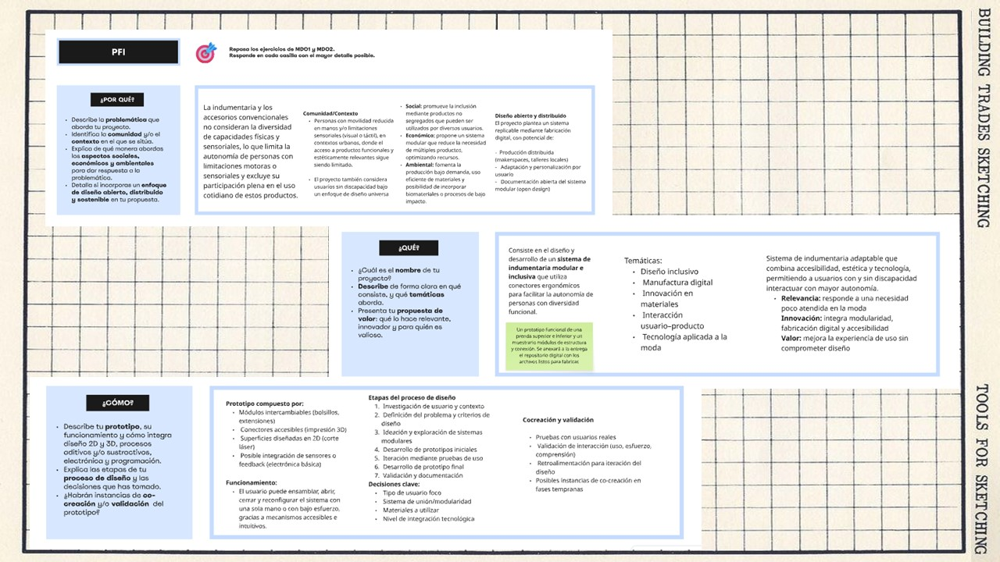
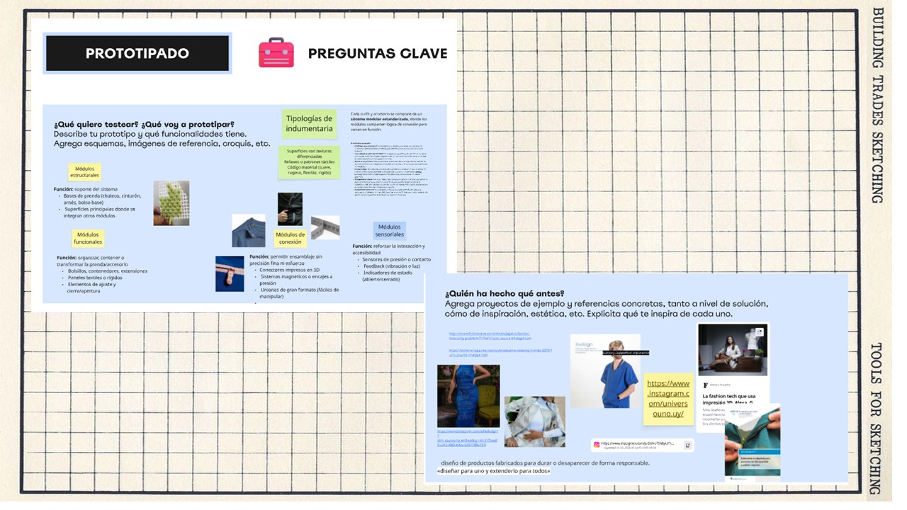
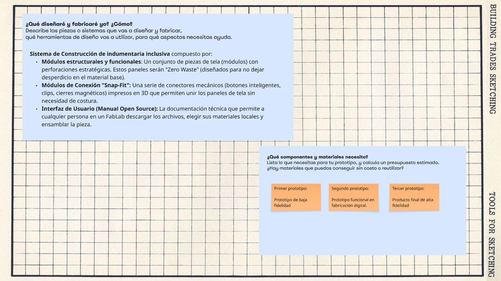
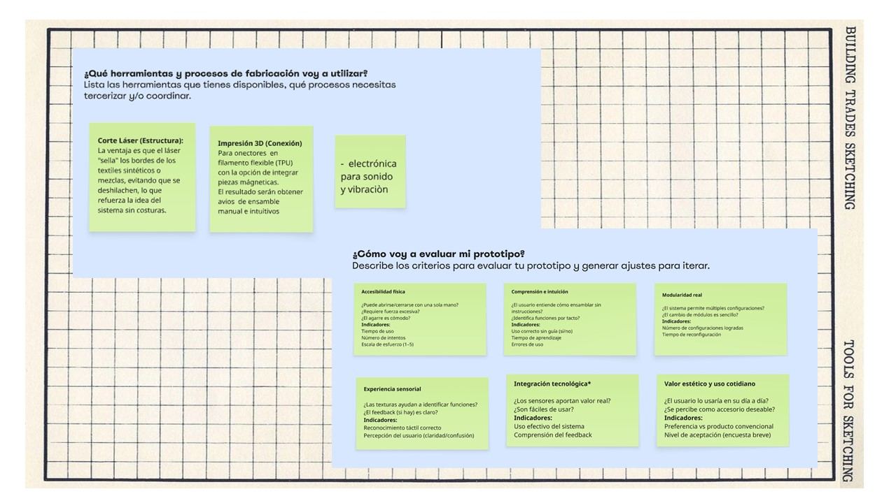
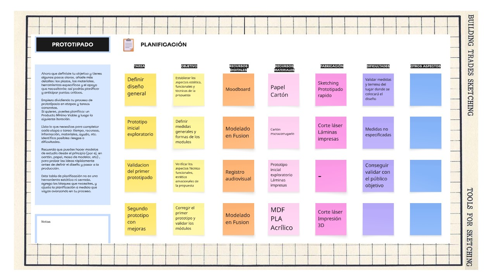
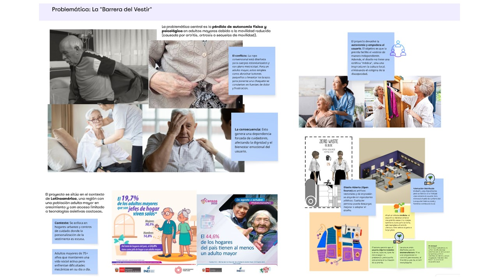
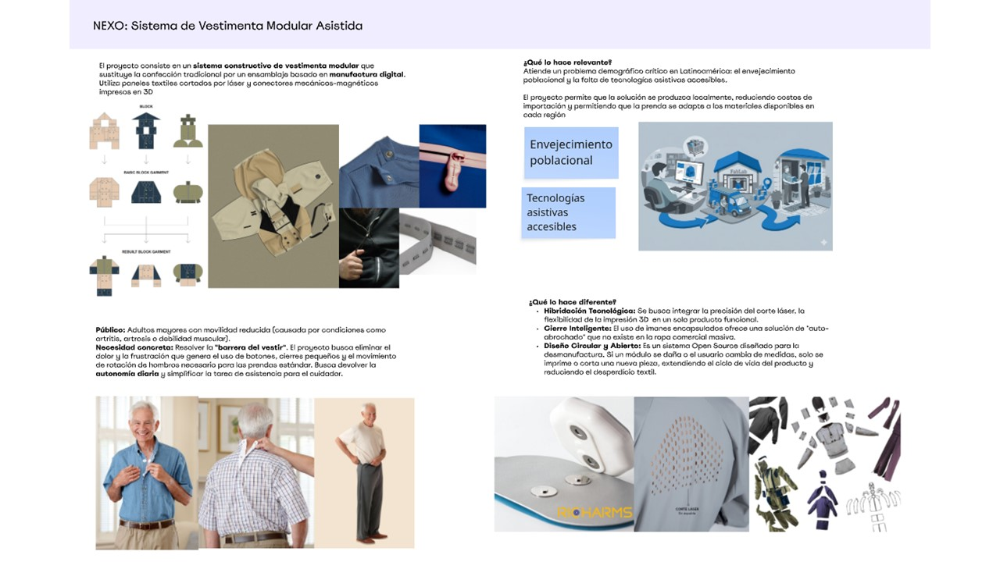
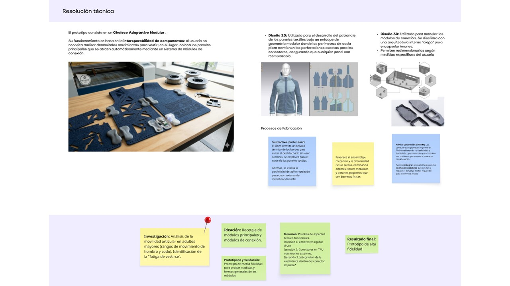
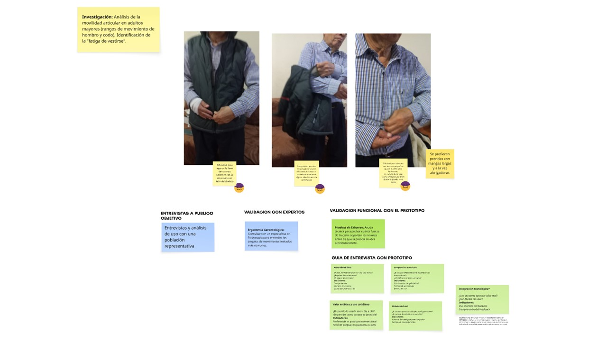

# MD03
## Prototipado y fabricación

Considerando una integración en el proyecto, las láminas adjuntas buscan responder las anteriores interrogantes más esta última, de manera mucho más aterrizada y consolodida. El ¿Por qué? ¿Qué? ¿Cómo? indican la ruta para un camino que se debe empezar a recorrer.

En esta sección, se busca profundizar en el  **_¿Cómo?_**
Resalta entonces el papel del prototipo: cómo será, su funcionamiento y cómo integra diseño 2D y 3D, procesos aditivos y/o sustractivos, electrónica y programación en la propuesta.
También es necesario planear la fabricación, planificar el accionar, eligiendo  materiales y tecnologías a utilizar. Estos pasos que se encuentran dentro del proceso de diseño implicando también consideran instancias de co-creación, para profundizar en las decisiones tomadas, los resultados y posibles ajustes.

El cronograma, nos ayuda a visualizar el tiempo de desarrollo, los recursos necesarios y el objetivo de cada acción.

#### Pre entrega

En esta instancia, considerando todos los recursos anteriores, se plantea la presentación del proyecto de manera preliminar, según el enfoque y lo mapeado al momento. 

En mi caso, el registro corresponde a la idea inicial de la que partió la indagación, relacionada a la problemática del vestir y las dificultades que tenian para ello los adultos mayores.

