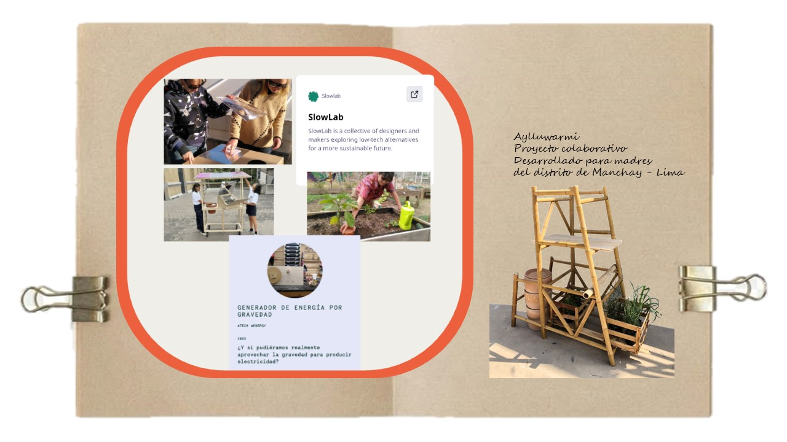
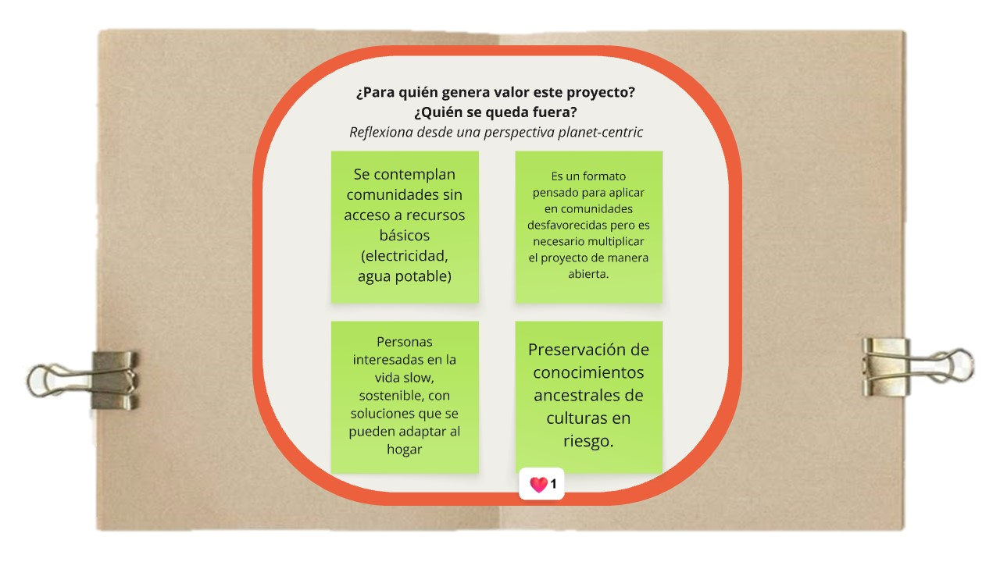
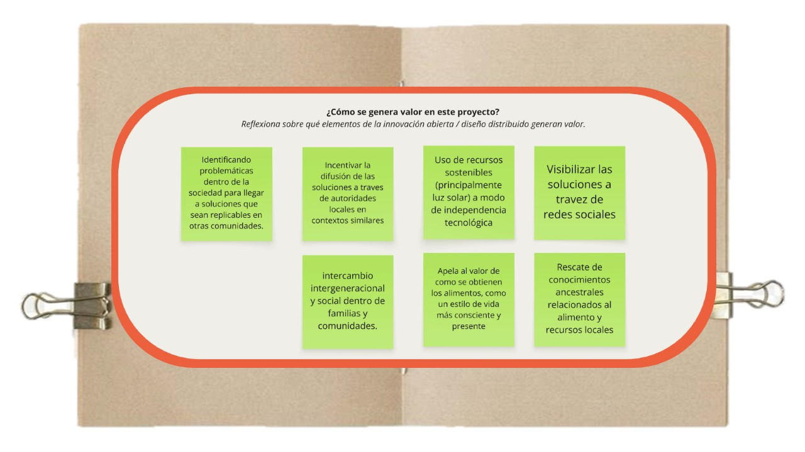
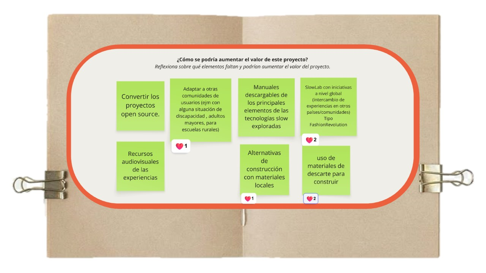
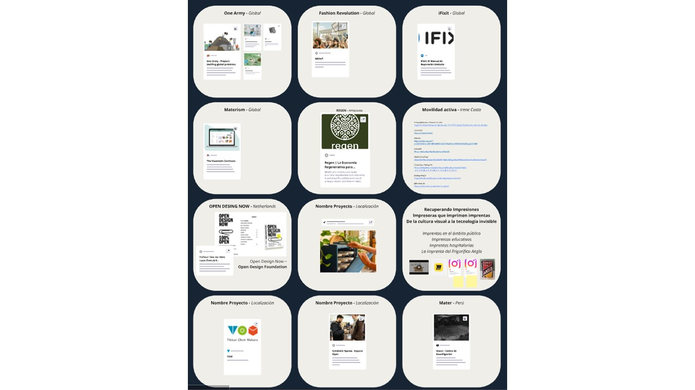
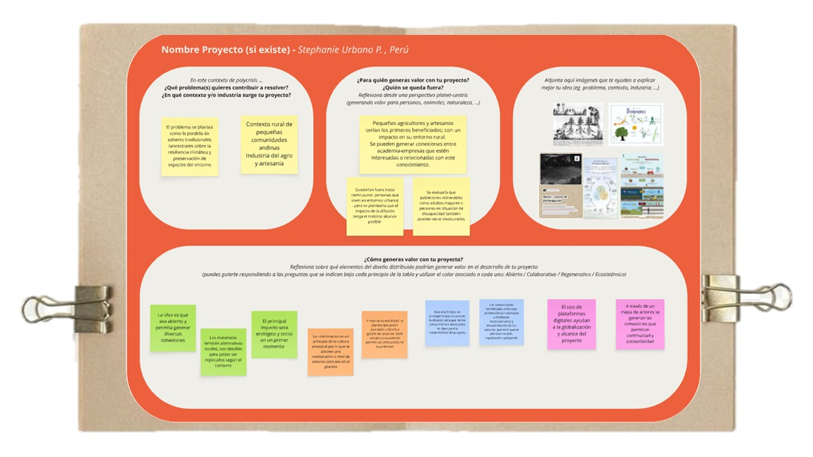

---
hide:
    - toc
---

# MI01

En este módulo vimos el tema de Innovación Abierta y Distribuida.
Considero importante y bastante acertado, abordar esta perspectiva en el diseño para los tiempos que estamos viviendo. 
Los proyectos se conciben bajo los principios del Open Source: *transparente* *replicable* *accesible*

