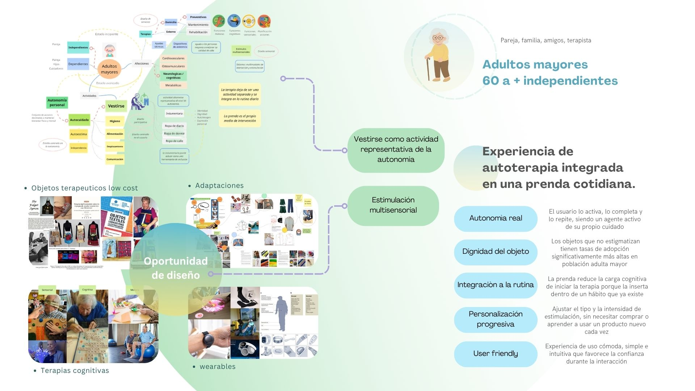
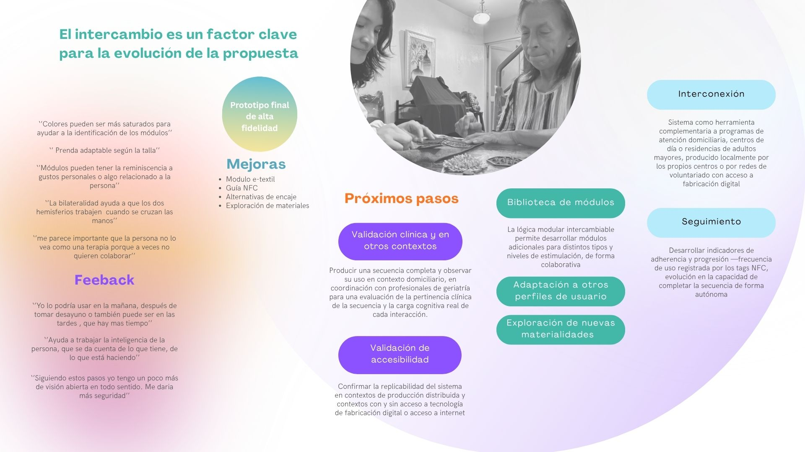

### PROYECTO INTEGRADOR

Sistema de autoterapia vestible para adultos mayores autónomos, como medida para el tratamiento del deterioro cognitivo 

El sistema, emplea estrategias de estimulación física, sensorial y cognitiva mediante módulos intercambiables que integran mecanismos de guía digitales y analógicos que promueven la autoterapia y la autonomía del adulto mayor, combatiendo el deterioro cognitivo temprano

 

 

 

 

 

 

 

 

 