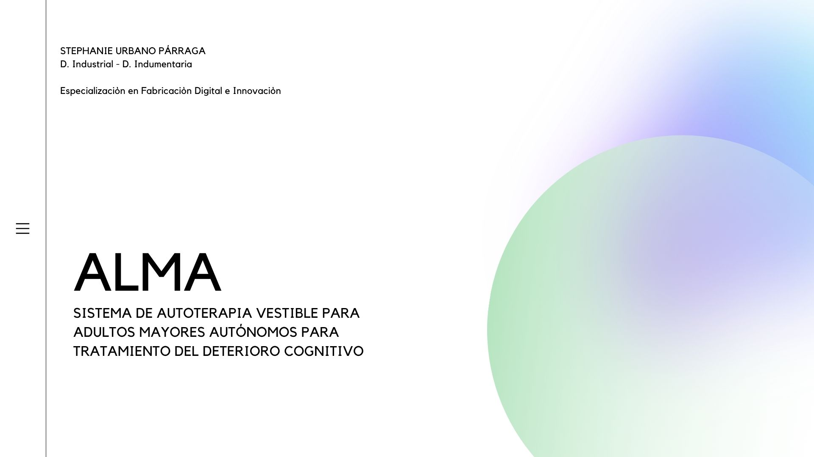
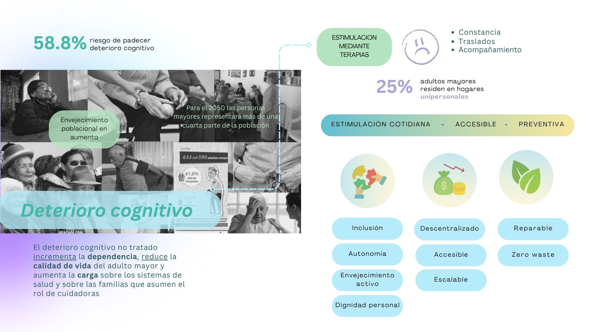
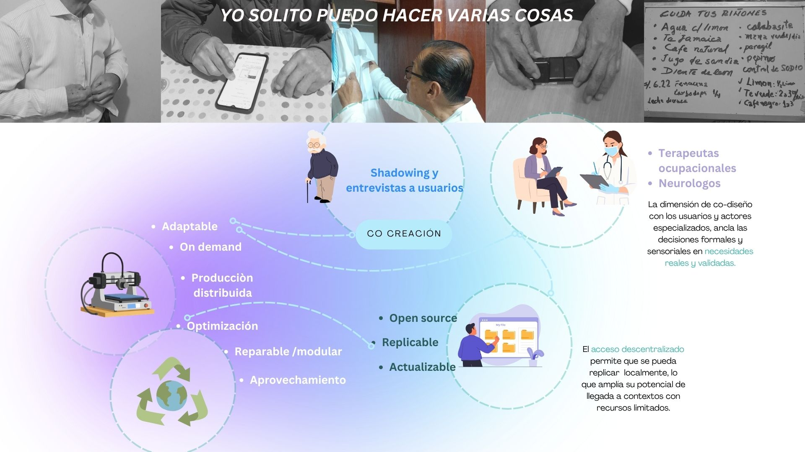
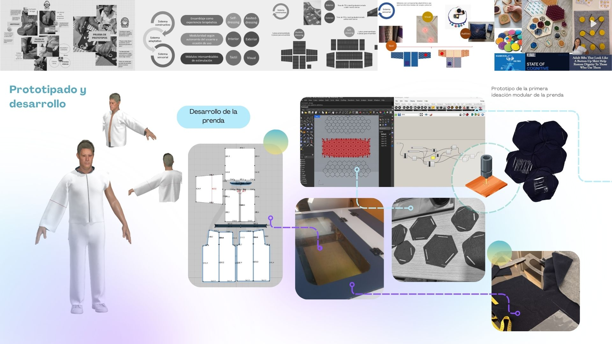
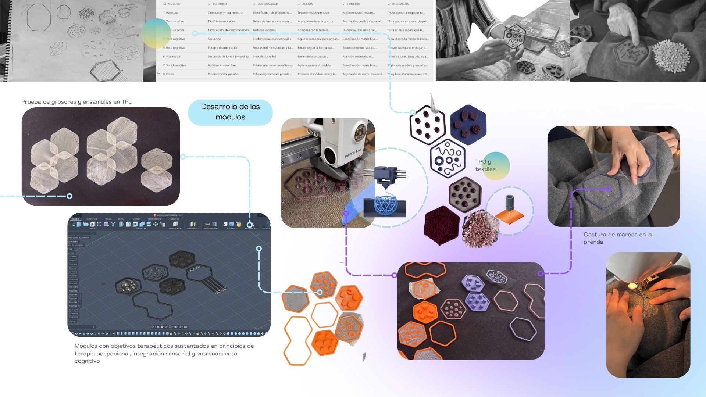
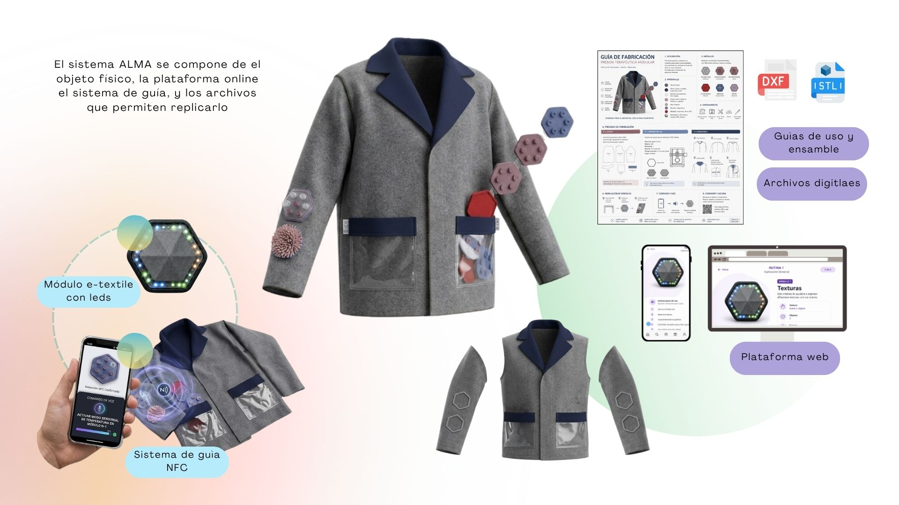

### PROYECTO INTEGRADOR

Sistema de autoterapia vestible para adultos mayores autónomos, como medida para el tratamiento del deterioro cognitivo 

El sistema, emplea estrategias de estimulación física, sensorial y cognitiva mediante módulos intercambiables que integran mecanismos de guía digitales y analógicos que promueven la autoterapia y la autonomía del adulto mayor, combatiendo el deterioro cognitivo temprano

 

 

 

 

 

 

 

.jpg) 

LINK AL VIDEO
https://drive.google.com/file/d/1fwWAyM7qCjKW4YceU42M65S6QX5tu_Y7/view?usp=drive_link

DESCARGABLES
https://drive.google.com/drive/folders/18pDcGlLeFyNkbPECKnyFLgk0xwdIEJvV?usp=drive_link 

WEB ENLACE : 