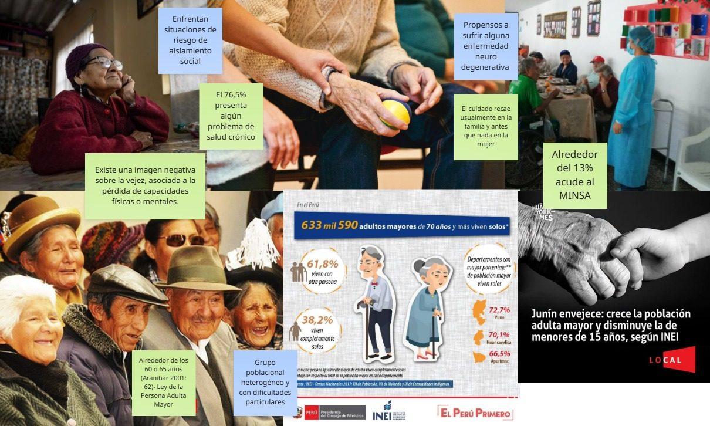
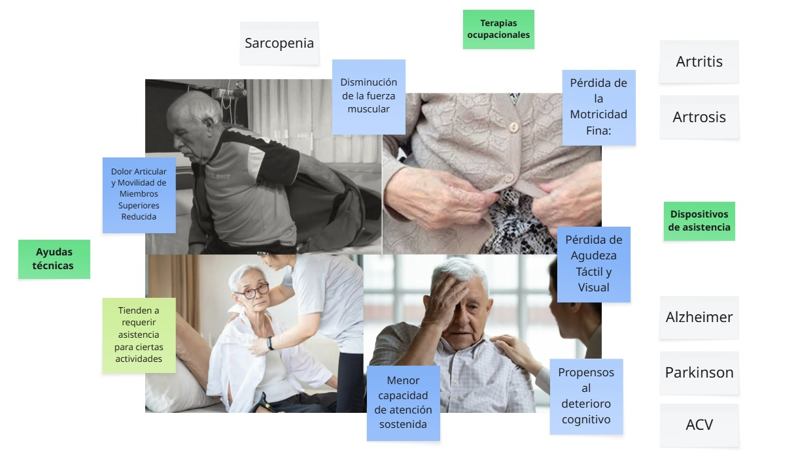
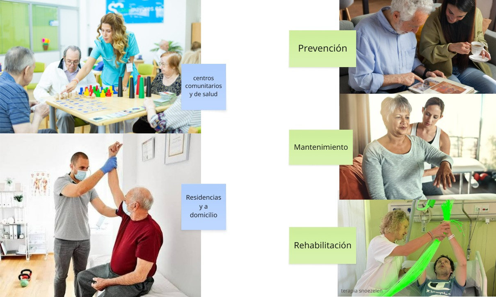
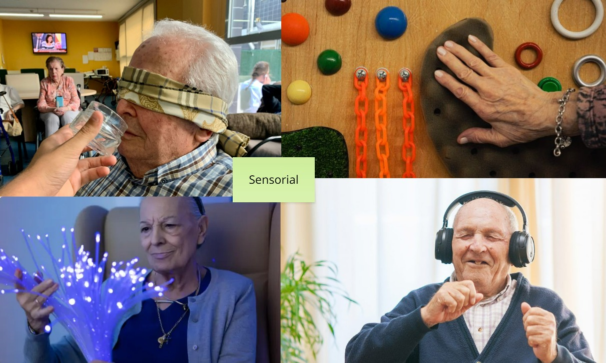
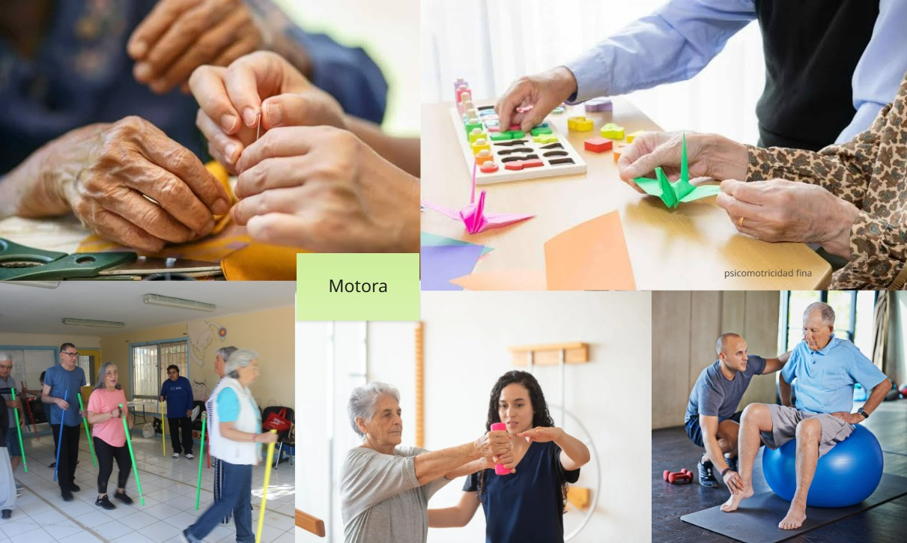
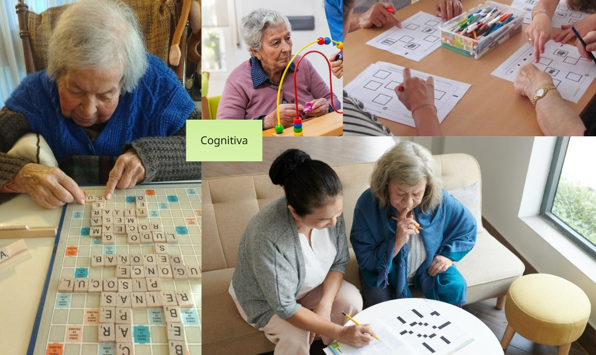

### DESCUBRIR

##### PROBLEMÁTICA

###### Adultos mayores, envejecimiento y contexto

El envejecimiento poblacional constituye uno de los principales desafíos sociales y sanitarios a nivel mundial, situación que también se refleja en el contexto peruano. De acuerdo con la legislación nacional, se considera persona adulta mayor a toda aquella que tiene 60 años o más. Sin embargo, esta población no debe entenderse como un grupo homogéneo, sino como un conjunto diverso de individuos con diferentes capacidades, necesidades y condiciones de vida, influenciadas por factores sociales, económicos, culturales y de salud.

En el Perú, aproximadamente el 42,2 % de los hogares cuenta con al menos una persona adulta mayor, evidenciando la creciente presencia de este grupo poblacional en la estructura familiar. Paralelamente, el envejecimiento suele estar acompañado por un deterioro progresivo de las capacidades físicas, cognitivas y sensoriales, así como por una elevada incidencia de enfermedades crónicas. A ello se suma que una proporción significativa de adultos mayores no accede oportunamente a los servicios de salud debido a limitaciones de acceso, confianza o disponibilidad de atención. Estas condiciones incrementan el riesgo de pérdida de autonomía y dependencia funcional, afectando directamente la calidad de vida y la participación en las actividades cotidianas

Además de las limitaciones físicas y cognitivas, persisten estereotipos sociales que asocian el envejecimiento con fragilidad, incapacidad e improductividad. Esta percepción contribuye a procesos de exclusión y limita las oportunidades para promover un envejecimiento activo. En consecuencia, surge la necesidad de desarrollar estrategias de diseño que favorezcan la conservación de la autonomía mediante intervenciones integradas en las actividades habituales de la vida diaria, evitando la estigmatización asociada al uso de dispositivos exclusivamente terapéuticos.

###### Afecciones principales y riesgos

El envejecimiento conlleva una serie de cambios progresivos que afectan la capacidad funcional y la autonomía de las personas adultas mayores. Entre las condiciones más frecuentes se encuentran la sarcopenia, la artritis y la artrosis, enfermedades que provocan pérdida de fuerza muscular, dolor articular y disminución del rango de movimiento, dificultando actividades cotidianas como vestirse, manipular objetos o mantener el equilibrio.

A nivel funcional, también es común la pérdida de la motricidad fina, la disminución de la sensibilidad táctil y de la agudeza visual, factores que complican acciones que requieren precisión, como abotonar una prenda, cerrar un cierre o manipular pequeños elementos. Paralelamente, algunos adultos mayores presentan una reducción en la atención sostenida y un mayor riesgo de deterioro cognitivo, asociado a enfermedades neurodegenerativas como el Alzheimer, el Parkinson o las secuelas de un accidente cerebrovascular (ACV).

Como consecuencia de estas limitaciones, muchas personas requieren ayudas técnicas, dispositivos de asistencia o el apoyo de un cuidador para realizar actividades básicas de la vida diaria. No obstante, estas intervenciones suelen centrarse en compensar la pérdida funcional más que en promover la estimulación continua de las capacidades remanentes.

###### Deterioro cognitivo

Se considera deterioro cognitivo cuando hay un descenso objetivo en funciones como memoria, pensamiento, orientación, lenguaje o capacidad para resolver problemas, respecto al nivel previo de la persona. Puede ser leve (deterioro cognitivo leve), cuando apenas interfiere con la vida diaria, o moderado y grave, cuando ya compromete de forma importante la autonomía y suele corresponder a distintos tipos de demencia.

En el deterioro cognitivo leve, la persona nota más olvidos o lentitud mental, pero mantiene en general su independencia. En fases avanzadas, la pérdida de memoria, el desorientarse y la dificultad para realizar tareas básicas hacen que se requiera ayuda continua.

Los síntomas pueden variar, pero suelen agruparse en varias áreas: memoria, lenguaje y acomunicación, atención, pensamiento y funciones ejecutivas. Orientación y percepeción, comportamiento, ánimo y personalidad.

Las consecuencias se evidencian en las dificultades para actividades instrumentales como manejo de dinero, medicación, tranasporte, tramites, hasta riesgo de errores peligrosos (gas abierto, mezcla de medicamentos). Esto incide en la perdida progresiva de autonomía, necesitando apoyo para actividades de la vida diaria. Consecuentemente, se evidencia un impacto emocional y social que deriva en otras afecciones como depresión, ansiedad, sensación de inutilidad o carga para la familia.

###### Terapias y envejecimiento activo

Las terapias dirigidas a adultos mayores incluyen intervenciones físicas, psicológicas, sociales y ocupacionales, adaptadas a cambios propios del envejecimiento. Suelen organizarse en programas que combinan ejercicio físico de bajo impacto, técnicas de relajación, dinámicas grupales, estimulación cognitiva y actividades recreativas para mejorar estado físico, ánimo, autoestima y vínculos sociales.

Ejemplos descritos en fuentes bibliográficas son caminatas suaves, ejercicios de movilidad articular, respiración y relajación, bailoterapia, automasajes, grupos de conversación y talleres de estilos de vida saludables. Estas intervenciones se aplican tanto en centros comunitarios y de salud como en domicilios y residencias, y pueden enfocarse en prevención, rehabilitación o mantenimiento funcional según la situación de cada persona mayor

En terapia ocupacional, los productos de apoyo son herramientas que permiten que la persona participe de manera más independiente en actividades de la vida diaria, trabajo, ocio y roles sociales. Pueden ser objetos físicos (adaptadores de cubiertos, tablas de baño, utensilios de agarre fácil, kits de motricidad fina y gruesa, material de estimulación cognitiva) o tecnologías de asistencia que compensan limitaciones sensoriales, motoras o cognitivas

###### Estimulación sensorial

La estimulación sensorial, motora y cognitiva en adultos mayores se entiende como un conjunto de intervenciones no farmacológicas diseñadas para mantener o mejorar funciones del sistema nervioso y la autonomía en la vida diaria. Se aplica tanto en envejecimiento sano como en personas con deterioro leve o demencias, con beneficios sobre capacidad funcional, estado de ánimo y participación social.

La estimulación sensorial se centra en activar de forma estructurada los sentidos (vista, oído, tacto, olfato, gusto) mediante estímulos agradables y significativos para la persona. Suelen emplearse luces suaves, imágenes, música, sonidos de la naturaleza, texturas, masajes, aromas y, en ocasiones, sabores asociados a recuerdos personales.

Los beneficios descritos incluyen reducción de ansiedad, agitación, apatía y estrés, así como mejora del estado de ánimo y sensación de bienestar. A nivel cognitivo, puede aumentar el nivel de atención y conexión con el entorno, y en contextos grupales favorece la comunicación y las relaciones interpersonales.

###### Estimulación motora

La estimulación motora comprende ejercicios físicos adaptados para mejorar fuerza, equilibrio, coordinación y movilidad general. Incluye movimientos suaves y conscientes, trabajo de marcha, ejercicios de flexibilidad, coordinación ojo‑mano y actividades psicomotrices sencillas.

Estos programas ayudan a mantener o mejorar la movilidad, la coordinación y el equilibrio, lo que facilita las actividades de la vida diaria y reduce el riesgo de caídas. También se ha observado que una mejor estabilidad física incrementa la seguridad subjetiva, favorece que la persona salga, se mueva más y participe en actividades sociales.

###### Estimulación cognitiva

La estimulación cognitiva se orienta a entrenar funciones como memoria, atención, lenguaje, funciones ejecutivas y razonamiento mediante actividades estructuradas. Se utilizan fichas de ejercicios, juegos de mesa, tareas de orientación temporal y espacial, lectura guiada, conversación estructurada, reminiscencia y programas específicos diseñados para adultos mayores.

Los programas bien diseñados buscan trabajar varias áreas cognitivas, adaptando el nivel de dificultad al perfil de cada persona mayor. La evidencia indica mejorías o mantenimiento en rendimiento cognitivo, así como efectos positivos en ánimo, motivación y percepción de autoeficacia.

 

##### Beneficios integrales y visión conjunta
Cuando la estimulación sensorial, motora y cognitiva se combina en programas integrales (multisensoriales), los estudios señalan mejoras globales en función cognitiva, motora y sensorial, junto con mayor participación en actividades cotidianas. Este tipo de abordaje contribuye a regular el sueño, reducir síntomas depresivos y de ansiedad, y mejorar la conducta y la calidad de vida en personas mayores con y sin deterioro cognitivo.

Desde la perspectiva del envejecimiento activo, estas intervenciones no se limitan a “rehabilitar pérdidas”, sino a mantener capacidades, prevenir deterioro y sostener la autonomía el mayor tiempo posible. En la práctica, se recomienda que los programas sean significativos para la persona, se realicen de forma regular y se adapten a su nivel funcional, intereses y contexto de vida

###### Fuentes consultadas

https://cdn01.pucp.education/idehpucp/wp-content/uploads/2018/11/23160106/publicacion-virtual-pam.pdf
https://elmontonero.pe/columnas/vulnerabilidad-de-los-adultos-mayores-en-el-peru

https://revecuatneurol.com/magazine_issue_article/prevalencia-deterioro-cognitivo-leve-peruanos-adultos-mayores-mediana-edad-cognitive-impairment-prevalence-peruvian-middle-age-elderly-adults/
https://pmc.ncbi.nlm.nih.gov/articles/PMC12053864/

https://salusmayores.es/blog/importancia-expectativas-autonomia-mayores/

https://www.oas.org/es/CIDH/jsForm/?File=/es/cidh/prensa/comunicados/2024/233.asp

https://cdn01.pucp.education/idehpucp/wp-content/uploads/2018/11/23160106/publicacion-virtual-pam.pdf

https://salusmayores.es/blog importancia-expectativas-autonomia-mayores/

https://www.oas.org/es/CIDH/jsForm/?File=/es/cidh/prensa/comunicados/2024/233.asp

https://cdn01.pucp.education/idehpucp/wp-content/uploads/2018/11/23160106/publicacion-virtual-pam.pdf

https://extranet.who.int/countryplanningcycles/sites/default/files/planning_cycle_repository/cuba/programa_de_atencion_integral_al_adulto_mayor.pdf

https://scielo.isciii.es/pdf/clinsa/v19n1/v19n1a05.pdf

https://biblioteca.ciencialatina.org/guia-de-actividades-terapeuticas-para-un-envejecimiento-activo/

https://ciencialatina.org/index.php/cienciala/article/view/7434/11235

https://www.tena.com.ec/academia-tena/10-actividades-cognitivas-para-adultos-mayores/

https://www.albertia.es/estimulacion-multisensorial-en-las-personas-mayores/
