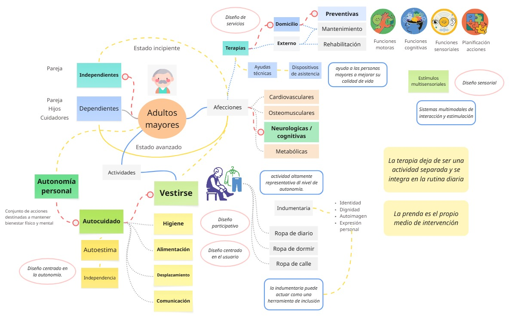
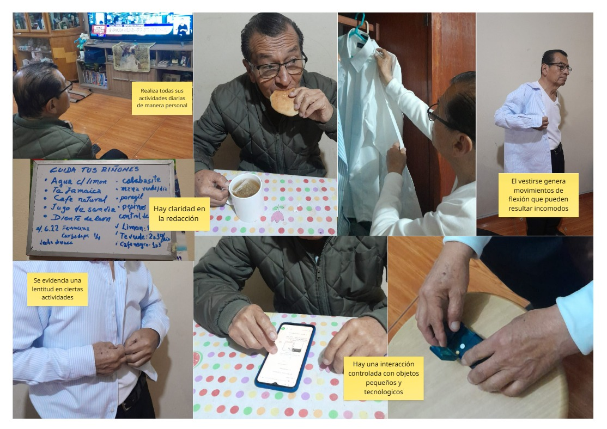
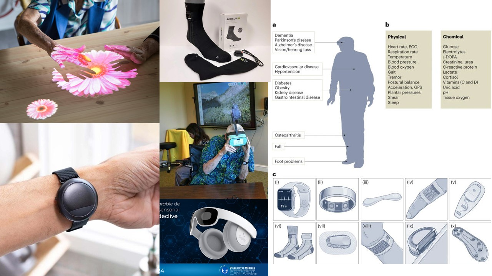
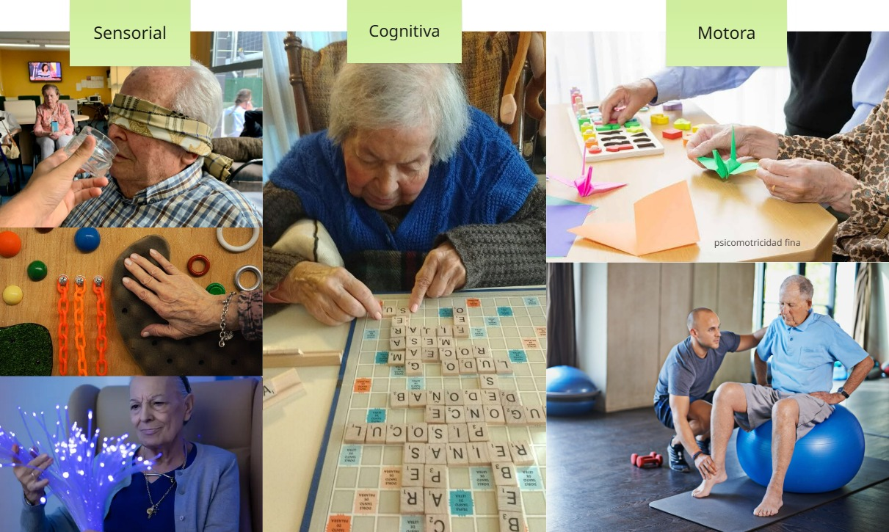
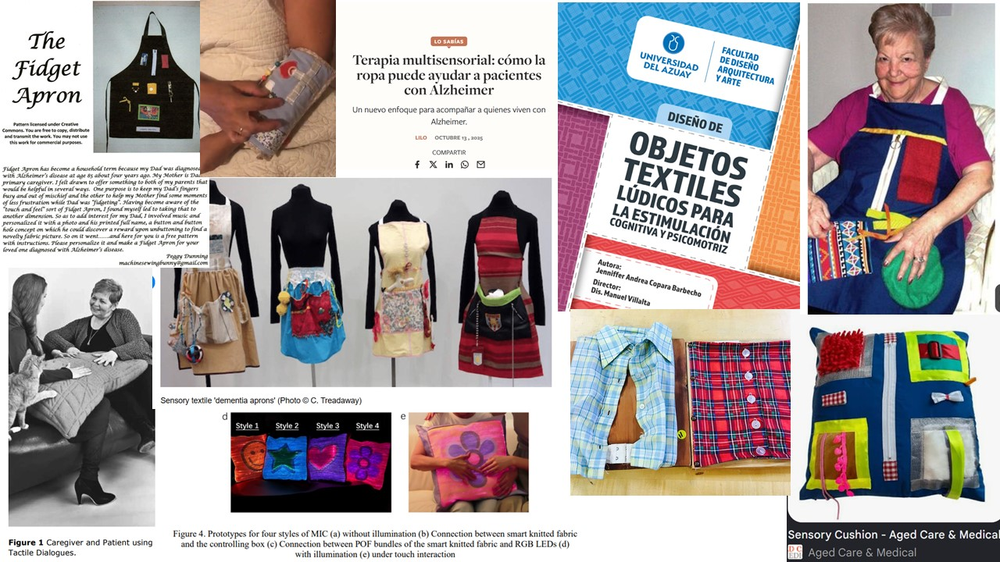
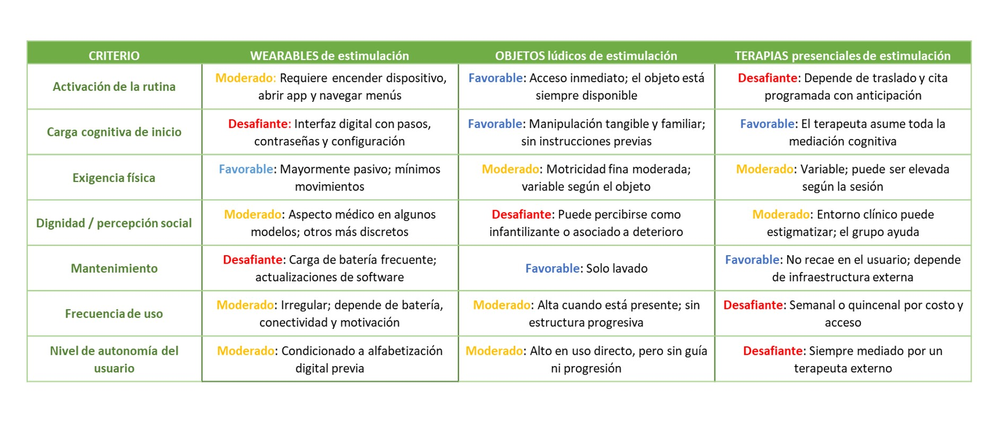
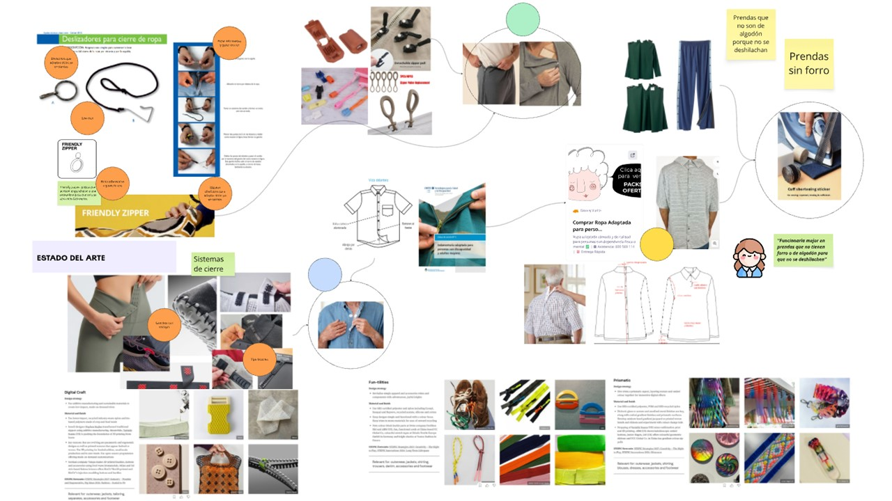
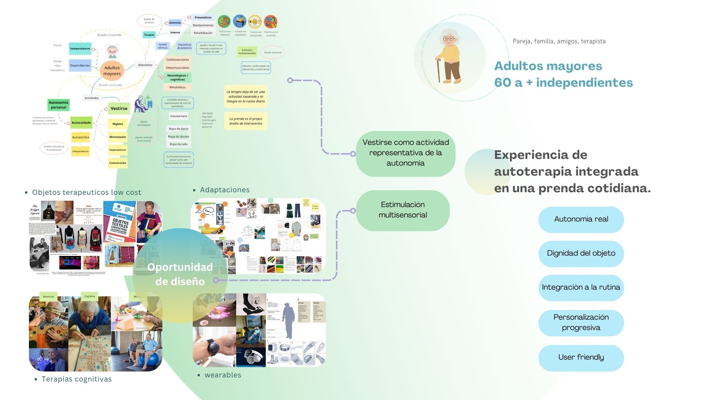
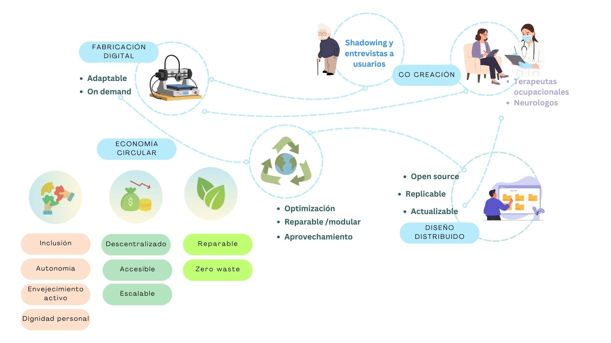

#### IDEACIÓN

Dados los antecendetes y la revisión documental realizada, se planteo la siguiente pregunta de investigación - ideación

###### ¿Cómo podemos promover el autocuidado y retrasar la aparición del deterioro cognitivo en adultos mayores autónomos de Lima metropolitana?

Considerando entonces como:

###### Problemática general → Deterioro funcional asociado al envejecimiento.

###### Objetivo → Favorecer el autocuidado y prevenir el deterioro cognitivo

Con el fin de poder resumir y entender la relación entre los conceptos descritos, se realizó un diagrama que resalta la relación entre la actividad de vestirse y el potencial de vincularlo con la estimulación requerida para retrasar la aparición del deterioro cognitivo.

Como aspectos resaltante se destaca lo siguiente:

> Vestirse es una actividad altamente representativa del nivel de autonomía.

> La indumentaria puede actuar como una herramienta de inclusión

_Ambos puntos están vinculados con el hecho de que el acto de vestirse es una actividad que se realiza de manera íntima, y que remite a la identidad, dignidad y expresión personal de cada persona._

> Ciertos materiales textiles apelan a la memoria afectiva y la aceptación del vestirse diariamente.

> La estimulación puede venir de sistemas multimodales de interacción 

_Los estimulos que se reconocen como familiares, son más facilmente aceptados y activan recuerdos que favorecen la actividad cerebral_

Para complementar estas indagaciones, se realizó un shadowing con un familiar cercano, por temas de accesibilidad, para rescatar las actividades resaltantes y entender las dinámicas implicadas en la vida diaria del usuario. Resalta su autonomía, aunque con cierta lentitud, para poder realizar actividades primarias cotidianas, además de su entendimiento de dispositivos moviles y autogestión para la toma de medicamentos

 

##### Estado del arte

Siendo necesario entender abordajes previos a la pregunta planteada, se realizó un benchmarking que tuvo como objetivo explorar diferentes soluciones a nivel mundial, latinoamericano y nacional que hubiesen abordado ciertos aspectos de la problemática, total o parcialmente.
Se consideraron 3 grupos principales:
 1)  _wearables_ como el nivel más alto de tecnología y que ofrece estimulos más avanzados 

 

 2) _terapias de estimulación_ actividades realizadas en centros especializados o por profesionales capacitados

 3) _objetos para estimulación_ principalmente hechos bajo un enfoque diy y de caracter artesanal, más accesibles

En base a estas categorías se realizo un cuadro comparativo, considerando criterios establecidos por importancia y relación con la condición del usuario: _activación de la rutina | carga cognitiva de inicio | exigencia física | dignidad/percepción social | mantenimiento | frecuencia de uso | nivel de autonomía del usuario_

 Otra categoría que se exploro fueron las _adaptaciones_ orientadas a la ropa perse para entender los mecanismos en ella que están relacionados con las acciones que realiza la persona al vestirse y las implicancias que se requiere.

 

 ##### Resolución conceptual

Triangulando los resultados de las indagaciones y exploración conceptual, es que se observa una oportunidad de diseño interesante para vincular el *vestirse* con la *estimulación sensorial* como alternativa de terapia principalmente preventiva, que se realice de manera cotidiana y priorizando la accesibilidad.

> **Experiencia de autoterapia integrada en una prenda cotidiana.**

Priorizando 5 aspectos clave:

> *Autonomía real*

 El usuario lo activa, lo completa y lo repite, siendo un agente activo de su propio cuidado

> *Dignidad del objeto y del usuario*

 Los objetos que no estigmatizan tienen tasas de adopción significativamente más altas en población adulta mayor

 > *Integración a la rutina*

La prenda reduce la carga cognitiva de iniciar la terapia porque la inserta dentro de un hábito que ya existe.

 > *Personalización progresiva*

Ajustar el tipo y la intensidad del estímulo, sin necesitar comprar o aprender a usar un producto nuevo cada vez

 > *User friendly*

Experiencia de uso cómoda, simple e intuitiva que favorece la confianza durante la interacción

##### Lineamientos 

El desarrollo del proyecto se sustenta en una serie de aspectos que serán considerados desde su etapa inicial, de manera que su diseño e implementación respondan a criterios técnicos, sociales y económicos coherentes desde el planteamiento hasta la ejecución.

_**Fabricación digital**_

Se tomará en cuenta el uso de la fabricación digital como estrategia central del proyecto, priorizando procesos adaptables y de producción bajo demanda. Esto permitirá ajustar cada solución a las necesidades particulares del usuario, evitando la estandarización rígida y reduciendo la producción de excedentes, al fabricarse únicamente lo que se requiere en cada caso.

_**Co-creación**_
El proyecto contempla, desde su fase previa, la incorporación activa de los futuros usuarios en el proceso de diseño. Para ello se plantea la realización de entrevistas que permitan recoger sus necesidades, expectativas y experiencias, así como instancias de validación que retroalimenten el desarrollo. Asimismo, se considerará la intervención de terapeutas ocupacionales, cuyo conocimiento profesional aportará una mirada técnica y clínica que enriquezca las decisiones de diseño.

_**Diseño distribuido**_
Se tendrá en cuenta un enfoque de diseño distribuido, mediante la publicación del proyecto bajo licencias de código abierto. Esto permitirá que la solución sea replicable en distintos contextos y por distintos actores, y que pueda ser actualizada de manera colaborativa en el tiempo, favoreciendo su mejora continua y su adaptación a nuevas necesidades.

Bajo el marco de la economía circular
_**Economía circular**_
En cuanto a la dimensión productiva y material, se considerará la optimización de recursos como criterio de diseño, procurando que las piezas sean reparables y modulares, de modo que puedan intervenirse o sustituirse parcialmente sin desechar el producto completo. Se buscará además avanzar hacia un modelo de cero residuos, contemplando el aprovechamiento de saldos y retazos textiles como insumo, lo que reduce el impacto ambiental y da valor a materiales que de otro modo serían descartados.

_Aspecto social_
Desde el ámbito social, el proyecto tomará en cuenta principios de inclusión y autonomía, orientando sus soluciones a favorecer un envejecimiento activo y la dignidad personal de quienes las utilicen. Se busca que el diseño no solo resuelva una necesidad funcional, sino que también contribuya a la independencia y el bienestar integral del usuario.

_Aspecto económico_
Finalmente, se considerará un modelo económico descentralizado, que permita la producción en distintos puntos y reduzca la dependencia de una cadena de suministro única. Esto, junto con la búsqueda de accesibilidad en los costos, apunta a que el proyecto sea escalable y pueda llegar a un mayor número de personas sin comprometer su viabilidad económica.

En conjunto, estos aspectos constituyen los criterios que orientarán las decisiones de diseño desde antes de iniciar el desarrollo del proyecto, asegurando que su implementación futura sea coherente, sostenible y centrada en las personas.

Bibliografía

https://salusmayores.es/blog/importancia-expectativas-autonomia-mayores/
https://www.oas.org/es/CIDH/jsForm/?File=/es/cidh/prensa/comunicados/2024/233.asp

https://cdn01.pucp.education/idehpucp/wp-content/uploads/2018/11/23160106/publicacion-virtual-pam.pdf

_Estado del arte_

Grupo 1: objetos textiles
https://selecciones.com.mx/terapia-multisensorial-como-la-ropa-puede-ayudar-a-pacientes-con-alzheimer/ 

https://www.mtbhomer.com/assets/pdf/publications/personalization-of-vibrotactile-behavior.pdf

https://www.researchgate.net/publication/320130974_Design_for_Dementia_Care_Making_A_Difference

https://journals.sagepub.com/doi/10.1177/00405175251379086 

https://www.myotspot.com/fine-motor-coordination-activities-for-neuro-patients/?utm_source=Pinterest&utm_medium=organic

https://agedcareandmedical.com.au/products/betterliving-sensory-cushion?srsltid=AfmBOoonb37mRuz0zv6YBF2-hsZiCTxl-sHR4PCEpZpLJetil-Gedo5-

https://ira.lib.polyu.edu.hk/bitstream/10397/115844/1/Tang_Design_Novel_Interactive.pdf

Grupo 2: wearables
https://guinea.pe/blog/promoviendo-bienestar-adulto-iot/

https://www.pccomponentes.com/los-smartwatches-mas-recomendados-para-las-personas-mayores?srsltid=AfmBOopRqjeTtLkZGGaFRKd83jHcPaR07Xq1t4f83G63Nj9DWZCNyA7E

https://cdn.prod.website-files.com/68236712486104f66d06ca97/69ef8cac80d0205b4abc847e_State%20of%20Cognitive%20Wearables.pdf

https://neuronup.com/estimulacion-y-rehabilitacion-cognitiva/deterioro-cognitivo/neurotecnologia-en-deterioro-cognitivo-leve-avances-en-neurorrehabilitacion-con-realidad-virtual-y-biomarcadores/

https://pmc.ncbi.nlm.nih.gov/articles/PMC12913556/

https://www.paho.org/es/documentos/papel-tecnologias-digitales-envejecimiento-salud

Grupo 3: terapias
https://extranet.who.int/countryplanningcycles/sites/default/files/planning_cycle_repository/cuba/programa_de_atencion_integral_al_adulto_mayor.pdf

https://scielo.isciii.es/pdf/clinsa/v19n1/v19n1a05.pdf

https://biblioteca.ciencialatina.org/guia-de-actividades-terapeuticas-para-un-envejecimiento-activo/

https://ciencialatina.org/index.php/cienciala/article/view/7434/11235

https://www.tena.com.ec/academia-tena/10-actividades-cognitivas-para-adultos-mayores/

https://www.albertia.es/estimulacion-multisensorial-en-las-personas-mayores/
