### DESARROLLO

La concepción de la solución se plantea como un sistema vestible basado en 3 niveles. El primero consideraba toda la construcción de la prenda en sí misma como una primera interacción; el segundo nivel proponía que se pueda adaptar en distintas conformación, uniendo  y quitando partes. El tercer nivel considera entonces la disposición de los módulos como puntos sensoriales de distintos niveles de interacción.

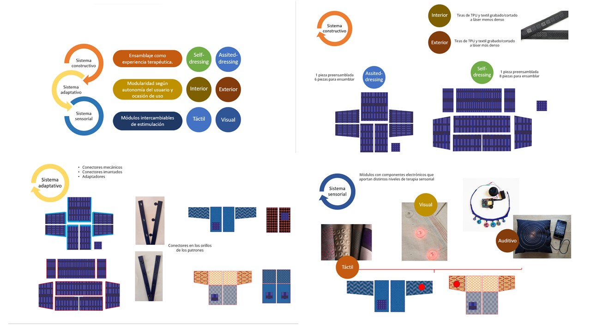

#### Indumentaria

Para realizar la estructura de la prenda, se empleó el programa CLO 3D. Este software permite desarrolla un avatar con las medidas del usuario y realizar los patrones para poder ubicarlo en el avatar virtual, probar el corte y las uniones sin necesitar de hacer muestras físicas.

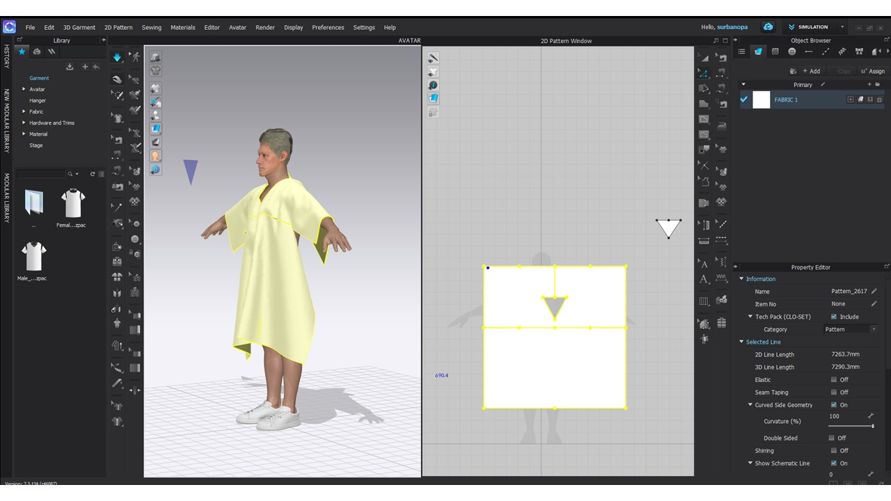

El patrón fue principalmente cuadrangular y se fue probando sobre el avatar digital hasta llegar a unas medidas adecuadas. Los patrones se exportan en un formato vectorial para poder plottear o cortar las telas.

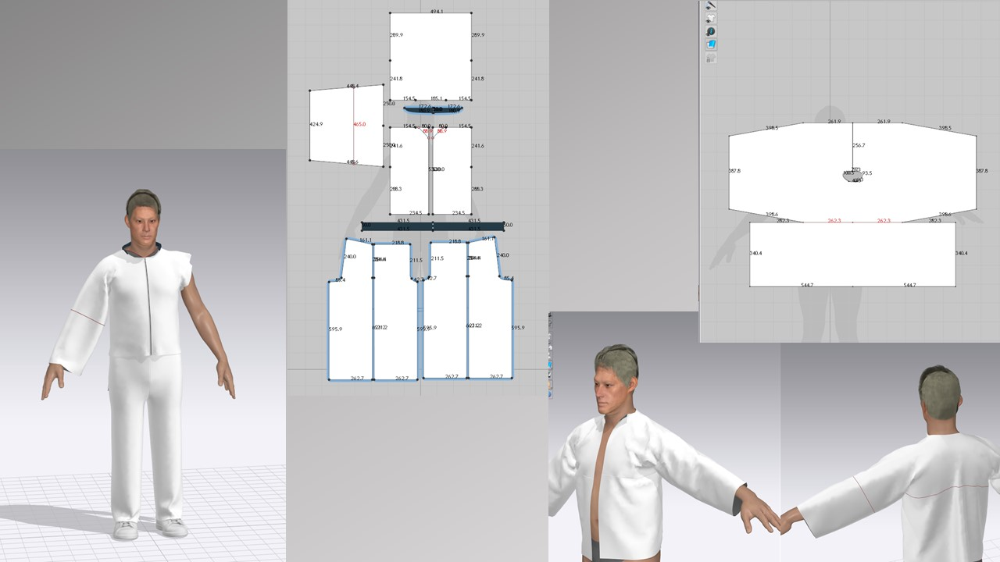

Siguiendo los lineamientos del primer nivel del sistema, se consideró una estructura modular alineada al objetivo del zero waste, para poder optimizar el nesting. La figura más óptima fue la de un hexágono, debido a que cubre más superficie con menos material que cualquier otra forma regular.

La distribución de los módulos se realizó en Rhinoceros Grasshoper. Con la cantidad y distribución determinadas, se procedió a realizar la edición del módulo final en Adobe Illustrator, pensando en una aplicación con fabricación sustractiva, como en otra aditiva.

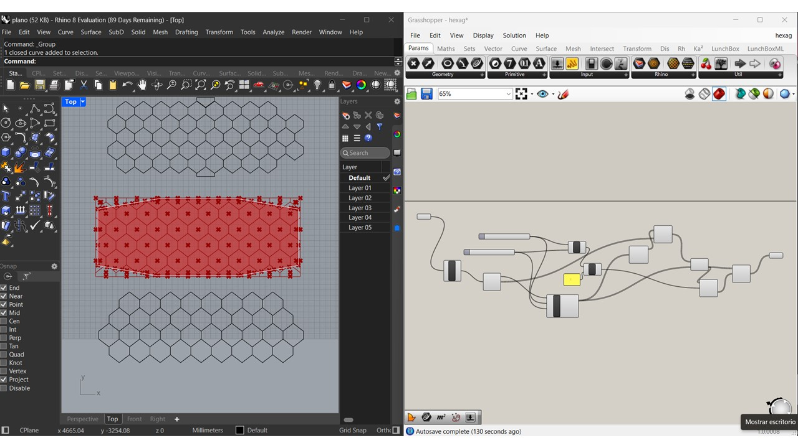

 Se plantearon 3 módulos de distintas medidas para poder realizar pruebas de corte y verificar el ensamble de modularidad, así como la resistencia de la unión. De estas pruebas se obtuvo un módulo aceptable en cuanto al tamaño y ensamble.

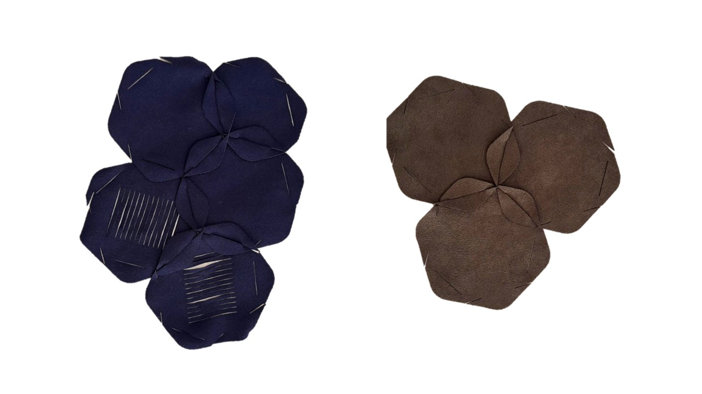

Es aquí donde se evidencio que si bien toda la estructura lograba ensamblarse de manera modular y óptima, al momento de realizar una movimiento de flexión, ciertos módulos se separaban. Si bien se podía variar el textil usado (en este caso se empleó un suede) seguían existiendo zonas que eran propensas a abrirse y causar incomodidad. 

Se exploraron también estas uniones con tpu transparente en distintos grosores, pero el resultado si bien era más firme y resistia mejor el ensamble, también se volvía demasiado rígido, restando comodidad. 

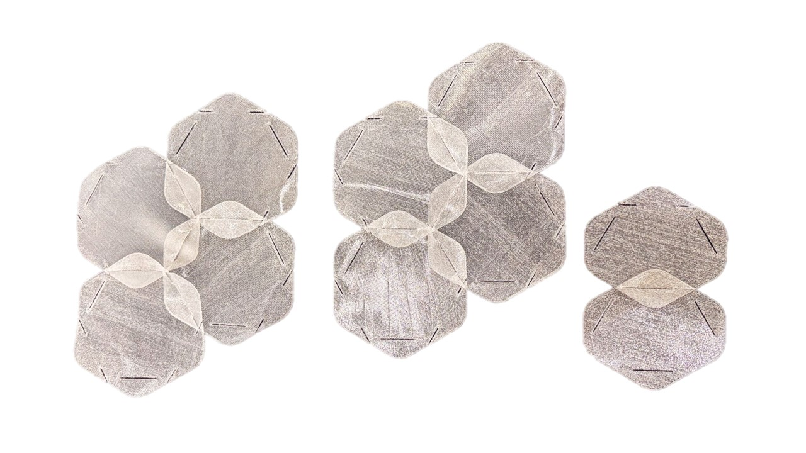

#### Módulos
En este punto se decidió priorizar el desarrollo del módulo como unidad de estímulo terapeútico, considerando cuales serían las dinámicas de uso, conservando la forma hexagonal elegida, sobre la estructura de la prenda anteriormente mapeada en una extensión de tela completa, y ya no constituida por pequeños módulos.

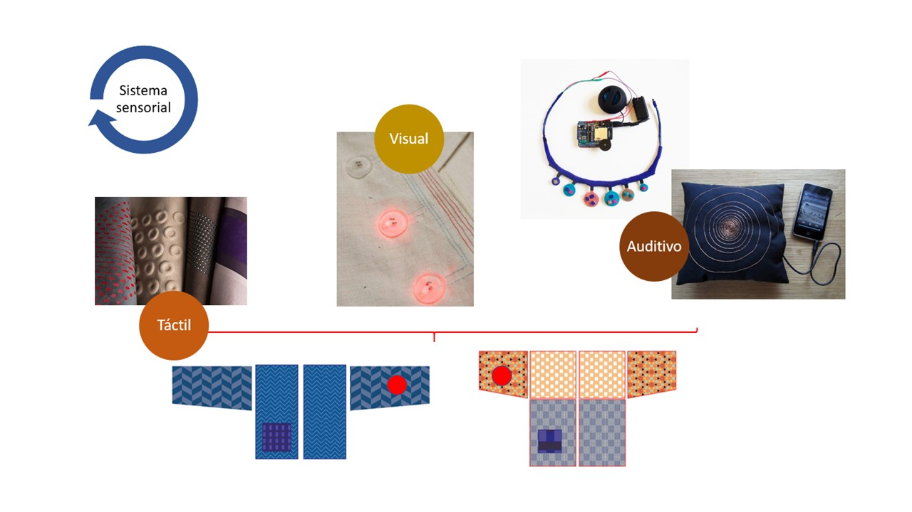

Se mapeo una primera rutina con 8 módulos, cada uno apelando a un estímulo y relacionado a una materialidad en particular. Se consideró una función esperada y una posible indicación sonora para cada uno. 

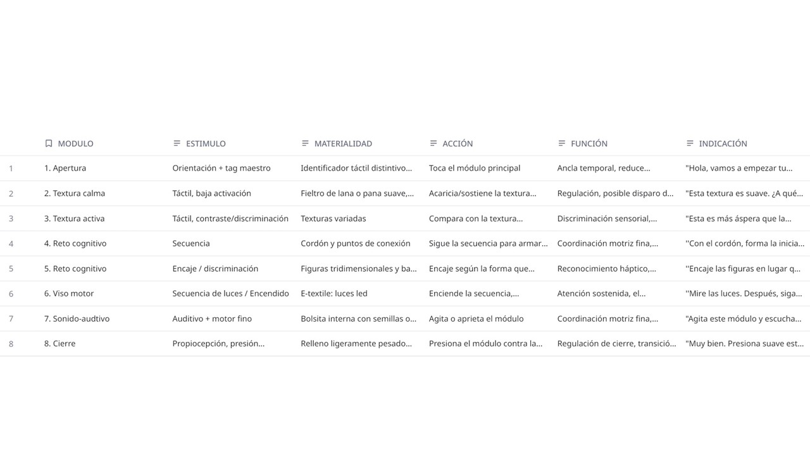

Para la primera fase del desarrollo, comencé desarrollando los módulos 2,3,4 y 5. Los aspectos formales se definieron según referencias de objetos lúdicos relacionados con la metodológía montesoria, apelando tanto a un estímulo congnitivo como sensorial.

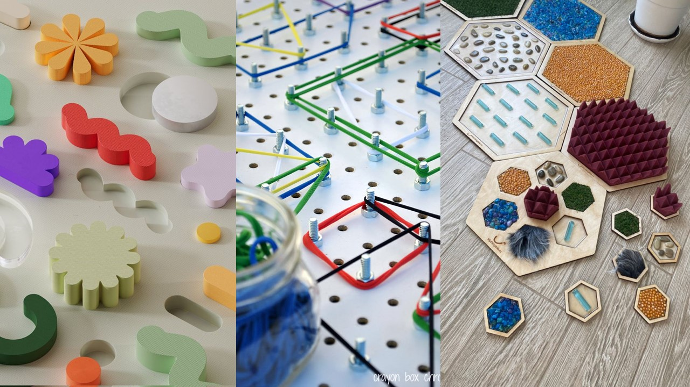

En el programa de Fusion 360, se realizó el diseño de cada módulo. Un módulo estaría vinculado a estimulos tactiles, por lo que se concibio como un marco que permita acoplar distintos tipos de texturas. Los módulos 4 y 5, tendrían diseños más tridimensionales, tanto como estímulos sensoriales como cognitivos (juego de encajes y rutas). 

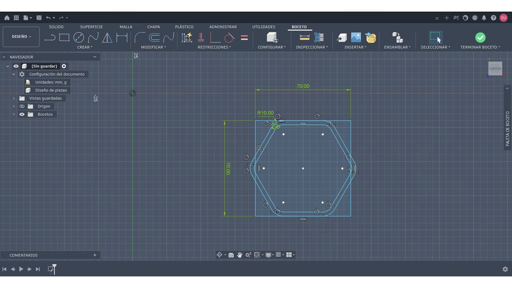

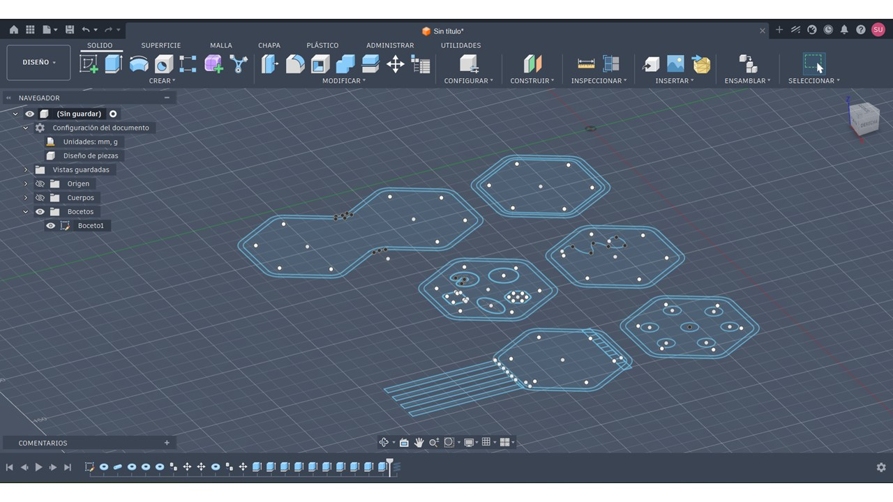

Las zonas vacias estarían ''llenas'' de un textil, más exactamente un tul (textil aptó para la aplicación esperada). También se realizó un módulo de prueba de dos cuerpos y un módulo con mecanismo de broches. Los cuerpos se exportaron en STL para configurarlo en el slicer
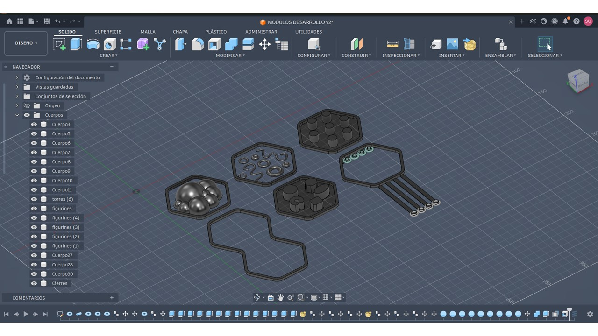

Considerando la inserción del textil, se programó una pausa en la segunda capa y un primer lote impreso en PLA para evaluar tamaño e interacción. 

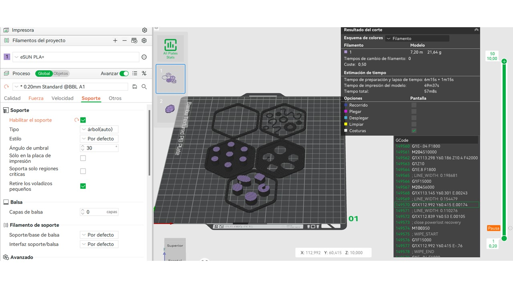

El tul resiste las formas y genera una estructura interesante. Los marcos también funcionan bien y además se observó que se pueden acoplar uno sobre otro, lo que facilitaría su guardado.

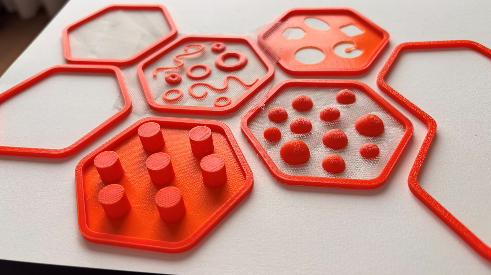

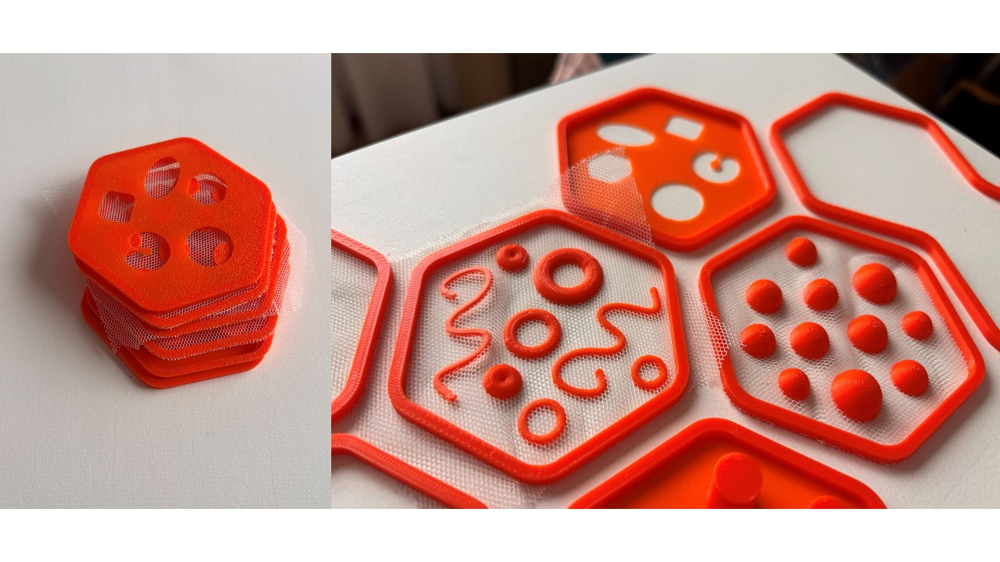

Se continuó con un segundo lote en TPU, por su flexibilidad para adaptarse al volumen del cuerpo y naturaleza del textil.

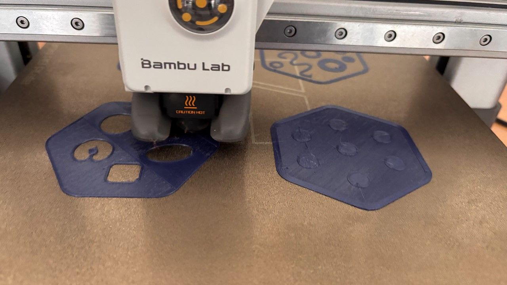

De las pruebas resultantes, el módulo de postes tenía una base que se separaba, apesar de que en el PLA si habia salido bien. al parecer el TPU no logro acoplarse bien entre sí

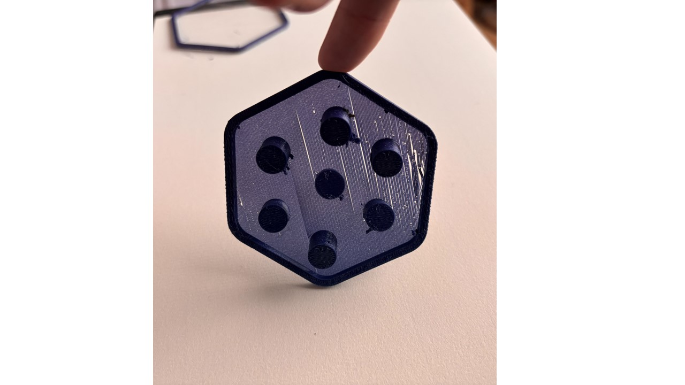

Se probó también otros tipos de tules, considerando que acoplandose a la prenda, este color podía generar contraste. La técnica incluye fijar el textil en la pausa programada para que después la impresora continue depositando el filamento. 

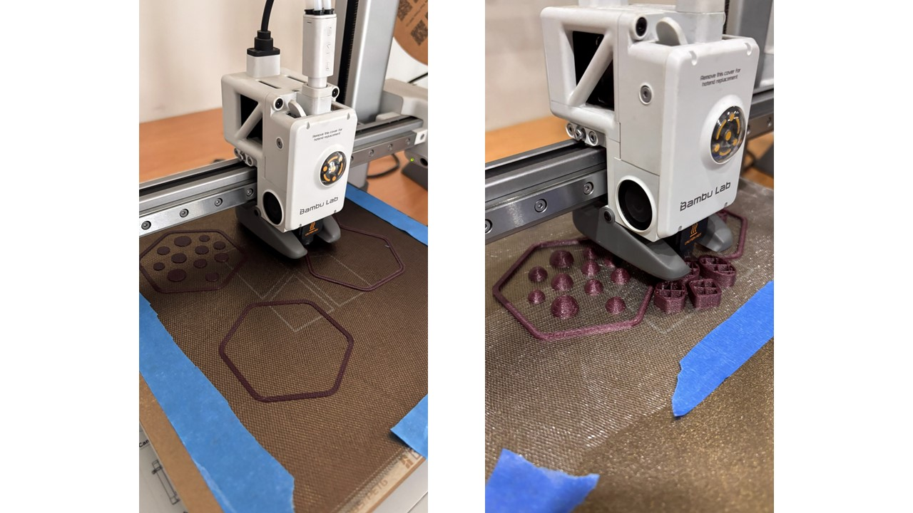

Los módulos resultantes que tenían figuras tridimensional de casi 1 cm de altura, estaban bastante fijas a la cama de impresión y el tul usado (tul cristal) se rompia con facilidad al momento de sacarlo. Si bien es posible que se requiera que enfríe completamente, para el momento de las pruebas esta fue igual una observación interesante para considerar el uso de este material

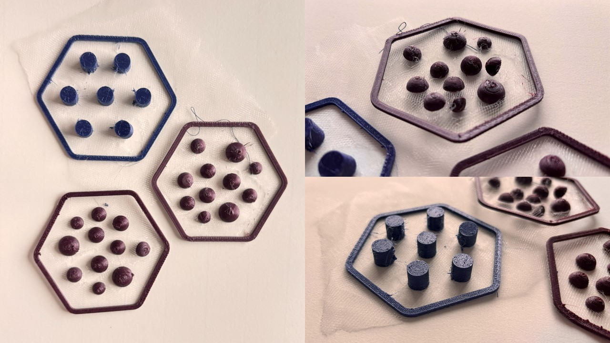

Como estrategia de encaje de los módulos con la prenda, se optó por un encaje a presión. La tolerancia entre el marco y el módulo fue de 0.15mm, también se realizaron pruebas para determinar un encaje adecuado.

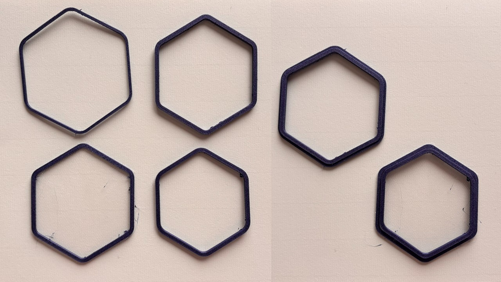

El lote final quedó finalmente con esta disposición:
* Módulos de marco (estos van con tul para poder costurarlo en la prenda)
* Módulos base (para acoplarles texturas diversas de textiles recuperados)
* Módulo de puzzle (que va sin tela)
* Módulo de texturas tridimensionales (que también requieren tela como base)

La secuencia concluyó con 2 módulos base con textiles costurados, un módulo puzzle y otro de ruta que constituyen los módulos cognitivos, y 2 módulos más de textura tridimensional.

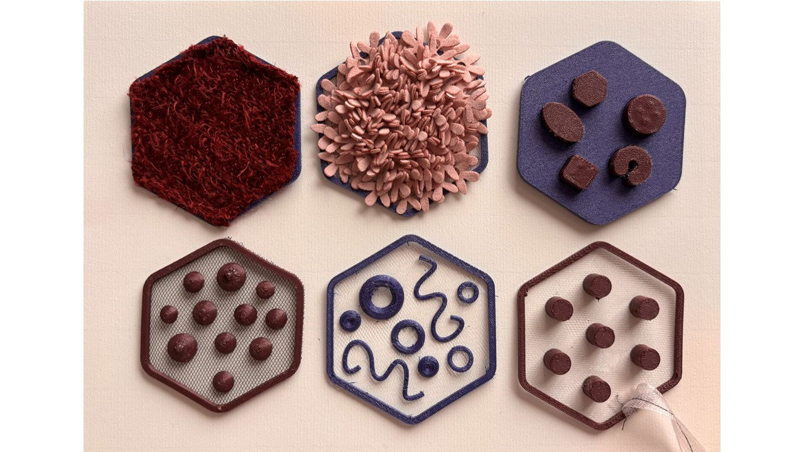

Los recortes de textil se costuraron por el reverso del tul, facilitando este acople y permitiendo incluir diversos textiles. Los módulos que tienen texturas sensoriales también aprovechan esta flexibilidad extra.

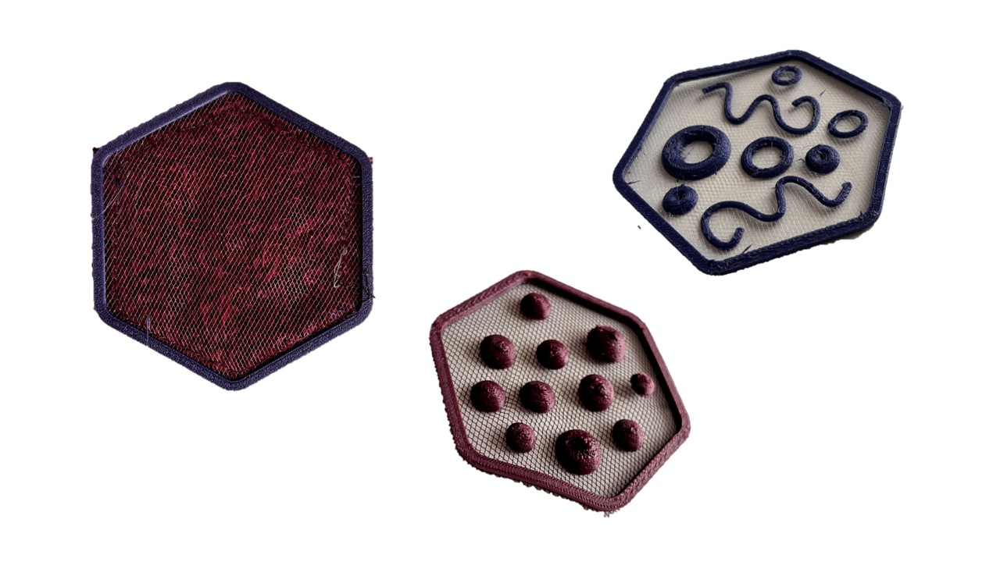

Los módulos cognitivo fueron un módulo puzzle con 5 piezas para sacar y colocar con un encaje justo, ni muy suelto ni muy exacto para facilitar la interacción. El módulo de ruta tiene acoplada una cuerda para poder seguir una ruta alrededor de los postes.

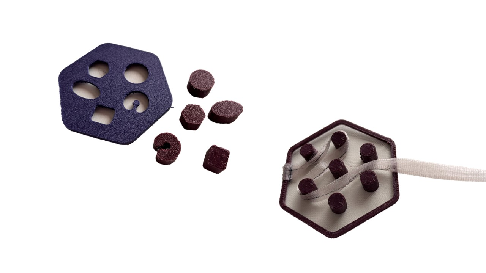

#### Ensamble final 

Tal como se mencionó lineas arriba, aprovechando el patrón digital, se cortó la tela con una cortadora láser para después costurar la zona de los hombros y dejando las mangas con un acople de broches en la zona de la siza. También se incluyó un bolsillo transparente que sirva como espacio de guardado para los módulos y así fuera fácil ubicarlos.

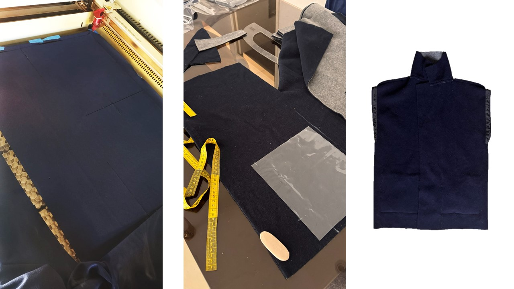

Gracias a la inserción de la tela en el módulo del marco, la costura se logro realizar alrededor de este para fijarla en las zonas de la manga en el antebrazo. Según la extensión de la manga, 2 hexagonos fueron colocados en cada antebrazo, apelando a que la interacción fuera bilateral, respondiendo a exigencias de terapias ocupacionales que inciden en la activación de ambos hemisferios del cerebro.

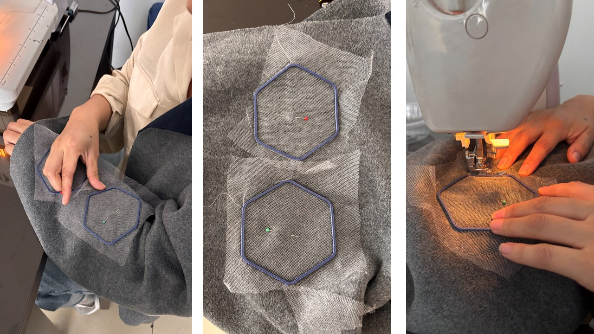

#### Resultado

Se comprobó la interacción con las piezas modulares además de los encajes entre los distintos módulos. 

El textil del marco no se llega a mimetizar tanto con el fondo, pero no resulta molesto, también se podría considerar solo conservar el marco despues de costurarlo

Sobre el indumento, la tela es de tipo polar, pero también se podría optar por otro tipo de textil. El delantero es cruzado y las mangas se pueden desacoplar según lo decida el usuario.

_Archivos para descargar_

