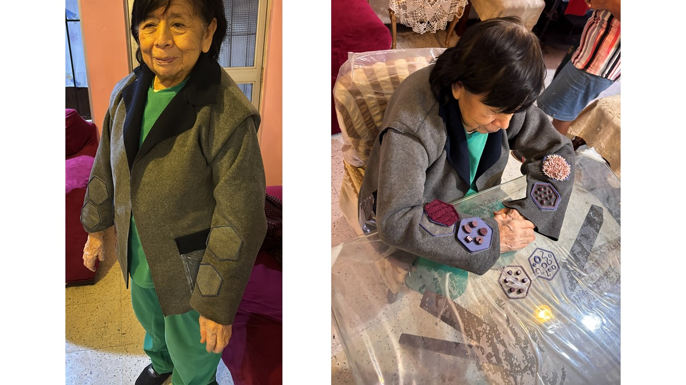
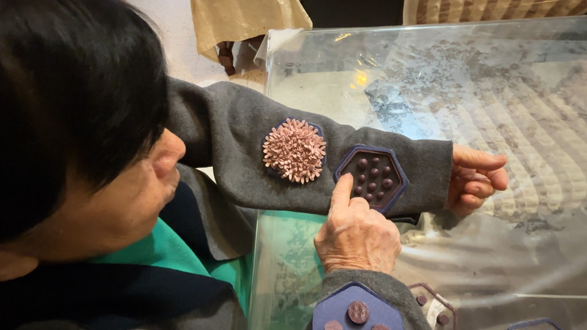
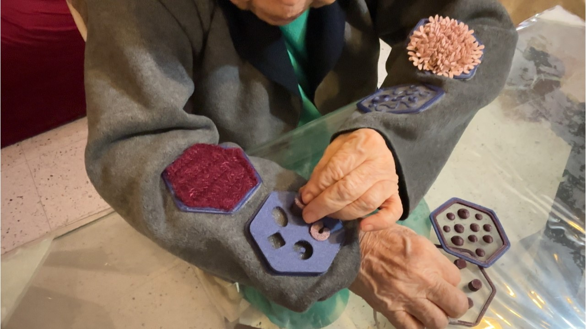
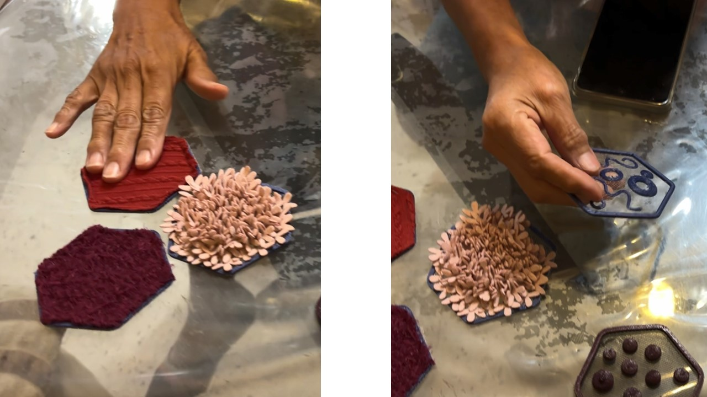

### VALIDACION 

Para una primera validación, se realizó una prueba con Sara, de 85 años. 
La prenda le quedaba cómoda, ni muy holgada ni muy suelta. Se observó que las mangas podían resultar un poco largas. Para poder realizar la interacción, se ubico en una mesa, donde podía apoyar los brazos con comodidad.

Las texturas le llamaron la atención y realizo un recorrido de manera intuitiva. Había reminiscencia con ciertas texturas, sobretodo las textiles. Si se observó que una breve instrucción ayudaba a tener una noción de inicio sobre que realizar. 

La que más le llamó la atención fue el módulo puzzle. Las piezas encajaban con facilidad y si requerían que se deba concentrar, agudizando la vista y practicando la motrocidad fina.

También se validó los módulos con una terapista ocupacional. Le pareció interesante las texturas tridimensionales, mientras que las textiles, consideró que debían tener un poco más de grosor, que puedan ser ''apretables''.

También planteo que pueda haber una rutina ''de modelo'' para que el adulto mayor se pueda familiarizar, y después pueda personalizar según sus propios intereses y tiempos.

#### Comentarios generales

_TERAPISTA_

‘’Colores pueden ser más saturados para ayudar a la identificación de los módulos’’

‘’ La prenda puede ser adaptable según la talla’’

‘’Módulos pueden tener la reminiscencia a gustos personales o algo relacionado a la persona, eso hará que sientan más familiaridad, apego y por lo tanto mayor aceptación’’

''El bolsillo transparente ayuda a que ellos sepan que hay dentro, además que es práctico para que no se les pierda''

‘’La bilateralidad ayuda a que los dos hemisferios trabajen  cuando se cruzan las manos’’

‘’Me parece importante que la persona no lo vea como una terapia porque a veces no quieren colaborar si escuchan la palabra terapia o se les da algún objeto relacionado a ellos’’

_SARA_

‘’Yo lo podría usar en la mañana, después de tomar desayuno o también puede ser en las tardes , que hay mas tiempo’’

‘’Ayuda a trabajar la inteligencia de la persona, que se da cuenta de lo que tiene, de lo que está haciendo’’

‘’Siguiendo estos pasos yo tengo un poco más de visión abierta en todo sentido. Me daria más seguridad’’

#### Próximos pasos

#####  Versión2.0
Para una segunda versión, mucho más completa, tomando en cuenta las observaciones de la prueba de validación. se consideró:

> * Incorporar el módulo e-textil considerado en la tabla de la rutina 1, brindando un nuevo estímulo

> * Guía NFC, validada en la prueba, siendo necesaria para que el adulto pueda tener el comando de voz con las indicaciones de la rutina planreada como una guía inicial

> * Alternativas de encaje: si bien el encaje a presión funciona, para módulos tridimensionales sin base de tela (como el módulo puzzle) puede resultar insuficiente, por lo que se debe realizar una prueba con imanes o velcros

> * Exploración de materiales: Se pueden evaluar otras texturas para los módulos, como más propioceptivas, empleando silicona o biomateriales en formas tridimensionales. Así también, evaluar otros tipos de TPU, tanto en color como en dureza (Shore). Para la prenda, evaluar otros tipos de textiles para ocasiones como el verano por ejemplo.

#####  Corto plazo

> Validación clínica y en otros contextos

Producir una secuencia completa y observar su uso en contexto domiciliario, en coordinación con profesionales de geriatría para una evaluación de la pertinencia clínica de la secuencia y la carga cognitiva real de cada interacción. También, resulta interesante plantearla en un entorno más comunitario, fomentando por ejemplo, el intercambio de módulos.

> Validación de accesibilidad

Confirmar la replicabilidad del sistema en contextos de producción distribuida y contextos con y sin acceso a tecnología de fabricación digital o acceso a internet (para validar una versión análoga de las instrucciones del comando de voz del NFC)

#####  Mediano plazo

> Biblioteca de módulos

La lógica modular intercambiable permite desarrollar módulos adicionales para distintos tipos y niveles de estimulación, de forma colaborativa. Pueden ser incluso módulos ultrapersonalizados (con figuras que sólo el usuario pueda identificar), módulos temáticos (según el contexto/territorio). 

> Adaptación a otros perfiles de usuario

Lós módulos se pueden desarrollar según condiciones específicas y ampliar el público objetivo (niños y/O adultos con habilidades disminuidas  por ejemplo)

#####  Largo plazo

> Interconexión

Sistema como herramienta complementaria a programas de atención domiciliaria, centros de día o residencias de adultos mayores, producido localmente por los propios centros o por redes de voluntariado con acceso a fabricación digital

> Seguimiento

Desarrollar indicadores de adherencia y progresión —frecuencia de uso registrada por los tags NFC- que permitan ver la evolución en la capacidad de completar la secuencia de forma autónoma, dando datos útiles a cuidadores o médicos asignados al monitoreo del paciente, que pueda complementar diagnósticos