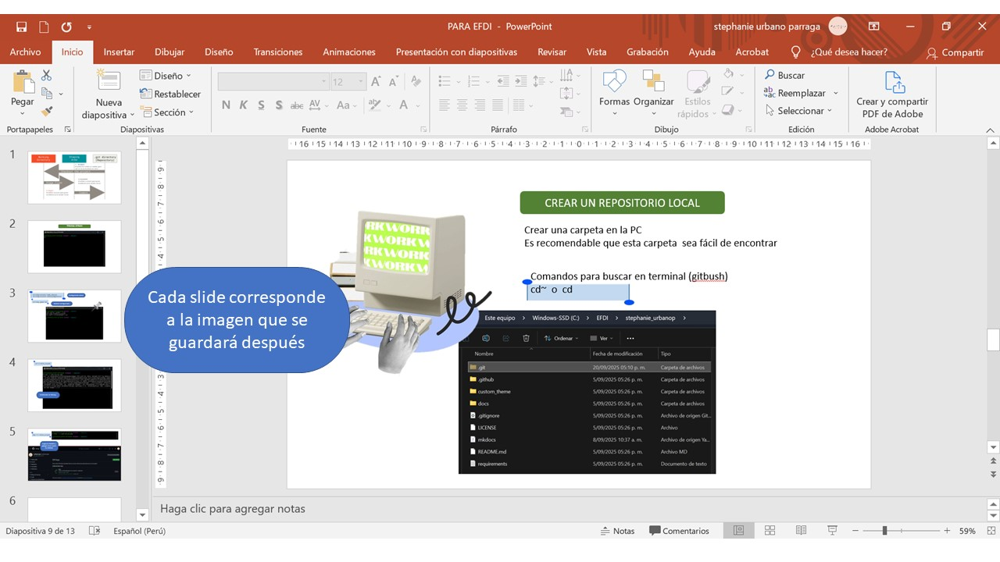

---
hide:
    - toc
---

# MT01

### Experiencia Previa

Anteriormente, en la formación de Fabriacademy, tuve la oportunidad de familiarizarme con el proceso de creación a través de Github y Visual Studio Code. La tarea era similar, pues debía crear una página para poder registrar el proceso. En cierta forma esto me ayudo a interiorizar lo visto en las primeras sesiones y se me hizo más llevadera la información. Puede ser el caso que para quién ve por primera vez temas de programación y lenguaje HTML, llega a ser un poco intimidante, hasta que continuas adentrándote con el proceso…

### La base
Comenzamos con **Git** como software de control de versiones. Su propósito es llevar registro de los cambios en archivos de computadora incluyendo coordinar el trabajo que varias personas realizan sobre archivos compartidos en un repositorio de código.

**Github** es un repositorio en donde los usuarios pueden almacenar el código de sus aplicaciones, ya sea de forma pública, privada o a través de una organización.  

Al instalar _Git Bash_, se obtiene herramientas de línea de comandos para que Git funcione correctamente en Windows, permitiendo así realizar todas las operaciones del control de versiones como clonar repositorios, confirmar cambios, enviar y recibir datos. Además, es necesario ya que Windows tiene una propia línea de comandos (CMD) que no incluye los comandos usados en Git. En mi caso lo tenía instalado para comenzar con la vinculación.

En este punto, recurrí al apoyo del mentor en el laboratorio de ESAN, Jorge Valerio, con quién trabajé también el Fabriacademy. Él está bastante familiarizado con el proceso, ciertamente diría que, por su práctica profesional, muchos comandos y el paso a paso los sabe de memoria. Me fue guiando en el proceso para poder crear una nueva página. Casi al final de la vinculación, recordé que me hacía falta todo el registro y capturas de lo que habiamos desarrollado.
Así que recordar de nuevo fue parte del proceso. Es decir, para efectos de material de la documentación, hice un viaje en retrospectiva de la secuencia de pasos. Esto también me ayudó a apuntar los puntos clave que se realizaron.

#### La llave

El paso de la vinculación de la llave lo resalto porque permite una conexión rápida, segura. Me preguntaba porque es tan compleja y tiene sentido pues hace que sean bastante difíciles de descrifrar, por lo que brinda mayor seguridad que contraseñas tradicionales durante la interacción de servidores y ejecución de comandos. En mi caso, debido a lo realizado para el Fabriacademy, ya contaba con una SSH key, por lo que tuve que buscarla y vincularla en Github.

En la cuenta se crea un fork del template para usar en el repositorio propio. Es decir ya no empezamos de cero, pero si hay que realizar las configuraciones respectivas y posterior personalización, que se puede realizar directamente también en esa página.

Apartir de este repositorio se requiere hacer una clonación a la carpeta local (pc) Esto permitirá hacer configuraciones de forma más accesible y con mayores opciones para distintos cambios.

#### Tres elementos

La idea es hacer el trabajo más fluido, por lo que aquí viene la parte de usar **Visual Studio Code**, editor sugerido. También ya lo tenía instalado y al igual que en la documentación anterior que realice, Visual Studio Code se convirtió en mi espacio de trabajo, el lugar donde edito y hago el control de versiones. Para esto es necesario complementarlo con **Markdown y Python**. El primero para poder ver el código de forma visual /_bastante necesario ya que agiliza el proceso antes de actualizar el sitio_. Mientras que la segunda extensión *Pyhton* actúa como la base sobre la que se ejecuta MkDocs, ya que este generador de sitios está construido en dicho lenguaje y requiere de él para instalar sus librerías y ejecutar los comandos de compilación. 

Entonces, a medida que vamos realizando los cambios, debemos seguir la siguiente secuencia para poder sincronizar dichas modicaciones en nuestro repositorio web. 

#### Detrás de cámaras

Recuerdo que para efectos de la documentación previa que realice, hubo cierta facilidad para el aspecto de la edición pues todo estaba con una base para modificar. Entonces identifique combinaciones clave que ya usaba de texto plano, que es el lenguaje de Markdown, y sus diferentes combinaciones con símbolos como * - # entre otros.  
>Para esta sección me sirvió mucho [GitHub Pages](https://docs.github.com/es/get-started/writing-on-github/getting-started-with-writing-and-formatting-on-github/basic-writing-and-formatting-syntax) y revisar la información de la página de [Markdown](https://www.markdowntutorial.com/)

Aún me falta profundizar y poner en práctica una sugerencia de Jorge para editar el tema y los colores, entre otras extensiones que podrían ser de utilidad.

Por otro lado, me sirvio tener un bitácora digital en Power Point, para registrar screens y notas, que luego al guardar en bloque de imágenes, la numeración ayudó a insertarlas de manera más efectiva. Además de quedar con el peso del archivo y tamaño apropiados. También hacer alguna edición en la diapositiva que correspone, guardar y automaticamente se actualiza también en el vínculo que coloqué previamente.

Me sirve también tener el texto aparte, en Word por ejemplo, para copiar y pegar en el editor posteriormente. Este y el punto anterior son recursos personales que facilitan mi proceso.

 De esta forma, completé también las secciones iniciales que corresponden a este entregable _(como about me)_ Mientras que la sección incial, se editó en el apartado de _mkdocs.yml_

### Reflexiones
 De por si este proceso es bastante iterativo, tedioso al inicio, con muchas conexiones, vínculos y comandos. Pero que terminan vislumbrando que, más allá de las herramientas, lo interesante es integrarlas. Entiendo que este ejercicio no solo es redactar el paso a paso, sino a entender un flujo de trabajo, donde cada parte cumple un rol esencial para que el resultado final cobre sentido.

 _Lo que estamos leyendo es parte, de ese resultado, que a su vez, es el proceso._