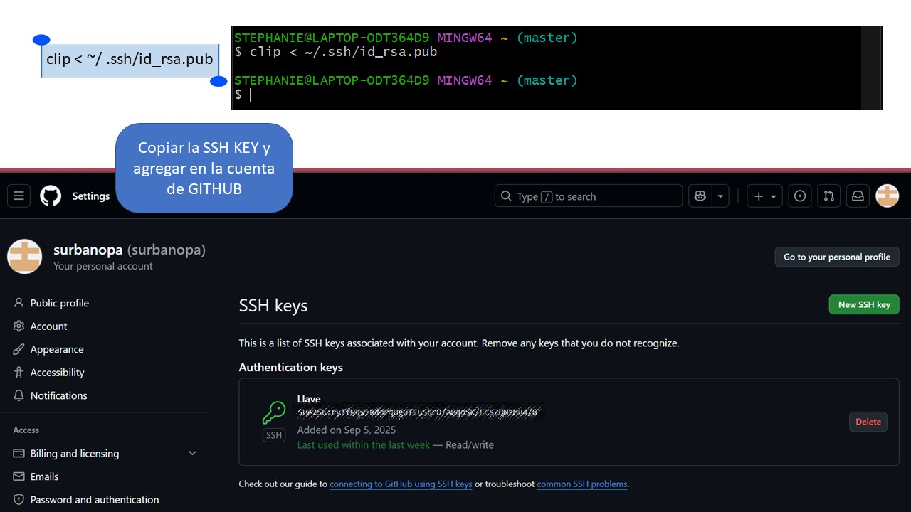

---
hide:
    - toc
---

# MT01

## Experiencia Previa

Anteriormente, en la formación de Fabriacademy, tuve la oportunidad previa de familiarizarme con el proceso de creación a través de Github y Visual Studio Code. La tarea era similar, pues debía crear una página para poder registrar el proceso. En cierta forma esto me ayudo a interiorizar lo visto en las primeras sesiones y se me hizo más llevadera la información. Puede ser el caso que para quién ve por primera vez temas de programación y lenguaje HTML, llega a ser un poco intimidante, hasta que continuas adentrándote con el proceso…

## El proceso
Comenzamos con _*Git*_ como software de control de versiones. Su propósito es llevar registro de los cambios en archivos de computadora incluyendo coordinar el trabajo que varias personas realizan sobre archivos compartidos en un repositorio de código.

Github es un repositorio en donde los usuarios pueden almacenar el código de sus aplicaciones, ya sea de forma pública, privada o a través de una organización.  

Al instalar Git Bash, se obtiene herramientas de línea de comandos para que Git funcione correctamente en Windows, permitiendo así realizar todas las operaciones del control de versiones como clonar repositorios, confirmar cambios, enviar y recibir datos. Además, es necesario ya que Windows tiene una propia línea de comandos (CMD) que no incluye los comandos usados en Git.
En mi caso lo tenía instalado para comenzar con la vinculación

En este punto, recurrí al apoyo del mentor en el laboratorio de ESAN, Jorge Valerio, con quién trabajé también el Fabriacademy. Él está bastante familiarizado con el proceso, ciertamente diría que, por su práctica profesional, muchos comandos y el paso a paso los sabe de memoria. Me fue guiando en el proceso para poder crear una nueva página. Casi al final de la vinculación, recordé que me hacía falta todo el registro y capturas de lo que habiamos desarrollado.
Así que recordar de nuevo fue parte del proceso. Es decir, para la documentación, hice un viaje en retrospectiva de la secuencia de pasos. Esto también me ayudó a apuntar los comandos clave que se emplearon y quise presentarlo en un formato amigable y bastante visual, que me sirva de recordación, pero también, para entender el porqué de lo que estoy haciendo. De por si este proceso es más de idas y venidas, como cuando validas una idea y toca volver atrás para retomar algún punto nuevamente. 

