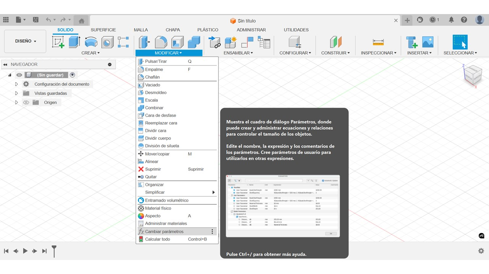
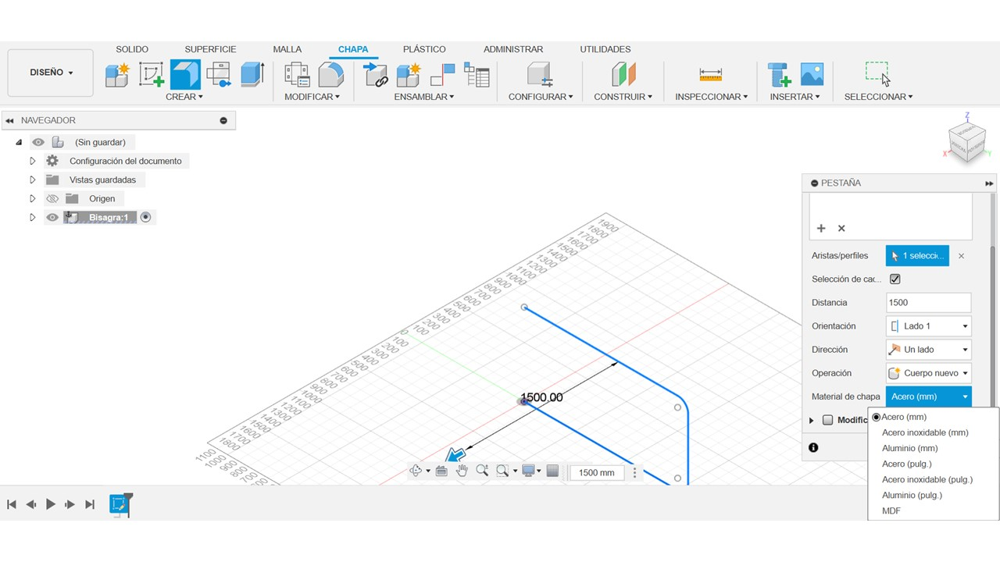
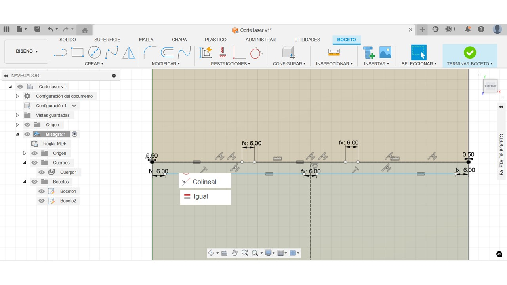
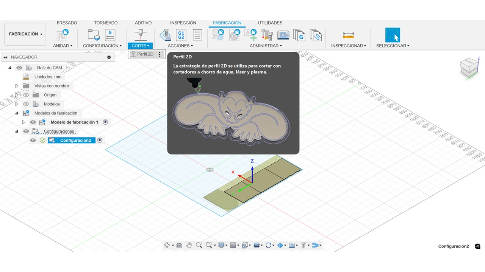
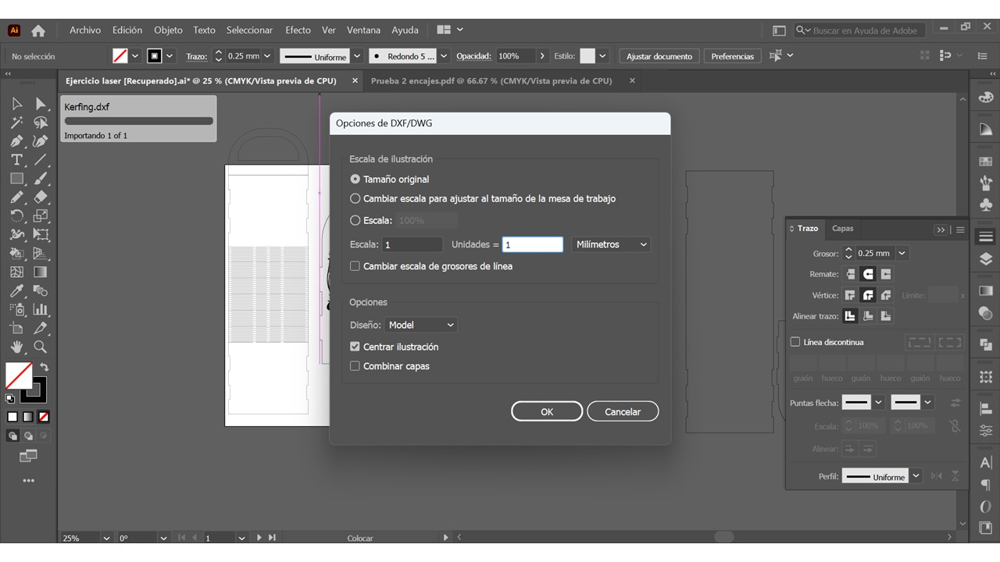
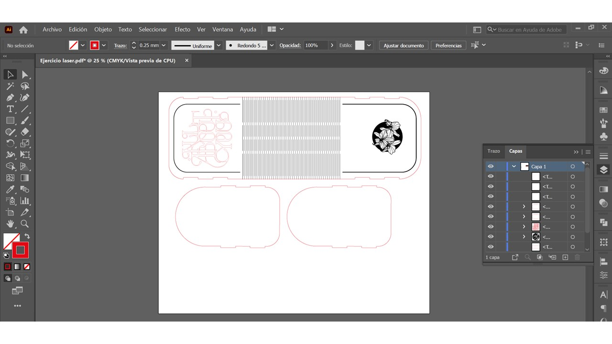

## Corte láser y plotter de corte

_Para esta asignación, considerando que empezamos la exploración con tecnologías de manufactura sustractiva, me parecio interesante resaltar este concepto:_ 

##### El diseño se ve determinado por la forma en la que se va a fabricar y a su vez, el proceso de manufactura se ve determinado por la forma en la que se pensó el diseño. 

Cuando hablamos de la materialización de archivos digitales, es necesario tener en cuenta con qué y para qué, ya que determinará una serie de acciones que darán por resultado un uso eficiente del material y correcto uso de la máquina. 

###### Conceptos para recordar

Para 1960, la tecnología de *corte láser* iniciada por Albert Einstein, sentó sus bases y siguió desarrollándose siendo al día de hoy, una de las tecnologías más ampliamente insertadas tanto en un ámbito industrial, como en fablabs, empresas pequeñas y usuarios. De igual forma la tecnología de *plotter de corte*, donde Remington - Rand para los años 60 desarrolló un avance para la época donde se vivía el auge de la _**automatización y precisión**_ en diversos procesos. Esta tecnología se convirtió en un elemento clave en talleres de diseño, especialmente gráfico, y producción en todo el mundo.

###### Funcionamiento

El corte láser podemos definirlo como un proceso de _**mecanizado térmico**_ donde el material se desgasta por el haz de rayo láser, mientras que el plotter de corte **mecanizado mecánico** a través de una sistema de cuchilla móvil que se desplaza sobre una lámina sujeta por rodillos.
Para el corte láser, podemos usar materiales hasta de 6mm de espesor, mientras que el plotter de corte, trabaja láminas de materiales que varían hasta 1mm.

En el caso del corte láser, como parámetros importantes que siempre estarán presentes, a pesar de que cambiemos de máquina (ya que la interfaz varia según la marca de la maquina) son _**potencia y velocidad**_. Según la operación a realizar y los materiales a usar, los valores de estos parámetros van a variar. También dependerá del modelo de la máquina.

Para efectos prácticos, me parece interesante considerar elaborar una tabla de test de parámetros, donde podremos trabajar con mayor precisión estos valores en una muestra previa. O si el lugar de trabajo cuenta con esta guía, será más rápido poder usar esos parámetros que ya están registrados.

###### Operaciones

El láser puede realizar corte, grabado y raster. La diferencia entre estos procesos radica en la profundidad en la que el láser va a penetrar el material. En el corte, el láser va a atravesar el material por completo pero en los otros procesos el desgaste es gradual.

 
Para poder diferenciar un proceso de otro en un mismo archivo, nos valemos de los colores de línea y los rellenos de estas figuras, esto en la preparación del archivo. Para _corte y grabado_ usamos archivos vectoriales, mientras que para _raster_ podemos usar archivos vectoriales o bitmap. Cuando se pase al software del láser, se debe configurar los parámetros según los colores previamente seleccionados.

###### Consideraciones

Como recurso de fabricación para encajes o ensambles, debemos considerar la **holgura** según el tipo de ajuste que se desea tener en esta pieza: ceñido, normal o holgado. Esta medida adicional es la que se le debe añadir a la pieza durante el diseño, para que luego al realizar el encaje, estas piezas queden firmes.Tener en consideración que este valor debe considerar **tolerancia** que es la variación máxima permitida en las dimensiones y forma de una pieza cortada con respecto a su diseño original. Esto varía según la máquina y tipo de tecnología.

#### Proceso de diseño y fabricación
##### Preparación de archivos

*Diseño vectorial*

El corte láser opera sobre **geometrías bidimensionales** derivadas de archivos vectoriales. Personalmente siempre he preparado mis archivos en un software de diseño vectorial 2D, como _Adobe Illustrator_. Sin embargo, los software de modelado 3D permiten exportar también vistas 2D por lo cual pueden ser de gran ayuda por ejemplo, a la hora de trabajar con curvas, varias piezas, y poder visualizar el modelado armado.
Para este ejercicio, se sugirió el uso de _Fusion 360_, considerando una ventaja interesante para la automatización que fue, el uso de **parámetros**, valores que establecemos y podemos cambiar posteriormente. Esto facilita la actualización de datos y cambios en el modelo. 

Otra función que probé fue la de modelado a través de una chapa metálica. Configurando el material a trabajar (en este caso mdf), se puede configurar una chapa que podrá doblarse y desdoblarse, marcando el área que corresponde a dicho doblez.

_**Kerf bending**_

Es en este espacio donde se aplica la técnica de **kerfing**, que son patrones de corte que permitirán doblar un material rígido y plano.

Se definieron las dimensiones de estos espacios que tienen relación con el grosor del material y donde también se emplearon los parámetros.

Con la función de patrón rectangular se realizo la distribución de dichas líneas para un resultado más rápido y preciso.

Todo lo anterior fue realizado a modo de prueba, ya que anteriormente no había usado estas funciones. Ya pensando en una pieza para la materialización  - a modo de prototipo-, probé generando una cara donde coloque los encajes.

Luego se aplico la opción de chapa metálica, obteniendo la distancia correspondiente a la curva con mayor precisión luego de usar la función de desplegado.

_**Nesting**_

Cuando ya tenemos las piezas listas, el programa nos permite generar una disposición eficiente de estas piezas en el espacio o material que se va a trabajar. 
Igualmente, existen otros programas online y desktop como *deepnest y fatlab* para poder generar una organización de las piezas. Esta función me parece especialmente útil cuando se trata de un lote grande de piezas para cortar.

Las caras del modelado se proyectaron en el espacio donde se va a organizar las piezas. Por otro lado, también podemos exportar el boceto en formato DXF y luego acomodar todo en el programa de diseño vectorial.

Dentro de los tutoriales que encontré para guiarme de estas funciones, había una opción de perfil 2D, igual orientada a preparar las piezas para el corte. No la pude explorar tanto, pero me pareció interesante, y refuerza la esencia de Fusion 360 como programa orientado a la fabricación, por lo que muchas funciones que tiene son realmente útiles.

_**Programa vectorial**_

En el espacio de trabajo de Adobe Illustrator, hay que activar la opción de importación, para poder ajustar como se van a importar archivos que vienen de otros programas. Esto es porque el programa hace un escalado automático y las medidas terminan por no coincidir.

Además, aproveche en poder editar los colores de línea para poder diferenciar entre las distintas operaciones que se debían realizar en la pieza.

Para mandar a cortar, fue necesario exportar el archivo en formato PDF, pero también se podría enviar en DXF

##### Corte de archivos

El laboratorio del fablab ESAN usa una máquina de marca china, que opera a través de _Coreldraw_ con un plugging desde el cuál se pueden mandar los cortes. Entonces se debe abrir el archivo a cortar y empezar a mandar parte por parte según la operación a realizar. Es decir, primero los grabados y luego las líneas de corte.

Para esto seleccionamos las líneas y luego en la esquina superior derecha marcamos según la operación a realizar: corte o grabado. La potencia se debe configurar directamente en la máquina de corte láser, mientras que la velocidad en la ventana emergente.

Entonces para los cortes usamos potencia 75 velocidad 20, mientras para el grabado potencia 20 y velocidad 75.
Además, debido al área de corte de la máquina (en teoría solo cortaba hasta 55 x 40) se realizaron unos cortes previos de prueba para verificar la posición. Sucede que esta máquina no realiza un movimento del cabezal previo, por lo que habia que tener cuidado con la ubicación del material para la pieza.

###### Resultados

###### Algunas reflexiones

Lo que más me costó fue agarrarle el truco a los parámetros en Fusion. De echo los mostrados serían de lo más sencillo de aplicar, ya que realmente su uso mejora significativamente el desarrollo posterior del flujo de trabajo y variaciones (que las hay) en el diseño. Por ejemplo, cuando se iba a mandar a cortar, el tema del tamaño fue una limitante, ya que al diseño se le habían agregado unos detalles que llegaban a 58 cm de largo y la máquina no cortaba hasta 60 sino solo 55. Tener los parámetros mejor vinculados, hubiese agilizado más el ajuste del tamaño.
Recomiendo ampliamente seguir explorando esta función, remarcando también la naturaleza de Fusion como programa de modelado orientado a la manufactura, con herramientas destinadas a mejorar la preparación del diseño pensando en ello.

Otro punto interesante y que aprendí con un trabajo anterior con la máquina de corte láser, es que según la marca, cada una tiene unos pequeños trucos y funciones que pueden facilitar las operaciones. Como el marcado previo para ver el área de corte (sin que corte el material) o la biblioteca de parámetros de materiales (donde podemos guardar parámetros ya probados).

Esto me lleva al punto tres, y es que nunca desestimaría el tiempo que se debe invertir en realizar en pruebas previas y prototipado. En esta oportunidad, algunos compañeros mandaron sus modelos a cortar y se dieron con la sorpresa, que habían temas de ajuste de tolerancias que eran necesarios verificar antes de. Había que cortar todo de nuevo. Entonces, pienso que podemos ahorrar material y tiempo, si realizamos algunas pruebas como de las medidas de nuestros ensambles, o del patrón de kerfin por ejemplo. Esto va a asegurarnos que nuestro diseño quede de la mejor manera posible.

###### Recursos revisados

Historia
https://biesse.com/ww/en/news/what-is-laser-cutting/ 
https://graphtec-spain.es/quien-invento-el-plotter-de-corte/
https://www.3erp.com/blog/cnc-machining-types/

link template prueba parámetros
https://3axis.co/laser-cut-material-test-template-cdr-file/lopq8k37/ 

Info cortadora láser
https://www.ucreatestudio.is.ed.ac.uk/support_docs/introduction_laser_cutting
https://lasercuttingsheffield.wordpress.com/engraving-and-cutting/

Preparación de archivos y tipos de operaciones
https://docs.saulstudio.ie/fab-lab-handbook/tutorials/laser-cutting/preparing-drawings-for-ruby.html 
https://docs.saulstudio.ie/fab-lab-handbook/tutorials/vinyl-cutting/vinyl-cutting.html 

Tolerancia y holgura
https://baisonlaser.com/blog/laser-cutting-tolerance/#:~:text=Comprensi%C3%B3n%20de%20la%20tolerancia%20del,o%20paralela%20es%20una%20pieza.

Info materiales y parametros
https://sites.saic.edu/aoc/laser-cutting/lasermaterials/ 
