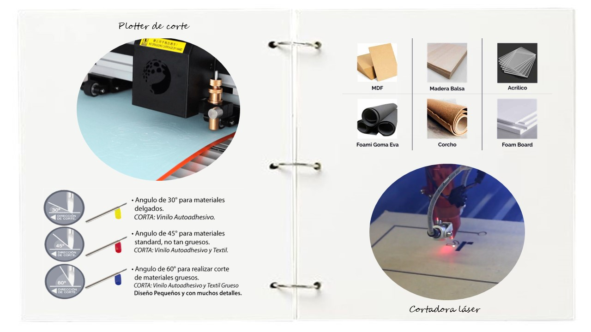
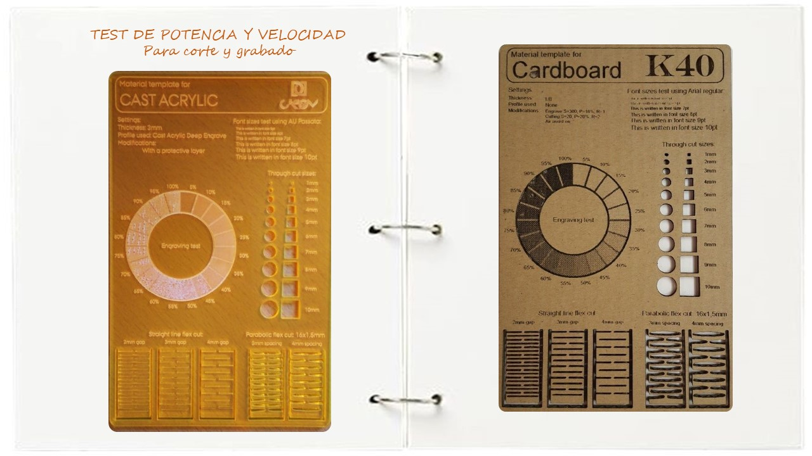
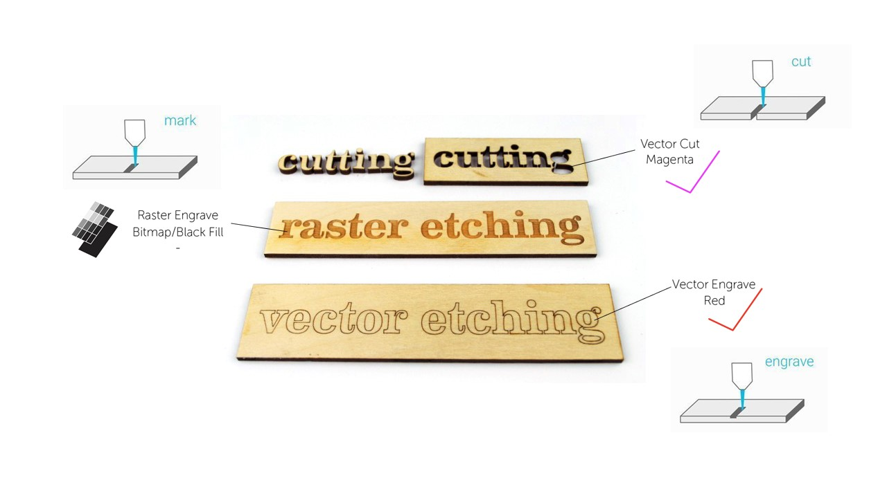

## Corte láser y plotter de corte

_Para esta asignación, considerando que empezamos la exploración con tecnologías de manufactura sustractiva, me parecio interesante resaltar este concepto:_ 

##### El diseño se ve determinado por la forma en la que se va a fabricar y a su vez, el proceso de manufactura se ve determinado por la forma en la que se pensó el diseño. 

Cuando hablamos de la materialización de los archivos digitales, es necesario tener en cuenta dicho concepto, ya que determinará una serie de acciones que darán por resultado un uso eficiente del material y correcto uso de la máquina de CNC. Es lo que veremos en el desarrollo del ejercicio.

###### Conceptos para recordar

Para 1960, la tecnología de *corte láser* iniciada por Albert Einstein, sentó sus bases y siguió desarrollándose siendo al día de hoy, una de las tecnologías más ampliamente insertadas tanto en un ámbito industrial, como en fablabs, empresas pequeñas y usuarios. De igual forma la tecnología de *plotter de corte*, donde Remington - Rand para los años 60 desarrolló un avance para la época donde se vivía el auge de la _**automatización y precisión**_ en diversos procesos. Esta tecnología se convirtió en un elemento clave en talleres de diseño, especialmente gráfico, y producción en todo el mundo.

###### Funcionamiento

El corte láser podemos definirlo como un proceso de _**mecanizado térmico**_ donde el material se desgasta por el haz de rayo láser, mientras que el plotter de corte **mecanizado mecánico** a través de una sistema de cuchilla móvil que se desplaza sobre una lámina sujeta por rodillos.
Para el corte láser, podemos usar materiales hasta de 6mm de espesor, mientras que el plotter de corte, trabaja láminas de materiales que varían hasta 1mm.

En el caso del corte láser, como parámetros importantes que siempre estarán presentes, a pesar de que cambiemos de máquina (ya que la interfaz varia según la marca de la maquina) son _**potencia y velocidad**_. Según la operación a realizar y los materiales a usar, los valores de estos parámetros van a variar. También dependerá del modelo de la máquina.

Para efectos prácticos, me parece interesante considerar elaborar una tabla de test de parámetros, donde podremos trabajar con mayor precisión estos valores en una muestra previa. O si el lugar de trabajo cuenta con esta guía, será más rápido poder usar esos parámetros que ya están registrados.

###### Operaciones

El láser puede realizar corte, grabado y raster. La diferencia entre estos procesos radica en la profundidad en la que el láser va a penetrar el material. En el corte, el láser va a atravesar el material por completo pero en los otros procesos el desgaste es gradual.

 
Para poder diferenciar un proceso de otro en un mismo archivo, nos valemos de los colores de línea y los rellenos de estas figuras, esto en la preparación del archivo. Para _corte y grabado_ usamos archivos vectoriales, mientras que para _raster_ podemos usar archivos vectoriales o bitmap. Cuando se pase al software del láser, se debe configurar los parámetros según los colores previamente seleccionados.

###### Consideraciones

Como recurso de fabricación para encajes o ensambles, debemos considerar la **holgura** según el tipo de ajuste que se desea tener en esta pieza: ceñido, normal o holgado. Esta medida adicional es la que se le debe añadir a la pieza durante el diseño, para que luego al realizar el encaje, estas piezas queden firmes.Tener en consideración que este valor debe considerar **tolerancia** que es la variación máxima permitida en las dimensiones y forma de una pieza cortada con respecto a su diseño original. Esto varía según la máquina y tipo de tecnología.

