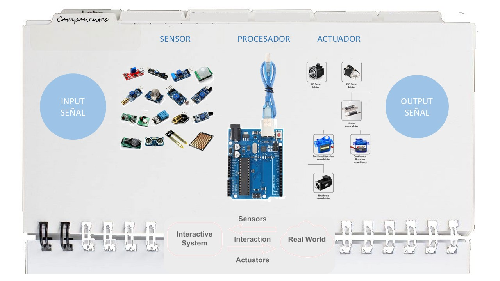
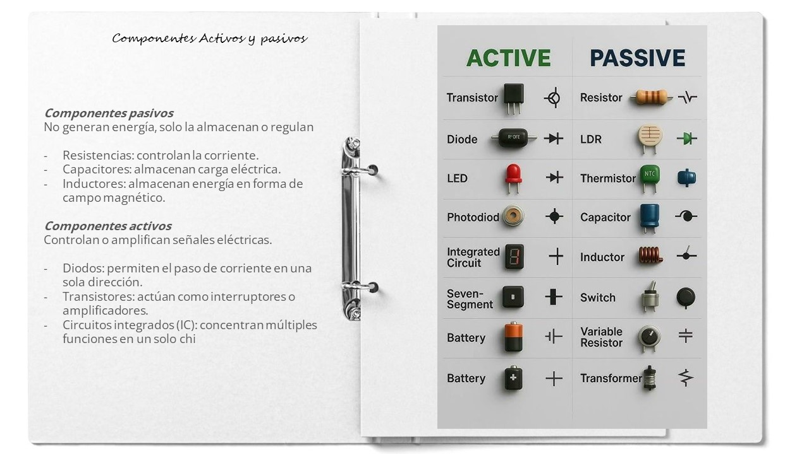
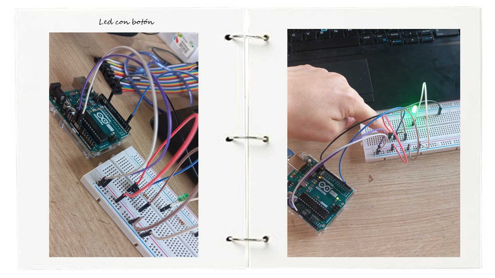
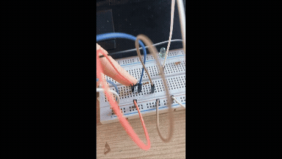
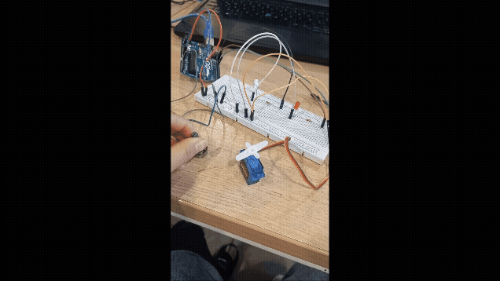
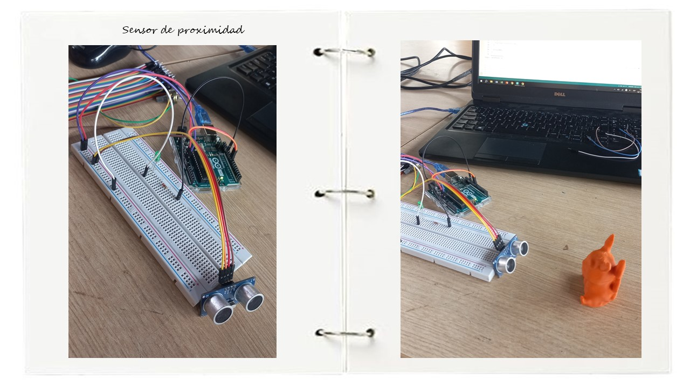
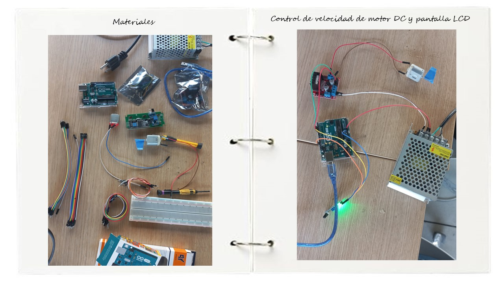

## Electrónica y programación

_El área de la electrónica abre un nuevo campo de exploración y posbilidades materiales en las soluciones de diseño. Automatización, comandos y acciones a un nuevo nivel, que pueden ayudar a llegar a recolectar datos y generar respuestas en base a ellos_ 

##### Conceptos importantes

Empezando a delimitar los conceptos clave, para estos proyectos usamos **Arduino** como medio principal para programar. Al ser de **código abierto** nos permite personalizar las funciones a realizar. Arduino se compone de una placa electrónica con un microcontrolador re-programable y distintos pines que se conectan con **sensores y actuadores.**

Las ventajas de Arduino frente a otros microcontroladores y plataformas, radica en que el entorno de programación es user friendly, permite el desarrollo de proyectos a distintos niveles de complejidad, además de ser económico, y multiplataforma.

Arduino responde a un enfoque de diseño como lo es el **Interaction Design**, es decir, resulta una herramienta a través de la cual podemos realizar distintas experiencias de interacción entre usuarios y productos, especialmente para aquellas propuestas que incluyan electrónica dentro de su aspecto funcional. 

Otro enfoque ligado es el del **Diseño de Interacción Física**. En este, se pueden construir sistemas físicos interactivos entre software y hardware que permiten captar información y traducirla de forma analóga. Generalmente esta orientado a desarrollo de productos de alcance menos sofisticado. Este enfoque permite su aplicación en diferentes áreas e industrias, como salud y agriculutra, por nombrar algunas.

###### Harware

Está compuesto por dispositivos, componentes y estructuras físicas (sensores, circuitos, cables, placas, fuentes de energía, microcontroladores, etc.) que trabajan de manera integrada para recibir información, procesarla y producir una respuesta.

###### Software
Para el software, ya que estamos trabajando con Arduino, emplearemos ARDUINO IDE. El entorno de desarrollo integrado Arduino, o software Arduino (IDE), contiene un editor de texto para escribir código, un área de mensajes, una consola de texto, una barra de herramientas con botones para funciones comunes y una serie de menús. Se conecta al hardware Arduino (placa electrónica) para cargar programas y comunicarse con ellos.

##### Proyectos prácticos

###### Ejercicio 1
Programar el Arduino para que lea un botón y encienda un LED únicamente mientras el botón está presionado.
Cuando el botón se suelta, el LED debe apagarse.

###### Ejercicio 2
Programar el Arduino para que lea el valor de un potenciómetro y controle el brillo de un LED.
Cuando el potenciómetro esté en valores bajos, el LED debe estar tenue; cuando el potenciómetro esté en valores altos, el LED debe brillar más fuerte.

###### Ejercicio 3
Programar el Arduino para que lea un potenciómetro y controle el ángulo de un servo SG90 en tiempo real.
Mientras el servo esté moviéndose (cambiando de ángulo), debe encenderse un LED rojo.
Cuando el servo esté quieto (el ángulo no cambió respecto a la lectura anterior), debe encenderse un LED verde.

###### Ejercicio 4
Programar el Arduino para que use el sensor de distancia SRF05 y encienda un LED cuando un objeto esté a menos de 20 cm. Si el objeto está más lejos, el LED debe permanecer apagado.

###### Ejercicio 5
Programar el Arduino para que lea una fotoresistencia conectada a un pin analógico.
Si la luz ambiente es alta, debe encenderse un LED.
Si la luz es baja, debe encenderse otro LED diferente.
Solo uno de los dos LEDs debe estar encendido a la vez. Además, el valor leído debe mostrarse en el Monitor Serie

###### Ejercicio adicional

##### Reflexión

