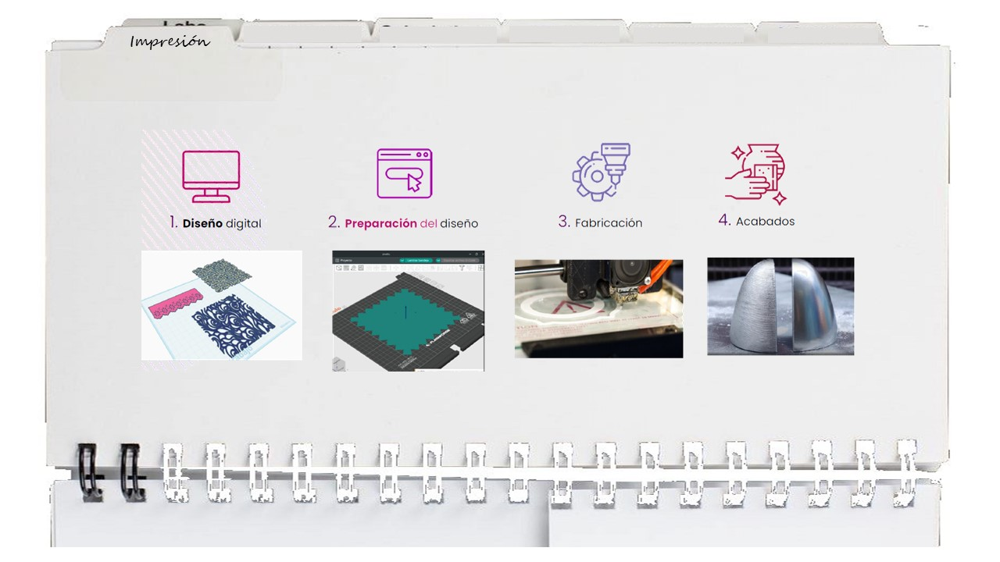

## Impresión y escaneo 3D

_La impresión 3D es una de las tencologias mas emocionantes de los ultimostiempos, me parece increíble la versatilidad con la que se pueden materializar volúmenes complejos y poder crear productos que de otra forma tardarían demasiado en reproducirse. Muchos nuevos desarrollos de diversos productos han sido posibles gracias a la impresión 3D, que ha revolucionado desde la industria de la moda, hasta la odontología, construcción y medicina._

##### Conceptos importantes
Dentro de todas las tecnologías dentro de lo que conocemos como impresión 3D, la más democratizada es la de deposición de material fundido (FDM) es un proceso de fabricación aditiva que permite crear objetos tridimensionales a partir de un modelo digital, construyéndolos capa por capa con un filamento que puede ser de distintos tipos de plástico. 

Luego de preparar nuestro diseño en un software de diseño 3D, es necesario pasar este archivo por un software de laminado (slicer), el cual traduce el modelo en instrucciones que la impresora puede interpretar. El software permite configurar parámetros clave como el tipo de impresora, el tipo de filamento, la altura de capa, la velocidad de capas, la orientación del modelo, la escala, el tiempo estimado de impresión y la necesidad de soportes. Estas decisiones influyen directamente en la calidad, eficiencia y viabilidad del objeto impreso.

Es crucial tener esto en cuenta para poder optimizar desde el diseño y asegurar una impresión correcta. Además, siempre es necesario vigilar durante el proceso de impresión para no tener complicaciones.
Por otro lado, el escaneo 3D realiza el inverso del proceso, es decir, pasamos de la materialización a la digitalización. Esta operación es especialmente útil para agilizar el proceso del modelo o realizar diseños personalizados de algún objeto (prótesis por ejemplo) Esta tecnología es igual de versátil y también se aplica en diversas industrias como la medicina y videojuegos, donde se escanean escenarios para facilitar su uso en entornos virtuales.

###### Proceso

El ejercicio propuesto para aterrizar estos conceptos consistió en **descargar un archivo 3D existente, importarlo en el software de laminado y prepararlo correctamente para su impresión. En nuestro caso, las impresoras del fablab ESAN, son de la marca Bambu, por lo que como slicer empleamos el software Bambu Studio.

En primer lugar, descargué el modelo 3D propuesto, lo guarde como OBJ para abrirlo en el software. Seleccioné como equipo de impresión el modelo Bambu Lab A1, asegurándome de que el perfil de máquina coincidiera con la impresora disponible. Posteriormente, realicé un ajuste de escala, reduciendo el tamaño del modelo para optimizar el tiempo de impresión y el consumo de material. La altura de capa se mantuvo por defecto, pero si se puede considerar trabajar con un valor menor como 0.12 por ejemplo.

Se modifico la orientación de la pieza y se activo la opción de soporte como normal, además de aumentar el relleno de la pieza. Después de la opción laminar capa, si la impresora está conectada se puede enviar directamente a imprimir, de lo contrario, se manda guarda como GCODE.

##### Reflexión
Este ejercicio permitió comprender la importancia del software de laminado como una etapa clave en la impresión 3D, donde las decisiones del diseñador influyen directamente en la eficiencia del proceso. La orientación y la escala del modelo demostraron ser factores determinantes para reducir tiempos, evitar soportes innecesarios y optimizar recursos. En mi caso, estoy familiarizada con la impresión 3D tanto en objetos tridimensionales como en aplicaciones con textiles por ejemplo. El tema es largo y complejo, pero es una tecnología que da pie a sinfín de resultados con distintas modificaciones y materiales con los que se trabajen. 
