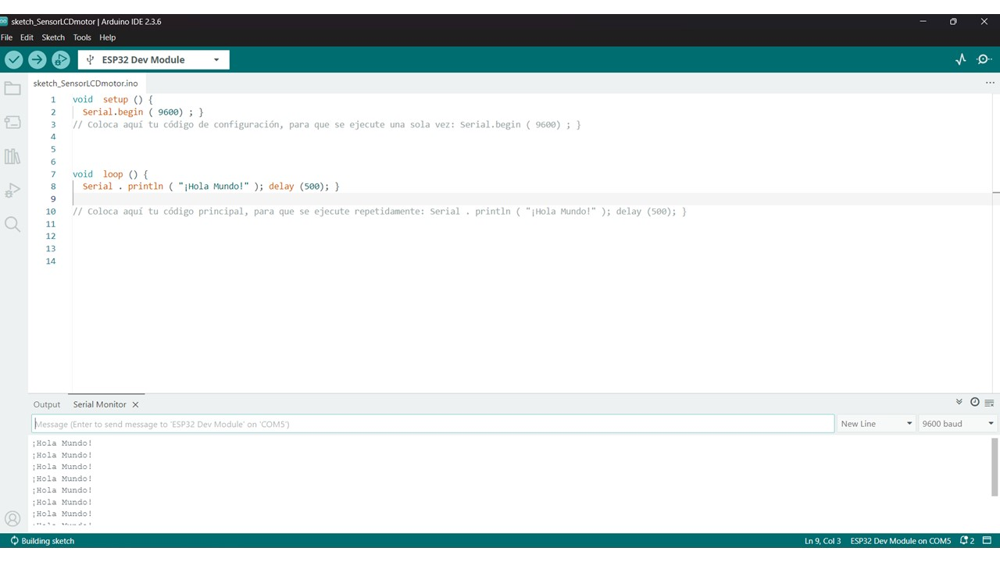
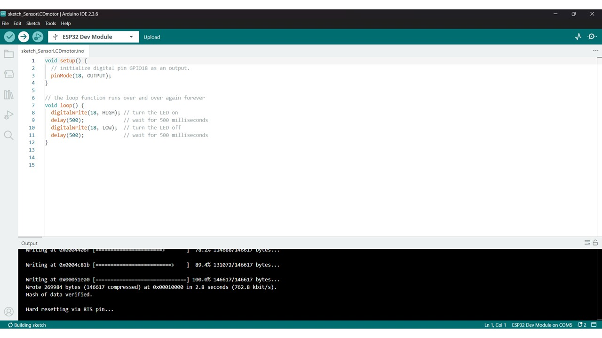
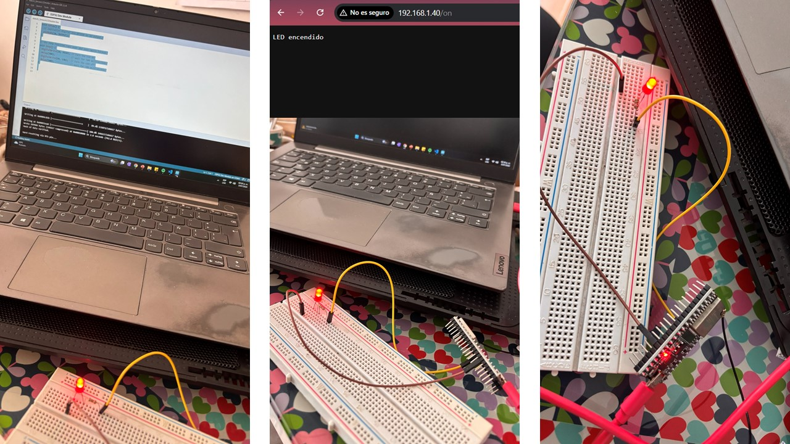
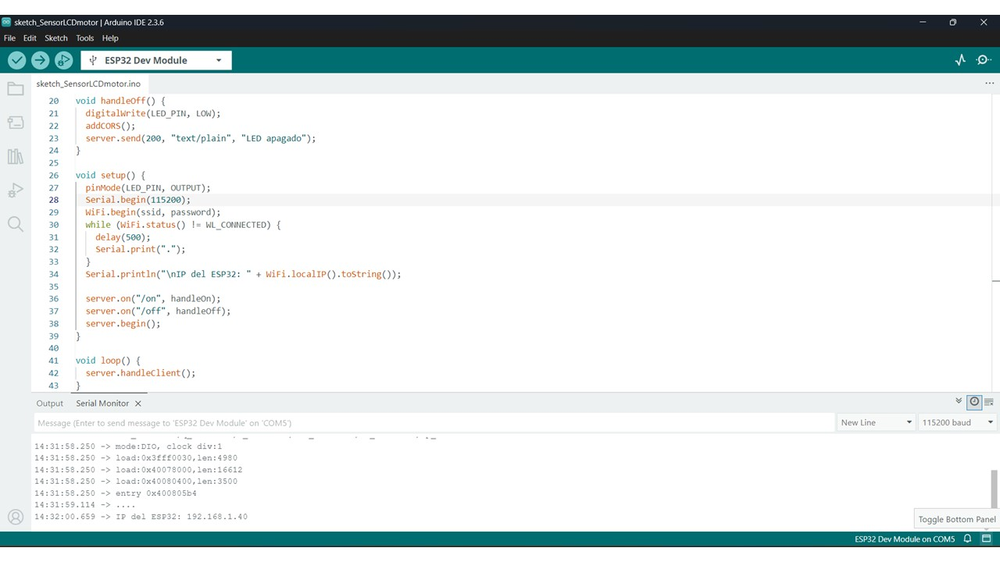
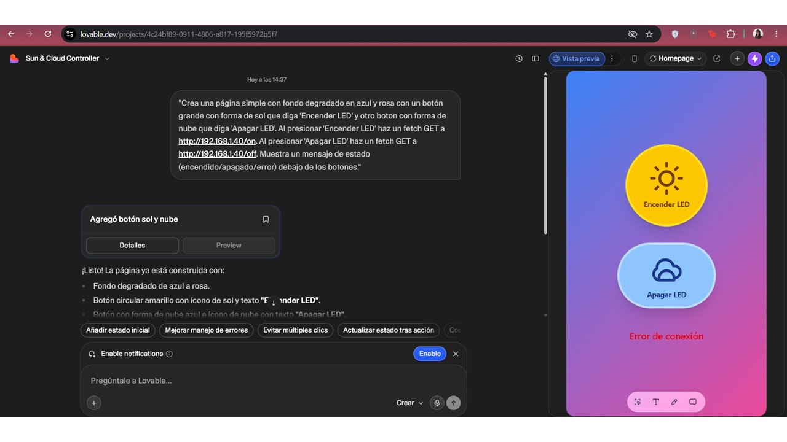
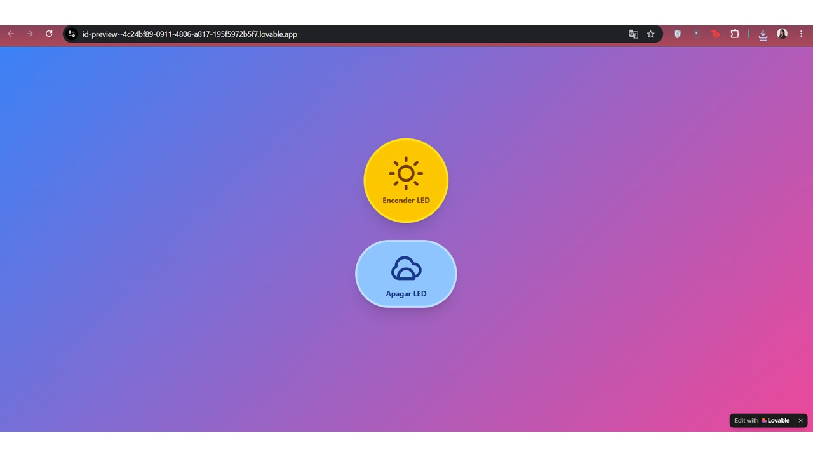
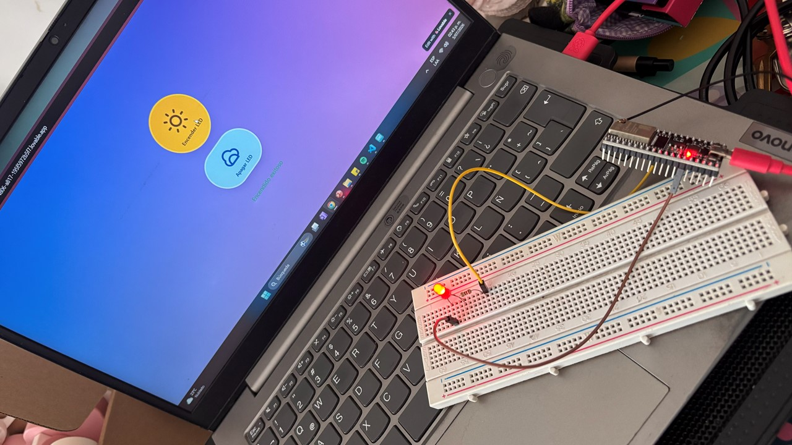
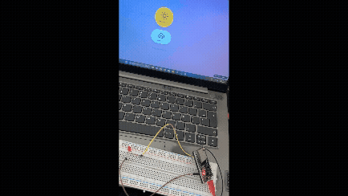

## INTERFACES Y APLICACIONES
### Introducción

En el desarrollo de productos interactivos, el hardware representa únicamente una parte del sistema. Su verdadero potencial se alcanza cuando es capaz de comunicarse con aplicaciones, plataformas digitales e interfaces de usuario que permitan controlar, visualizar o intercambiar información en tiempo real.

En esta sesión se introducen los conceptos fundamentales de interfaces digitales, comprendiendo cómo un microcontrolador como el ESP32 puede actuar como puente entre el mundo físico y el entorno digital. Gracias a sus capacidades de conectividad Wi-Fi y Bluetooth, el ESP32 permite establecer comunicación con aplicaciones web, dispositivos móviles y servicios en la nube, transformando acciones digitales en respuestas físicas como el encendido de LEDs, activación de motores, lectura de sensores o control de actuadores.

A partir de este enfoque, los estudiantes identifican el flujo de comunicación entre hardware y software, comprendiendo que una interfaz constituye el medio mediante el cual un usuario interactúa con un sistema electrónico de forma intuitiva.

### Conceptos clave

Durante la sesión se abordaron los siguientes términos fundamentales:

> Interfaz de Usuario (UI)}

Medio visual mediante el cual un usuario interactúa con un sistema digital. Puede estar conformada por botones, interruptores, indicadores o paneles de control.

> ESP32	

Microcontrolador con conectividad Wi-Fi y Bluetooth integrado que permite desarrollar proyectos de Internet de las Cosas (IoT).
> Entrada (Input)	

Acción realizada por el usuario o proveniente de un sensor que genera una instrucción para el sistema.

> Salida (Output)

Respuesta física o digital ejecutada por el sistema, como encender un LED, activar un motor o mostrar información en pantalla.

> Comunicación Serial	

Canal de comunicación utilizado entre el computador y el ESP32 para enviar y recibir información durante la programación y depuración.

> Monitor Serial	

Herramienta del IDE de Arduino utilizada para visualizar mensajes enviados por el ESP32 y comprobar el funcionamiento del programa.

> Dirección IP	

Identificador asignado al ESP32 cuando se conecta a una red Wi-Fi, permitiendo acceder al dispositivo desde un navegador o una aplicación web.

> Servidor Web	

Servicio alojado en el ESP32 que permite controlar el hardware mediante una página web o interfaz digital.

> IoT (Internet of Things)	

Ecosistema de dispositivos físicos conectados a Internet capaces de intercambiar información y ejecutar acciones de manera remota.

>Frontend	

Parte visual de una aplicación con la que interactúa el usuario.

> Backend	

Lógica que procesa las instrucciones y comunica la interfaz con el hardware.

#### Flujo de interacción Hardware – Software

La integración entre interfaces digitales y dispositivos electrónicos puede entenderse mediante el siguiente flujo:

Usuario → Interfaz Digital → Red Wi-Fi → ESP32 → Acción Física (Output)

En este proceso:

* El usuario interactúa con una interfaz mediante botones o controles.
* La interfaz envía una instrucción al ESP32.
* El microcontrolador interpreta la orden recibida.
* Finalmente ejecuta una acción física, denominada output, como encender un LED o mover un servomotor.

Este modelo constituye la base de numerosos sistemas IoT, domótica, automatización y productos interactivos.

### Ejercicio

> Ejercicio 01. Verificación de comunicación con el ESP32

Como primera actividad se estableció la conexión entre el computador y el ESP32 utilizando el entorno de desarrollo Arduino IDE.
 
 <pre>
<code>
void  setup () { 
    Serial.begin ( 9600) ; 
    }  
  
void  loop () { 
    Serial . println ( "¡Hola Mundo!" ); delay (500);
}  
</code>
</pre> 
  

Luego de cargar el comando, se abrió el Monitor Serial para comprobar que la comunicación entre ambos dispositivos se encontraba funcionando correctamente. El microcontrolador envió un mensaje de confirmación ''Hello Mundo!'', permitiendo verificar tanto la correcta programación como la comunicación serial antes de continuar con el desarrollo del proyecto.

Esta primera validación constituye una validación inicial para identificar errores de conexión, configuración o carga del programa.

> Ejercicio 02. Verificación del output mediante un LED

Una vez comprobada la comunicación serial, se realizó la primera prueba de salida física (Output).

Se conectó un LED al protoboard utilizando una salida digital del ESP32 y se cargó un programa que permitía controlar su estado.

 
 <pre>
<code>
>void setup() {
  // initialize digital pin GPIO18 as an output.
  pinMode(18, OUTPUT);
}
// the loop function runs over and over again forever
void loop() {
  digitalWrite(18, HIGH); // turn the LED on
  delay(500);             // wait for 500 milliseconds
  digitalWrite(18, LOW);  // turn the LED off
  delay(500);             // wait for 500 milliseconds
}
</code>
</pre>

Al ejecutar el código se verificó que el LED respondía correctamente a las instrucciones del microcontrolador, confirmando que el sistema era capaz de transformar una instrucción digital en una respuesta física observable. En este caso el código mandaba al led a que estuviera intermitente

Este ejercicio permitió afirmar el concepto de Output, identificando cómo una acción programada puede controlar un componente electrónico conectado al microcontrolador.

> Ejercicio 03. Desarrollo de una interfaz web para controlar el LED

_Como ejercicio integrador, se desarrolló una interfaz gráfica utilizando la plataforma Lovable, con el objetivo de controlar el LED desde una aplicación web._

Previamente fue necesario configurar la conexión Wi-Fi del ESP32 dentro del programa, incorporando las credenciales de la red inalámbrica y obteniendo la dirección IP asignada al dispositivo una vez establecida la conexión.
 
 <pre>
<code>
const char* ssid = "WIFI";
const char* password = "PASSWORD";
const int LED_PIN = 18;
WebServer server(80);
void addCORS() {
  server.sendHeader("Access-Control-Allow-Origin", "*");
}
void handleOn() {
  digitalWrite(LED_PIN, HIGH);
  addCORS();
  server.send(200, "text/plain", "LED encendido");
}
void handleOff() {
  digitalWrite(LED_PIN, LOW);
  addCORS();
  server.send(200, "text/plain", "LED apagado");
}
void setup() {
  pinMode(LED_PIN, OUTPUT);
  Serial.begin(115200);
  WiFi.begin(ssid, password);
  while (WiFi.status() != WL_CONNECTED) {
    delay(500);
    Serial.print(".");
  }
  Serial.println("\nIP del ESP32: " + WiFi.localIP().toString());
  server.on("/on", handleOn);
  server.on("/off", handleOff);
  server.begin();
}
 void loop() {
  server.handleClient();
}

</code>
</pre>

Con esta información fue posible obtener el IP a través del cual se realizaría la conexión. Para verificar este IP se colocaba en la web como /on y se apreciaba que el led encendia.

Ya en la plataforma de Loveable se pidió el desarrollo de una interfaz, que incluyera dos botones principales:

* Encender LED
* Apagar LED

Para que pudiese funcionar, se abrio en una ventana aparte

Cada botón enviaba una solicitud al ESP32 mediante la red local, permitiendo modificar en tiempo real el estado del LED conectado al microcontrolador.

Este ejercicio permitió comprender el funcionamiento completo de un sistema IoT básico, integrando:

Este ejercicio permitió comprender el funcionamiento completo de un sistema IoT básico, integrando: 

>Hardware (ESP32) / Comunicación Wi-Fi / Servidor Web / Interfaz Digital / Usuario / Output físico

La actividad evidenció cómo una interfaz desarrollada con herramientas de diseño puede convertirse en un medio de interacción entre el usuario y un dispositivo electrónico, ampliando las posibilidades de aplicación en proyectos de automatización, domótica, wearables y productos inteligentes.

### Conclusiones
El ESP32 constituye una plataforma versátil para integrar hardware y aplicaciones digitales gracias a su conectividad inalámbrica incorporada.

La utilización de interfaces gráficas facilita la interacción entre el usuario y los dispositivos electrónicos, haciendo más intuitivo el control de sistemas físicos.Esto resulta especialmente interesante para el desarrollo de productos interactivos, experiencias IoT y sistemas inteligentes.

#### Fuentes de consulta

Random Nerd Tutorials – ESP32 Web Server (Arduino IDE). Guía práctica para crear un servidor web en el ESP32 y controlar salidas digitales mediante una interfaz web.
Arrow – How to Program an ESP32 Web Server Using Arduino IDE. 
Ampheo – ESP32 Web Server Tutorial. Tutorial actualizado sobre control de LEDs, sensores y relés desde un navegador web mediante Wi-Fi.
DIYables ESP32 Web Apps.