## Control numérico computarizado (CNC) 
El Control Numérico Computarizado (CNC) es una de las tecnologías más importantes dentro de la fabricación digital. Permite automatizar procesos de mecanizado mediante instrucciones codificadas, logrando altos niveles de precisión, repetibilidad y eficiencia.

##### Conceptos importantes
Al trabajar con un router CNC, es fundamental definir correctamente los parámetros de corte, ya que estos influyen directamente en la calidad del acabado y la seguridad del proceso:
- Velocidad de Husillo (Spindle Speed): La velocidad de rotación de la fresa, medida en revoluciones por minuto (RPM).
- Velocidad de Avance (Feed Rate): La velocidad horizontal con la que la herramienta se desplaza a través del material (mm/min o pulg/min).
- Paso de Profundidad (Stepdown): La cantidad de material que la herramienta remueve verticalmente en cada pasada.

El CNC permite trabajar con diversos materiales, entre los más comunes:
- Madera (MDF, triplay, madera maciza): fácil de mecanizar, ideal para prototipos. 
- Plásticos (acrílico, PVC, HDPE): requieren parámetros más controlados. 
- Metales blandos (aluminio): demandan mayor precisión y lubricación.

##### Operaciones principales
Existen operaciones predeterminadas que se programan en el software de mecanizado cuando se realiza la generación del toolpath.
- Perfilado (Profiling): Corte a lo largo del contorno de una línea.
- Vaciado (Pocketing): Remoción de material dentro de un área cerrada para crear cavidades.
- Grabado: Seguimiento de líneas para detalles superficiales
- Taladrado (Drilling): Perforaciones verticales directas.

La elección de la fresa es clave para obtener buenos resultados:
##### Tipos de fresas
Para el mecanizado se utiliza como herramienta principal las fresas, herramientas que permiten el corte en sentido transversal y longitudinal. Pueden ser de punta plana, esférica o en V, dependiendo del acabado que se espera obtener; además de incluir diferentes cantidades de flautas. En mecanizado, las "flautas" son los canales helicoidales de las fresas de corte (herramientas) que evacuan virutas, con opciones comunes de 2, 3 o 4 flautas.
- Fresa de corte ascendente (Upcut): mejor evacuación de viruta.
- Fresa de corte descendente (Downcut): mejor acabado superficial.
- Fresa de compresion: Combina ambas geometrías para acabados perfectos en ambos lados del material (especial para laminados).

##### Proceso

###### Generar el diseño 
El proceso inicia en un software de diseño vectorial, en este caso Illustrator. También, se uso el software Slicer, para poder realizar una pieza con la técnica de plano seriado.
La geometría generada debe estar en formato vectorial y trabajada en escala real (1:1). Es importante verificar que el archivo tenga los contornos estén cerrados. No deben existir líneas encimadas, ya que el software las interpretará como trayectorias dobles. Para exportar, el archivo se guarda en formato DXF.

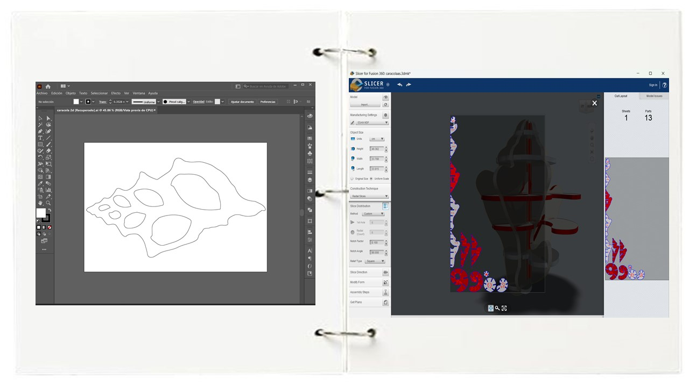

###### Software CAM
Una vez listo, se importa en el software Vcarve para poder generar el toolpath, que viene a ser el conjunto de instrucciones generadas por el software, que definen la ruta exacta que seguirá la fresa para cortar o mecanizar una pieza. Incluye la posición (X, Y, Z), la dirección, la velocidad y la profundidad de corte.

###### Material y ejes
Comenzamos configurando el material, definiendo las dimensiones del material (X, Y) y espesor (Z = 12 mm). Es necesario establecer el origen (X0, Y0) generalmente en la esquina inferior izquierda y el Z-Zero en la superficie del material. En nuestro caso, estamos usando un material que ya ha sido cortado antes, por lo que este punto lo establecemos midiendo previamente el espacio que vamos a dejar.
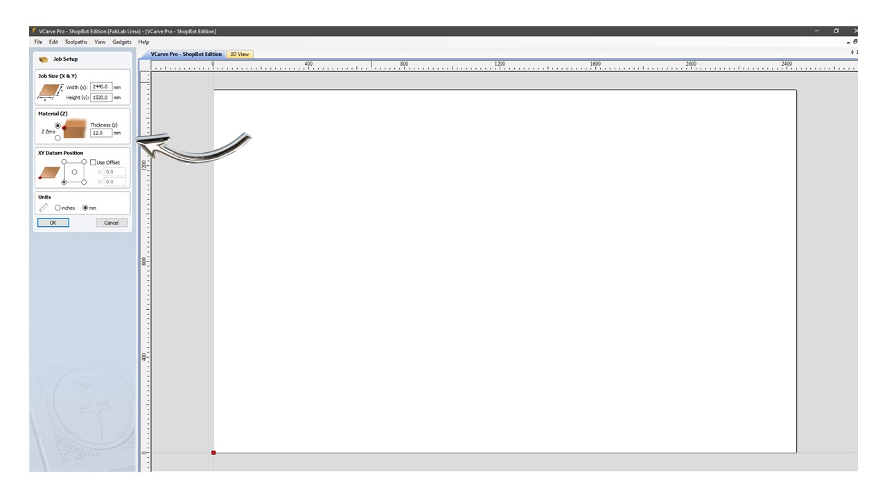

###### Preparación del archivo
Importamos el archivo DXF y verificamos la integridad de los vectores, para esto podemos emplear la opción de Join vectors. El software incluye otros tipos de herramientas vectoriales, que se pueden emplear según sea el caso.
En el caso de tener distintas piezas, como con el archivo de planos seriados, probamos la opción de nesting, que permite optimizar la ubicación dentro del área de trabajo.

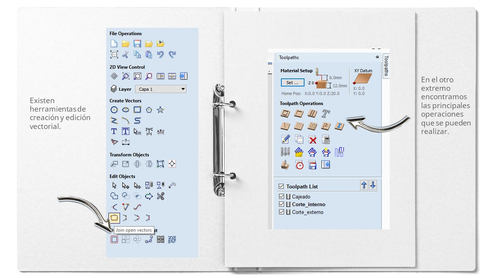

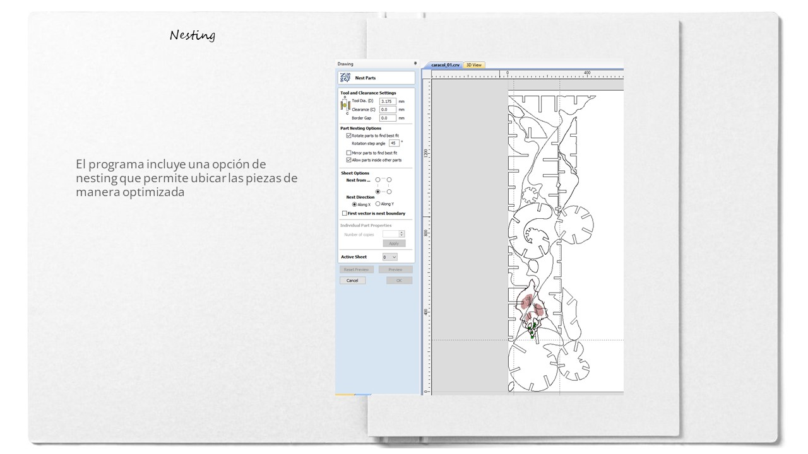

Además, podemos asignar un fillet especifico, ya sea T-Bone o Dog Bone. Para el archivo de planos seriados, usamos Tbones en todas las esquinas.
 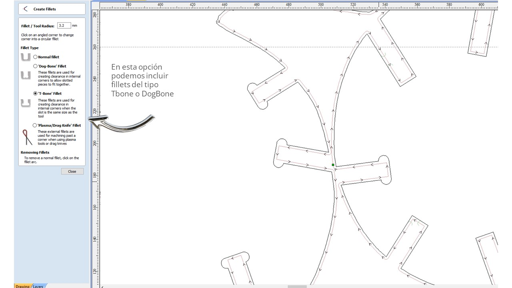

###### Asignación de Trayectorias (Toolpaths):
Seleccionamos los vectores de acuerdo a la operación a realizar. En el primer diseño se tenían 3 operaciones: Corte externo, corte interno y pocket. Cada ruta se prepara por separado.  Configuramos la herramienta a usar, en este caso, vamos a usar una straight cut plana de 1/8" 

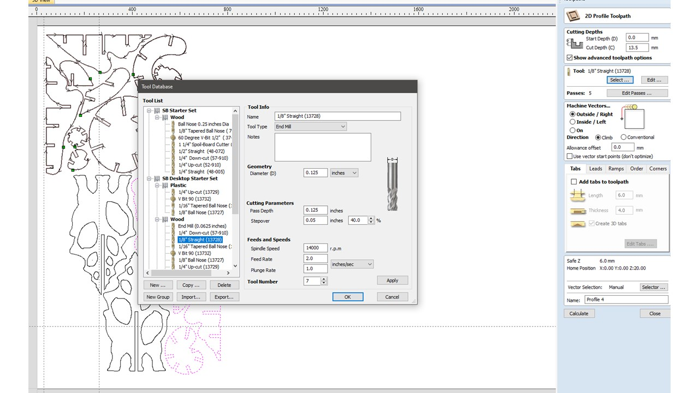

Luego de elegir el vector tenemos la opción de marcar la operación que va a realizar, además de poder incluir pestañas (Tabs) que son puentes de sujeción para evitar que las piezas cortadas se muevan y dañen la fresa. La ruta se debe guardar con un nombre específico según la operación a realizar.

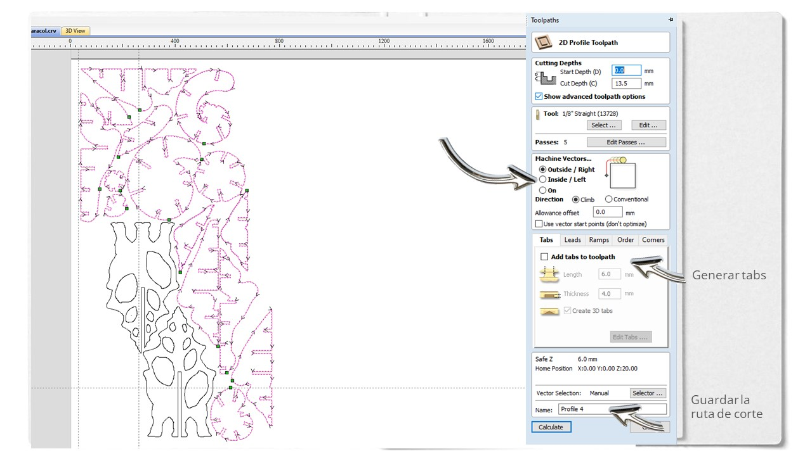 

Cuando este asignado, continuamos con la simulación, donde se abre una previsualización 3D para detectar posibles colisiones o errores de profundidad. 

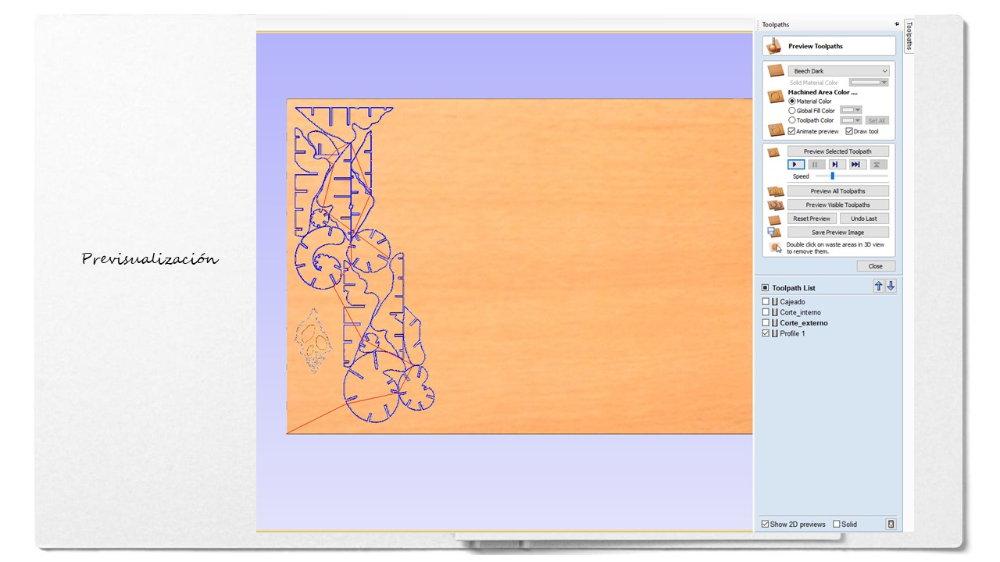

El software nos permite ver además, los tiempos de cada operación para tener un tiempo estimado. Con esta información, podemos pasar a exportar el G-Code. En este software se debe guardar operación por operación, utilizando el post-procesador específico para ShopBot (mm) (*.sbp).

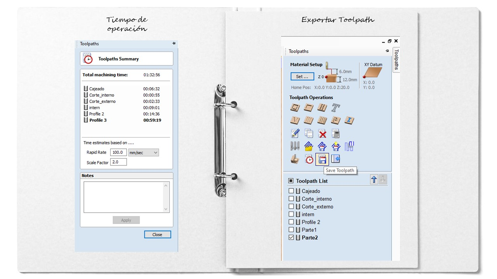

###### Ejecución en ShopBot 
Empezamos asegurando la plancha de MDF a la cama de sacrificio mediante tornillos; se instala la fresa en el collet y realizar el "Homing" de los ejes. Antes de empezar la operación, es importante realizar la calibración del Eje Z, utilizando la placa táctil (Z-zero plate) para que la máquina reconozca la superficie del MDF.

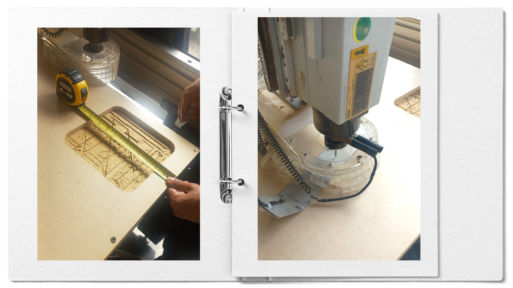

Abrimos el software de control de ShopBot y cargamos el archivo sbp. Es necesario usar los implementos de seguridad correspondiente, especialmente los protectores auditivos. Para empezar el mecanizado, encendemos la máquina, el extractor y accionamos el husillo que debe empezar a girar antes de acercarse a cortar el material. 

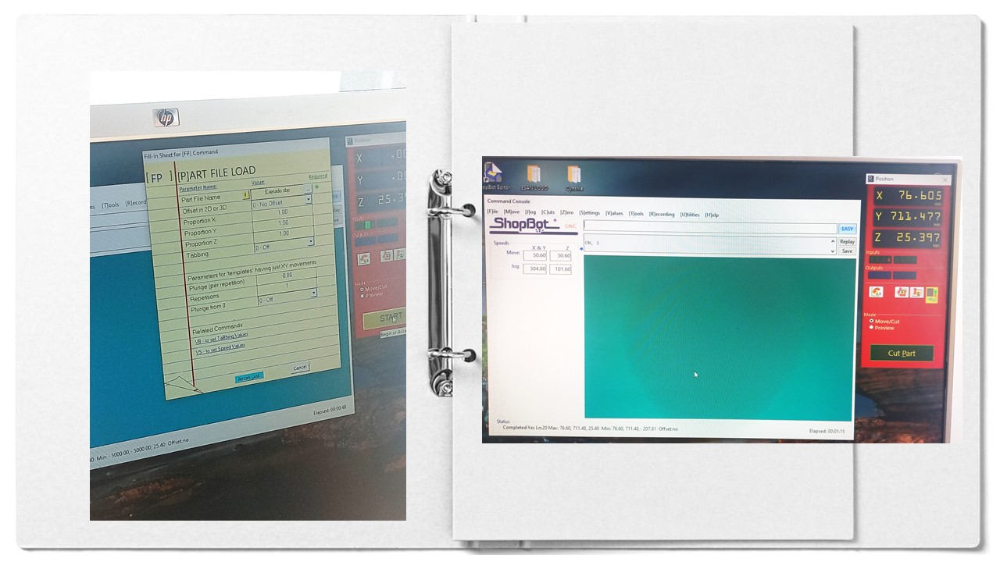

Ya que se ejecuta la operación según la ruta elegida, se empezaron por los cajeados. Durante la operación es necesario monitorear constantemente el proceso, realizando una aspiración extra de la viruta que se va generando y estando al pendiente en todo momento de lo que la máquina va realizando. 

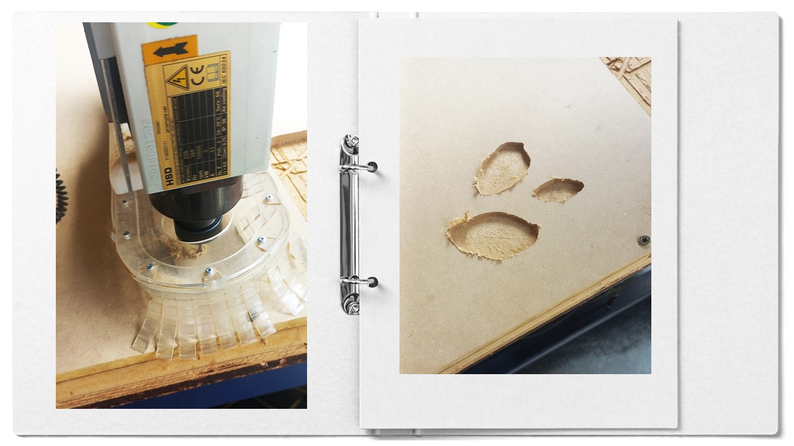

La segunda operación que realiza la máquina son los cortes internos y después los cortes externos, con las mismas consideraciones anteriores

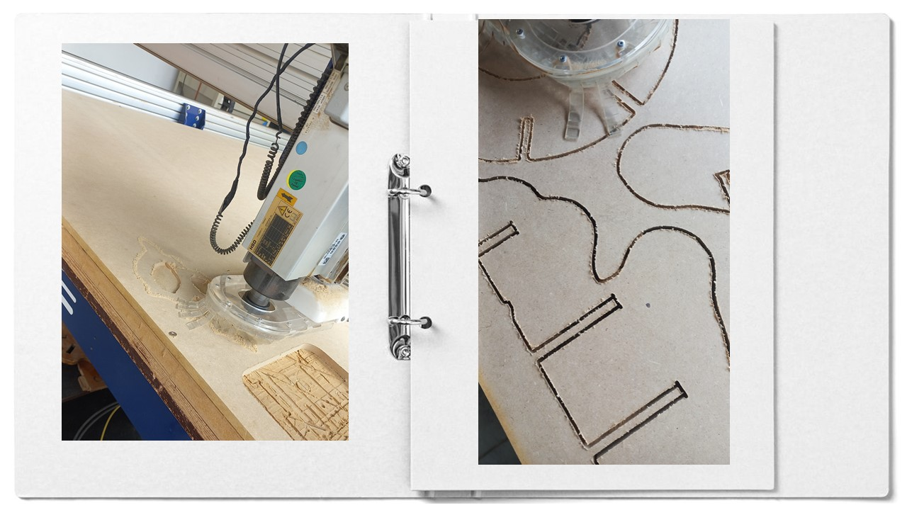