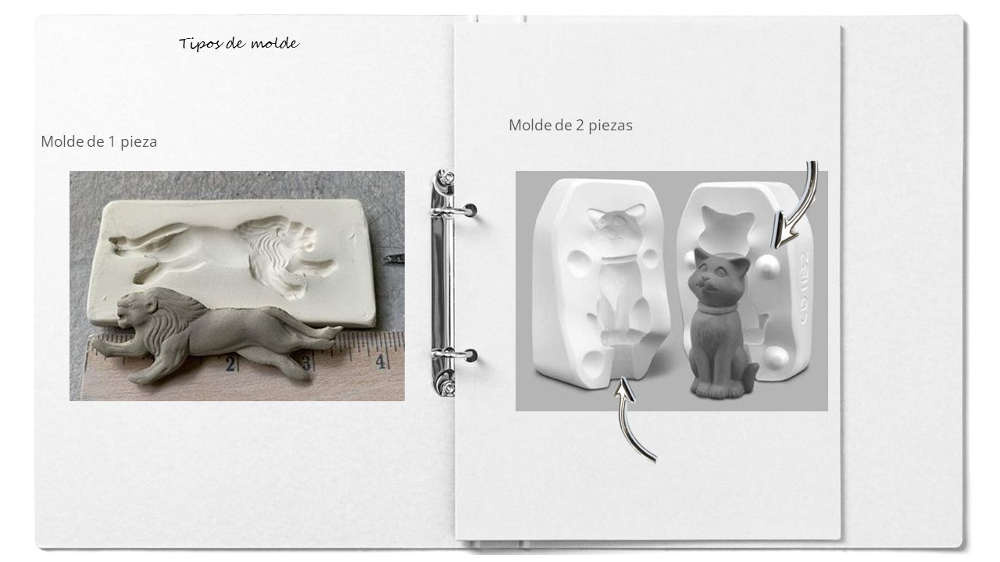
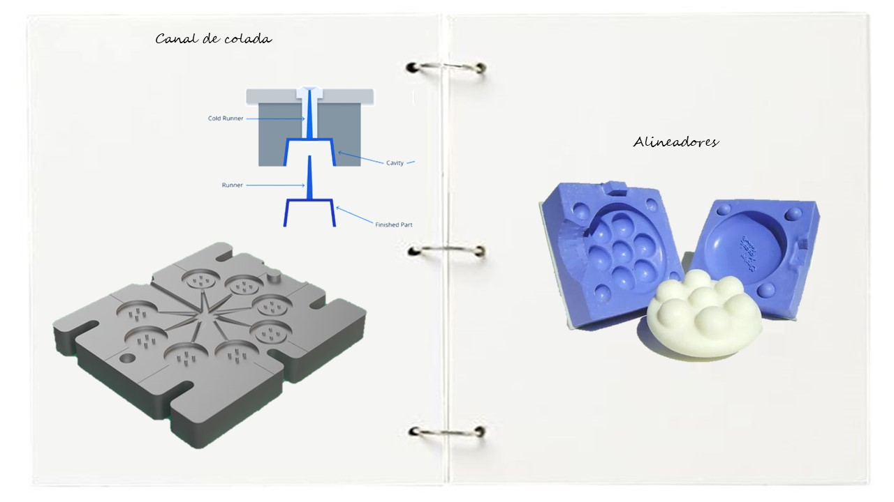
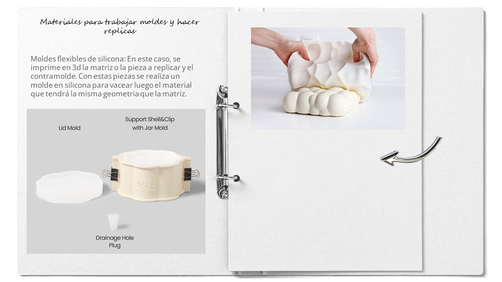
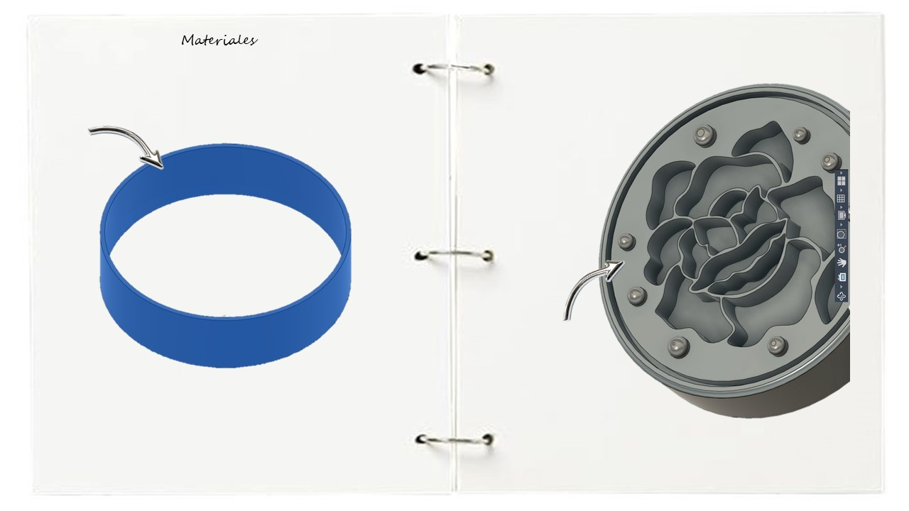
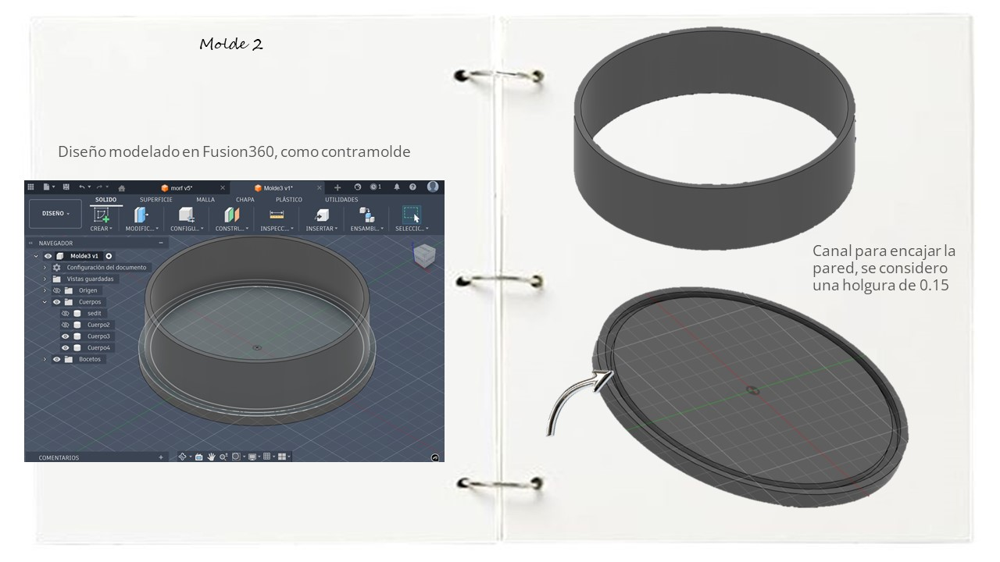

## Moldes

_Los moldes son un método efectivo para replicar piezas a distintas cantidades, además de poder usar diferentes materiales, según sea la pieza final que se desea obtener. Mi experiencia previa con moldes ha sido en el taller de cerámica de la universidad. Realizábamos nuestras matrices a mano, o replicando objetos encontrados. Usando principalmente yeso para crear moldes rígidos, y en el taller de plástico, también llegamos a realizar moldes de gelatina y replicas con resina epoxi. En un trabajo además, realizamos piezas en plata replicando las nervaduras de las hojas con una silicona rígida moldeable_

##### Conceptos importantes
La incorporación del uso de la impresión 3D para el desarrollo de moldes, ha facilitado sin duda los tiempos para el desarrollo de matrices. Haciendo la comparativa con lo mencionado anteriormente. Nosotros solíamos trabajar a mano con arcilla, generar un encaje de las paredes con tablas de mdf, marcar entre otros pasos. Ahora, puedes tener las piezas listas del molde y la matriz para poder empezar a testear estos elementos mucho más rápido, y, de forma más precisa y estandarizada.

Para empezar, hay que indagar y ser conscientes de la pieza de la cual necesitamos un molde. Tiene aristas? Tiene volumen concavo y/o convexo? Texturas? Partes al aire? Esto para pensar en estrategias para el desmolde. El pensamiento siempre debe ser completo, analizamos entonces el antes y el después para plantear un diseño eficiente en los moldes. En algunos casos vamos a necesitar solo un molde y en otros casos, el molde debe ser un sistema modular para sacar la pieza integra.

 

Dentro de las consideraciones que debemos tener en cuenta para el desarrollo de las piezas de molde, los siguientes puntos en el diseño del molde me parecen importantes:

###### Angulo de desmolde:
 Es la inclinación con la cual se diseña las piezas de la pieza del molde para evitar fuerza excesiva al expulsar la pieza y dañar esta misma y el molde. Este ángulo puede ir desde los 0.5° para piezas en lo posible verticales, y desde 1 a 2° para situaciones más comunes.

###### Fillets:
 En la mayoría de casos, es importante incluir radios o fillets en las piezas del molde para evitar atascos en las esquinas o aristas agudas, lo que mejora el flujo de material y la integridad estructural de la pieza. Las esquinas agudas debilitan la pieza, ya que el material fundido fluye a través de ellas o hacia ellas y no siempre se llegan a completar. Estos radios van desde los 0.5mm.

###### Agujeros de vertido: 
Estos canales permiten que el material fluya en todo el molde y lo llene completamente, evitando zonas con aire que terminaran huecas.

###### Alineadores: 
Son guías que nos permiten encajar el molde de forma correcta y evitar que se muevan, asegurando la integridad de la pieza y obtener la geometría de manera correcta.

###### Proceso

Me parecio interesante considerar una aproximación a los moldes que se pueden realizar, considerando el material con el que se va a sacar la réplica o molde respectivamente.

Mi primer intento fue esta aproximación. Detecte que las líneas entre las cavidades eran muy finas por lo que probablemente no se iba a apreciar bien la figura luego del desmolde.

Posterior a ello plantee un molde que pueda abrirse, además de añadir texto y relieves.

El segundo molde lo plantee como una base circular y una pared que encaja en la base. La pieza a copiar con el molde la realice en otro programa ya que estaba experimentando.

Ambos moldes se llevaron al slicer y se configuraron para optimizar la impresión

##### Experimentación 

Para la prueba de los moldes, se empleo una receta de biosilicona de Louis Borges. 
_***por completar_
##### Reflexión

Fuentes consultadas:

https://xometry.pro/es/articulos/injection-molding-molds/ 
https://formlabs.com/latam/blog/impresion-3d-para-moldeo-inyeccion/?srsltid=AfmBOootrMCilLozxa6z84fQlIV-Rp5URhoJ831UYsAeLRm2pTZXVk01
Molde de papel https://www.instructables.com/Pulp-It/ 
