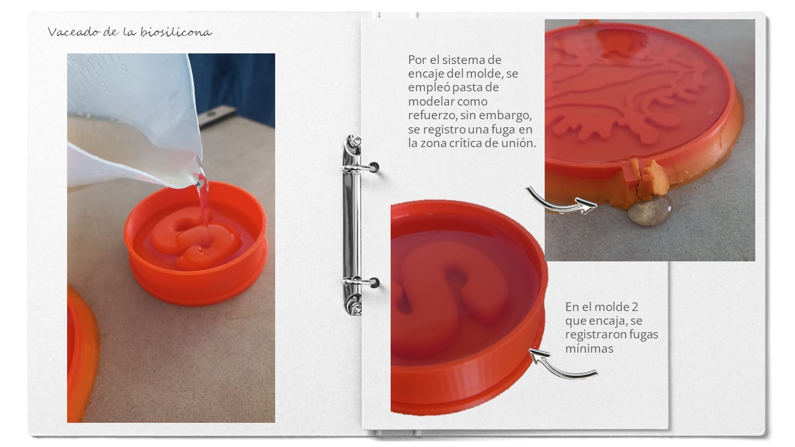
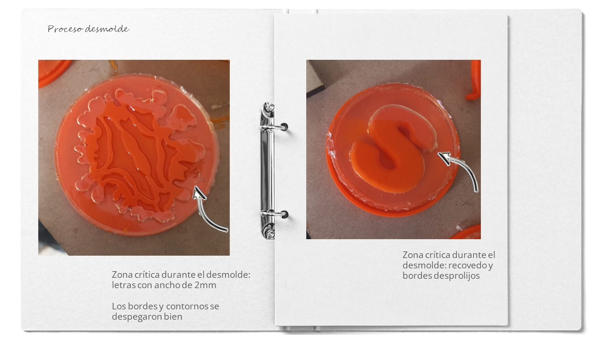
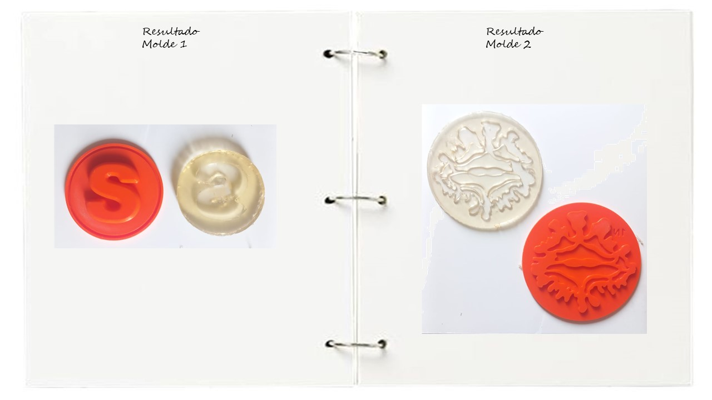

## Moldes

_Los moldes son un método efectivo para replicar piezas a distintas cantidades, además de poder usar diferentes materiales, según sea la pieza final que se desea obtener. Mi experiencia previa con moldes ha sido en el taller de cerámica de la universidad. Realizábamos nuestras matrices a mano, o replicando objetos encontrados. Usando principalmente yeso para crear moldes rígidos, y en el taller de plástico, también llegamos a realizar moldes de gelatina y replicas con resina epoxi. En un trabajo además, realizamos piezas en plata replicando las nervaduras de las hojas con una silicona rígida moldeable_

##### Conceptos importantes
La incorporación del uso de la impresión 3D para el desarrollo de moldes, ha facilitado sin duda los tiempos para el desarrollo de matrices. Haciendo la comparativa con lo mencionado anteriormente. Nosotros solíamos trabajar a mano con arcilla, generar un encaje de las paredes con tablas de mdf, marcar entre otros pasos. Ahora, puedes tener las piezas listas del molde y la matriz para poder empezar a testear estos elementos mucho más rápido, y, de forma más precisa y estandarizada.

Para empezar, hay que indagar y ser conscientes de la pieza de la cual necesitamos un molde. Tiene aristas? Tiene volumen concavo y/o convexo? Texturas? Partes al aire? Esto para pensar en estrategias para el desmolde. El pensamiento siempre debe ser completo, analizamos entonces el antes y el después para plantear un diseño eficiente en los moldes. En algunos casos vamos a necesitar solo un molde y en otros casos, el molde debe ser un sistema modular para sacar la pieza integra.

 

Dentro de las consideraciones que debemos tener en cuenta para el desarrollo de las piezas de molde, los siguientes puntos en el diseño del molde me parecen importantes:

###### Angulo de desmolde:
 Es la inclinación con la cual se diseña las piezas de la pieza del molde para evitar fuerza excesiva al expulsar la pieza y dañar esta misma y el molde. Este ángulo puede ir desde los 0.5° para piezas en lo posible verticales, y desde 1 a 2° para situaciones más comunes.

###### Fillets:
 En la mayoría de casos, es importante incluir radios o fillets en las piezas del molde para evitar atascos en las esquinas o aristas agudas, lo que mejora el flujo de material y la integridad estructural de la pieza. Las esquinas agudas debilitan la pieza, ya que el material fundido fluye a través de ellas o hacia ellas y no siempre se llegan a completar. Estos radios van desde los 0.5mm.

###### Agujeros de vertido: 
Estos canales permiten que el material fluya en todo el molde y lo llene completamente, evitando zonas con aire que terminaran huecas.

###### Alineadores: 
Son guías que nos permiten encajar el molde de forma correcta y evitar que se muevan, asegurando la integridad de la pieza y obtener la geometría de manera correcta.

##### Proceso

Me parecio interesante considerar una aproximación a los moldes que se pueden realizar, evaluando el material con el que se va a sacar la réplica o molde respectivamente.

Para algunos casos de materiales, como biomateriales, los moldes maestros pueden ser los que salen directamente luego de la impresión. La naturaleza del material permite usarlos directamente para sacar replicas.

En otros casos, como para la silicona, lo impreso en 3D será la base para sacar el molde maestro que será hecho con silicona o en yeso. Estos moldes pueden tener sistemas de encaje para facilitar el desmolde posterior.

Mi propuesta para el molde fue una circunferencia con un relieve. El sistema sería una pared que pueda abrirse, además de incluir texto que pueda identificar el molde.

El segundo molde lo plantee como una base circular y una pared que encaja en la base. La idea fue que en esta base se pueda insertar un volumen para poder replicar luego con otro material. 

Ambos moldes se llevaron al slicer y se configuraron para optimizar la impresión.

 [Molde 1](https://drive.google.com/file/d/1bIP5W_oM-YYg7TX9cmVkir_wQg6JMbUf/view?usp=sharing) [Molde 2](https://drive.google.com/file/d/1rTVgAtyEIZbhKRX6wbvmf83KAV4O6atZ/view?usp=drive_link)

El resultado fue un molde de 2 piezas y un molde de 3 piezas. La tolerancia del primer molde quedo bastante bien durante el encaje. En el segundo molde, por temas de prueba se cambiaron las medidas lo que afecto las dimensiones del diametro de las paredes. 

##### Experimentación 

Para la prueba de los moldes, se empleo una receta de biosilicona de [Loes Boges](https://class.textile-academy.org/2020/loes.bogers/files/recipes/biosilicon/) que emplea principalmente gelatina, glicerina y agua.

 Se preparó la mitad de la receta además de añadir una cucharada de vinagre para evitar los hongos.

Dado que al tacto la consistencia del molde de silicona no era lo suficientemente rígida (sin ser dura) se decidió dejar secando un tiempo más para que pueda ser flexible sin romperse al desmoldar.

Al momento del desmolde, contrario a lo esperado el molde 1 resulto con menos zonas afectadas que el molde 2. En principio ayudo que la capa de silicona haya quedado delgada por lo que la película al desmoldar fue muchos más fácil en los contornos sinuosos.

El molde 2 de letra, quedo desprolijo en los bordes y en uno de los recovedos de la letra. El espesor de la silicona fue ligeramente más grueso.

##### Reflexión

Inicialmente no le tenía confianza al molde 2, pense que los espacios interiores quedarian pegados ya que el molde tenia un espacio concavo en diferentes niveles. Sin embargo me sorprendió gratamente. Ayudo el grosor de la biosilicona para facilitr que se despegue sin romperse, sin embargo, las letras quedaron muy delgadas para la biosilicona. Considero que con una silicona regular si lograria copiar estos espacios.

En el caso del molde 1, resulto más dañado sobretodo en los espacios internos de la letra y también, para la consistencia de la biosilicona, el diseño tiene mucho espesor. Entonces el tema de la felxibilidad es vital para lograr una buena copia. Quizás si la biosilicona se deshidrata un poco más, no tenga problemas. Sin embargo, el mismo diseño de la letra podría considerar un espacio un poco más ancho para evitar recovedos escondidos.

Para ser primeras pruebas van bien y es una buena forma de ir viendo los detalles que se deben tener en cuenta para hacer un pequeña producción de piezas replicadas. 

Mis siguiente pasos son: Probar con silicona regular y sacar las réplicas en distintos materiales para evaluar la fidelidad de los moldes obtenidos. También planteo seguir experimentando con más sistemas de ajuste y encastre, que eviten fugas pero que faciliten el desmolde.

###### Fuentes consultadas:

https://xometry.pro/es/articulos/injection-molding-molds/ 
https://formlabs.com/latam/blog/impresion-3d-para-moldeo-inyeccion/?srsltid=AfmBOootrMCilLozxa6z84fQlIV-Rp5URhoJ831UYsAeLRm2pTZXVk01
Molde de papel https://www.instructables.com/Pulp-It/ 
STL moldes: https://drive.google.com/file/d/1rTVgAtyEIZbhKRX6wbvmf83KAV4O6atZ/view?usp=drive_link  https://drive.google.com/file/d/1bIP5W_oM-YYg7TX9cmVkir_wQg6JMbUf/view?usp=drive_link
